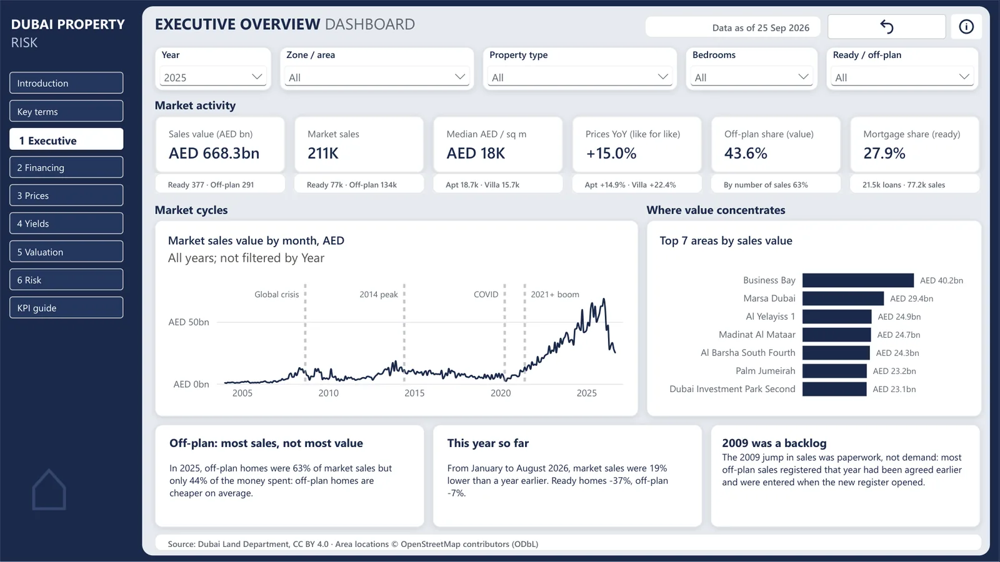

# Dubai Property Market and Mortgage Risk Analytics

An end-to-end analytics project on the full Dubai Land Department register (1.79M transactions and 10.5M Ejari rent lines since 2004): a PostgreSQL and dbt pipeline, a price index, an automated valuation model and a collateral stress test, published as a Power BI report.

**Live site:** https://safwantisekar.github.io/projects/dubai-property/
**Live report:** [Power BI, published to the web](https://app.fabric.microsoft.com/view?r=eyJrIjoiYzgxYTFiNGEtNTQ1OC00YWExLTk2YTctY2E2MDMwNjQyNjY5IiwidCI6ImQ0M2RmOTBjLTEwYTctNDg5MC1hYjBjLWU5YWMwNDQ2NjRiNCJ9)



## The question

The project takes the view of a UAE bank's mortgage and real-estate risk team: where is value being created in Dubai property, how much of it is funded by debt, what are properties worth, and how exposed would lenders be if prices fell? The nine business questions and KPI definitions are in the [project charter](docs/01-project-charter.md).

## Headline findings

Data to 25 Sep 2026. Each figure is quoted from the linked report, which shows the method and caveats.

| Area | Finding | Source |
|---|---|---|
| Market | 211,007 market sales worth AED 668.3bn in 2025, 6.6x the count of 2020. January to August 2026 is down 19% on the same months of 2025 (ready -37%, off-plan -7%). | [findings.md](reports/findings.md) |
| Financing | Between 28% and 48% of 2025 ready purchases were bank-financed. Lenders moved from a 75% to an 80% loan-to-value norm when the CBUAE raised the caps in April 2020. | [findings.md](reports/findings.md) |
| Prices | Like-for-like prices are +81.5% on January 2019. In 2023 the raw median rose 1.2% while like-for-like prices rose 16.6%, because sales shifted to cheaper zones. | [price_index.md](reports/price_index.md) |
| Index validation | Year-on-year correlation with DLD's official index of 0.93 (Dubai); our index turns about six months earlier. | [price_index.md](reports/price_index.md) |
| Valuation | The AVM values 65% of 2025-26 sales within 10% (MdAPE 6.8%), against 50% (MdAPE 9.9%) for comparable sales, out of time. | [avm_model_card.md](reports/avm_model_card.md) |
| Yields | Apartments yield 7.1% gross, villas 5.2% (Q3 2025 to Q2 2026). | [yields.md](reports/yields.md) |
| Stress test | At 80% LTV, a 20% fall puts 22% of recent ready apartment buyers in negative equity; a repeat of 2014 to 2020 puts 43% to 80% under water. Illustrative. | [stress_test.md](reports/stress_test.md) |
| Outlook | Central path with rates flat: Dubai +4.6% over 12 months (80% band -5% to +15%). The model beats a naive forecast on the index but not on volume. | [forecast.md](reports/forecast.md) |

## Architecture


- **Bronze:** raw CSVs loaded with `COPY`, every column as text, record counts checked against an independent parser.
- **Silver:** typed and cleaned in dbt; 22 cleaning rules, each a flag with a test, none silently deleting rows.
- **Gold:** star schema with additive aggregates, reconciled to silver exactly.
- **ML:** Python models write results back to Postgres.
- **rpt:** 22 views, the only objects Power BI's read-only role can see.

Details: [architecture](docs/03-architecture.md), [pipeline and data quality](docs/04-pipeline-and-data-quality.md).

## Stack

| Layer | Tools |
|---|---|
| Storage and transformation | PostgreSQL 18, dbt Core (dbt-postgres, dbt_utils, dbt_expectations) |
| Python | uv, psycopg 3, connectorx, Polars, pandas |
| Modelling | LightGBM, Optuna, SHAP, statsmodels (SARIMAX), scipy |
| BI | Power BI (PBIP: TMDL model, PBIR report), DAX, Publish to web |
| Quality | pytest, dbt tests, ruff, pre-commit, GitHub Actions with a Postgres service |
| Website | Static HTML, CSS and JavaScript on GitHub Pages ([separate repository](https://github.com/SafwanTisekar/SafwanTisekar.github.io)) |

## How to run

Requirements: macOS or Linux, PostgreSQL 18, [uv](https://docs.astral.sh/uv/), and the DLD bulk CSVs placed in `data/raw/dld/<dataset>/` (see [data sources](docs/02-data-sources.md)). Setup details: [docs/03 §6](docs/03-architecture.md#6-environment-setup-macos).

```bash
cp .env.example .env   # database settings and passwords
make setup             # uv sync, pre-commit hooks, dbt packages
make db                # database, roles, schemas and grants
make download          # FRED rates into data/raw
make bronze            # raw CSVs into bronze via COPY, reconciled to the files
make dbt               # silver, gold and rpt views, then the data-quality report
make train             # hedonic index, yields, AVM, forecast
make score             # stress test, model tables checked, post-model views
make model-reports     # reports/*.md and figures
make test              # pytest and dbt tests
make pipeline          # download, bronze, dbt, train and score in one go
```

`make help` lists every target. CI runs the same pipeline on committed extracts of the DLD files in `tests/fixtures/` (about 2,000 lines per table). A full rebuild on a 16 GB laptop takes about 8 minutes for dbt and 35 minutes for model training.

## Project structure

```
src/dubai_property/   ingest, quality checks, analysis, features, models, Power BI and website builders
dbt/                  staging, intermediate, marts and reporting models; seeds; custom tests
sql/                  database, roles and grants
notebooks/            exploratory analysis (calls functions in src/)
powerbi/              PBIP project: TMDL semantic model, PBIR report, theme
reports/              findings, model cards, data-quality and reconciliation reports, figures
tests/                pytest suite and CI fixtures
docs/                 charter, data sources, architecture, pipeline, data science, Power BI, website, roadmap
```

## Documentation

| Doc | Covers |
|---|---|
| [01 Project charter](docs/01-project-charter.md) | Questions, KPI definitions, scope, project rules |
| [02 Data sources](docs/02-data-sources.md) | Datasets, key fields, known issues, verified counts |
| [03 Architecture](docs/03-architecture.md) | Layers, stack, setup, Power BI connection and licensing |
| [04 Pipeline and data quality](docs/04-pipeline-and-data-quality.md) | Loader, cleaning rules, star schema, tests, decisions |
| [05 Data science](docs/05-data-science.md) | AVM, price index, yields, stress test, forecast, decisions |
| [06 Power BI](docs/06-power-bi.md) | Semantic model, measures, pages, publishing |
| [07 Website](docs/07-website.md) | Site structure, embed, build |
| [08 Roadmap and changelog](docs/08-roadmap.md) | What was built in each phase, open items |
| [Data dictionary](docs/data-dictionary.md) | Every model and column, generated from dbt |

## Data sources and licences

| Source | Content | Licence |
|---|---|---|
| [Dubai Land Department](https://dubailand.gov.ae/en/open-data/real-estate-data/) via Dubai Pulse | Transactions, Ejari rent contracts, Residential Sale Index | CC BY 4.0 |
| [OpenStreetMap](https://www.openstreetmap.org/copyright) (Nominatim) | Area centroids | ODbL, © OpenStreetMap contributors |
| [FRED](https://fred.stlouisfed.org/) | Fed Funds rate, Brent crude | Public |
| Central Bank of the UAE | Mortgage LTV regulations (cited in `seed_ltv_rules`) | Public |

The raw data is not in this repository. `tests/fixtures/` holds small DLD extracts for CI, redistributed under CC BY 4.0 with attribution ([README](tests/fixtures/README.md)); the DLD index fixture is synthetic. `powerbi/schemas/` holds Microsoft's Power BI JSON schemas under their own MIT licence.

## Limitations

- **Rates:** EIBOR is not loaded yet, so the Fed Funds rate stands in (the AED is pegged to the USD). The forecast's rate coefficient is not statistically significant.
- **Stress test:** loan-to-value ratios are assumptions or matched registered loans, held at origination. It is illustrative, not a regulatory stress test.
- **Valuation:** the register has no floor, view, condition, building age or developer, which limits any AVM built on it. On villas, comparable sales are slightly more accurate on MdAPE.
- **Coverage:** developer concentration uses master projects as a proxy until the DLD projects file is loaded. 71 of 265 areas have no map location.
- **Values** are nominal AED. 2026 is a partial year, and the latest months may still gain late registrations.
- **The live report** depends on a Power BI Pro licence (trial ends late November 2026); the website falls back to screenshots.

## Licence

Code: [MIT](LICENSE). Data: Dubai Land Department, CC BY 4.0. This is an independent project, not affiliated with DLD, and not investment or lending advice.
