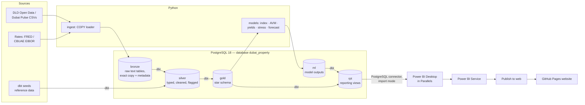

# 03 – Architecture

## 1. Design principles

1. **Free and local-first.** Everything runs on the Mac with free, open-source tools. The cloud is used only for Power BI Service and GitHub.
2. **Medallion layers.** Raw files → Bronze → Silver → Gold, as schemas in one **PostgreSQL** database, each testable.
3. **ELT: SQL for data, Python for models.** Python only *loads* raw files into Postgres. All cleaning and modelling of data happens in SQL (dbt). Python handles ML and writes results back to Postgres.
4. **Scale-aware.** Load with `COPY` (not row-by-row inserts), index the big fact tables, and push aggregation into SQL. Pull only model-sized frames into Python.
5. **Reproducible.** One command rebuilds everything. The Python environment is pinned with uv, and the database is rebuilt from raw files by dbt.

## 2. Flow



## 3. Layers (PostgreSQL schemas)

| Layer | Where | Built by | Content | Rules |
|---|---|---|---|---|
| Raw files | `data/raw/dld/<dataset>/` | You (manual download) / `ingest` | CSVs exactly as downloaded | Immutable; SHA-256 checksum recorded in `data/raw/manifest.json` |
| Bronze | schema `bronze` (e.g. `bronze.dld_transactions`) | Python `COPY … FROM STDIN` | Every source column as `text`, plus `_source_file`, `_snapshot_date`, `_ingested_at`, `_row_hash` | No transformation at all, so any cleaning bug can be traced back to the source; row counts logged |
| Silver | schema `silver` | dbt `staging` + `intermediate` | Typed, snake_case, de-duplicated across snapshots, decoded, quality flags (docs/04) | Every cleaning rule documented and tested |
| Gold | schema `gold` | dbt `marts` | Star schema: facts, dimensions, aggregates | Tested keys, reconciled totals, indexed |
| ML | schema `ml` | Python | Price index, AVM scores, yields, stress grid, forecast, metrics | Versioned by `model_version` |
| Reporting | schema `rpt` | dbt views | Friendly column names, only the columns Power BI needs | The **only** schema Power BI reads; read-only role |

## 4. Tech stack

| Concern | Tool | Why |
|---|---|---|
| Database | **PostgreSQL 18** via **Homebrew** (`postgresql@18`, native on Apple Silicon) | Industry-standard open-source RDBMS; free with no limits; mature dbt and Power BI connectors |
| DB client | **pgAdmin 4** or **DBeaver** (free); `psql` CLI | Browsing schemas and running ad-hoc SQL (the Postgres equivalent of SSMS) |
| Language/env | Python 3.11+, **uv** | Fast, reproducible |
| Python ↔ Postgres | **psycopg 3** (COPY loads, writes), **SQLAlchemy**, **connectorx** (fast reads into Polars/pandas) | Bulk-speed I/O in both directions |
| Transformations | **dbt Core + dbt-postgres** | SQL modelling, tests, lineage docs, index configs |
| DataFrames | **Polars** (wrangling), pandas (model frames) | Memory-efficient |
| Modelling | scikit-learn, **LightGBM**, **statsmodels** (hedonic OLS, SARIMAX), **SHAP**, Optuna | Standard AVM / econometrics toolkit |
| Notebooks | Jupyter in VS Code | EDA and explainability only |
| Quality | dbt tests, `dbt_utils`, `dbt_expectations`, pytest, ruff, pre-commit | |
| CI | GitHub Actions with a `postgres:18` service container | Lint + pytest + `dbt build` on the committed fixtures in `tests/fixtures/` (~2k real DLD lines per table, CC BY 4.0) |
| BI | Power BI Desktop (PBIP) in Parallels → Power BI Service | PostgreSQL connector, import mode |
| Website | Static HTML/CSS/JS on **GitHub Pages** | Free |

## 5. Repository structure

```
dubai-property-analytics/
├── CLAUDE.md
├── README.md
├── Makefile
├── pyproject.toml              # uv-managed deps
├── uv.lock
├── .env.example                # PG_HOST, PG_PORT, PG_DB, PG_USER, PG_PASSWORD, PBI_READER_PASSWORD
├── .gitignore
├── .pre-commit-config.yaml
├── .github/workflows/
│   ├── ci.yml                  # ruff, pytest, dbt build on tests/fixtures (postgres service container)
│   └── pages.yml               # deploy website/ to GitHub Pages
├── sql/
│   ├── 00_create_database.sql  # database (UTF8), roles: dpa_owner, pbi_reader
│   └── 01_schemas_grants.sql   # bronze, silver, gold, ml, rpt + grants (pbi_reader: SELECT on rpt only)
├── data/                       # gitignored
│   ├── raw/dld/<dataset>/  raw/cbuae/
│   └── sample/                 # 2% stratified CSV sample for local dev
├── src/dubai_property/
│   ├── config.py               # paths, split dates, thresholds
│   ├── db.py                   # connection helpers (psycopg, SQLAlchemy engine, connectorx URI)
│   ├── ingest/
│   │   ├── load_bronze.py      # CSV → bronze via COPY; manifest + row-count log
│   │   ├── download_dld_increment.py  # stub for v1 (docs/04 Decisions)
│   │   ├── download_rates.py
│   │   ├── sample.py           # stratified sample → data/sample (make sample)
│   │   └── fixtures.py         # ~2k-line CI fixtures → tests/fixtures (make fixtures)
│   ├── quality/
│   │   ├── profile.py          # column profiling → reports/profile_*.md
│   │   ├── investigate.py      # Phase 1 investigations → reports/phase1_evidence.md
│   │   ├── dq_report.py        # silver rows per step / per rule → reports/dq_report.md
│   │   └── reconcile.py        # file vs bronze vs gold counts/AED totals
│   ├── features/
│   │   ├── feature_list.py     # ALLOW-LIST of AVM features
│   │   └── build.py            # as-of lag features (SQL window functions, no look-ahead)
│   └── models/
│       ├── split.py
│       ├── avm_baseline.py
│       ├── avm_lgbm.py
│       ├── hedonic_index.py
│       ├── yields.py
│       ├── stress_test.py
│       ├── forecast.py
│       ├── evaluate.py
│       ├── explain.py
│       └── score.py            # write ml.* tables via COPY
├── dbt/
│   ├── dbt_project.yml
│   ├── profiles.yml            # dbt-postgres target reading credentials from env vars
│   ├── packages.yml            # dbt_utils, dbt_expectations
│   ├── seeds/
│   ├── macros/
│   └── models/
│       ├── staging/            # stg_transactions, stg_rent_contracts, stg_projects, stg_rates
│       ├── intermediate/       # int_market_sales, int_mortgages, int_rent_contracts
│       ├── marts/              # dim_*, fct_*, agg_*
│       └── reporting/          # rpt_* views for Power BI
├── notebooks/
│   ├── 01_market_cycles.ipynb
│   ├── 02_financing_mix.ipynb
│   ├── 03_prices_and_rents.ipynb
│   └── 04_model_explainability.ipynb
├── powerbi/
│   └── DubaiProperty.pbip      # + .Report / .SemanticModel folders
├── reports/                    # figures, model cards, dq_report.md
├── website/
└── tests/
    └── fixtures/               # committed CI extracts of the DLD/FRED files (README: attribution)
```

## 6. Environment setup (macOS)

```bash
# 1. PostgreSQL 18 (Homebrew) — already installed
brew services start postgresql@18        # runs now and at every login
# postgresql@18 is versioned (keg-only), so put its tools on PATH if `psql` isn't found:
echo 'export PATH="$(brew --prefix postgresql@18)/bin:$PATH"' >> ~/.zshrc && source ~/.zshrc
psql --version                           # should print 18.x
psql postgres -c "select version();"     # connects as your macOS user (Homebrew's default superuser)

# Config + data live in:  $(brew --prefix)/var/postgresql@18/   (postgresql.conf, pg_hba.conf)
# After editing config:   brew services restart postgresql@18

# 2. Optional GUI: pgAdmin 4 or DBeaver (free) — the Postgres equivalent of SSMS
brew install --cask dbeaver-community    # or: brew install --cask pgadmin4

# 3. Project (keep it OUT of OneDrive/iCloud-synced folders)
cd <project folder>/dubai-property-analytics
brew install uv
uv python install 3.11
cp .env.example .env                     # set PG_* values and passwords (PG_ADMIN_USER defaults to your macOS user)
make setup                               # uv sync, pre-commit install, dbt deps
make db                                  # database, roles, schemas, grants (sql/*.sql); idempotent
make dbt-debug                           # dbt connection check
```

The Homebrew install trusts local connections from your macOS user, which is fine for development. The project still creates password-protected roles (`dpa_owner`, `pbi_reader`), because Power BI connects over the Parallels network and must use a password (`scram-sha-256`).

Dubai Pulse API credentials are optional: the bulk CSVs plus DLD's date-filtered downloads are enough.

## 7. Performance settings

At ~1.6M transactions (+1M rent lines), Postgres is comfortably fast if you do the basics:
- **Load with COPY**, never row-by-row `INSERT`. Load bronze with indexes absent, then `ANALYZE`.
- **Indexes in gold** via dbt `indexes` config: `fct_transaction(txn_date)`, `(area_key)`, `(is_market_sale, txn_date)`; the same pattern for rents.
- **Materialisations:** staging = `view`, intermediate = `table`, marts = `table`, reporting = `view`.
- **Server settings** (`postgresql.conf`, see §6 for its location; for a 16 GB Mac): `shared_buffers = 2GB`, `work_mem = 128MB`, `maintenance_work_mem = 1GB`, `effective_cache_size = 8GB`, `max_wal_size = 4GB`. Restart after changing `shared_buffers`; the others take effect on reload.
  - **Applied 2026-09-30:** `max_wal_size = 4GB`, via `alter system set max_wal_size = '4GB'; select pg_reload_conf();` as the superuser. It is written to `postgresql.auto.conf` and takes effect on reload, with no restart. Why: with the 1 GB default, the Phase 1 rent load hit "checkpoints are occurring too frequently (9 seconds apart)", and one 483 MB file took 91 s instead of ~12 s (reports/phase1_findings.md §0). Check with `show max_wal_size;`.
  - **Applied 2026-09-30 (before Phase 2):** `shared_buffers = 2GB`, `work_mem = 128MB`, `maintenance_work_mem = 1GB`, `effective_cache_size = 8GB`, via `alter system set …` as the superuser, then `brew services restart postgresql@18` (`shared_buffers` needs a restart). All four are in `postgresql.auto.conf`; `select name, setting, unit, pending_restart from pg_settings where name in (…)` shows them with `pending_restart = f`, and `show` returns 2GB / 128MB / 1GB / 8GB. Previous values were the defaults (128MB / 4MB / 64MB / 4GB). The loaders and profilers still raise `work_mem` / `maintenance_work_mem` per session where they need more.
- Pull data into Python with `connectorx` (fast) and write results back with `COPY`.
- Target: full rebuild under 20 min. Record actual timings in docs/08.

## 8. Power BI on macOS: Parallels (decided) + connecting to Postgres

Power BI Desktop runs in the owner's **Windows VM under Parallels Desktop**. Postgres and the pipeline run natively on macOS. Power BI connects to Postgres **over the Parallels virtual network**:

1. **Find the Mac's address as seen from Windows:** in the VM, run `ipconfig`. The *Default Gateway* of the Parallels adapter is the Mac, typically `10.211.55.2` on the Shared Network.
2. **Let Postgres listen on that interface:** in `$(brew --prefix)/var/postgresql@18/postgresql.conf` set `listen_addresses = 'localhost,10.211.55.2'` (or `'*'`).
3. **Allow the VM in `pg_hba.conf`:** `host  dubai_property  pbi_reader  10.211.55.0/24  scram-sha-256`. Restart with `brew services restart postgresql@18`. Allow incoming connections if the macOS firewall asks.
4. **In Power BI Desktop:** Get Data → **PostgreSQL database** → Server `10.211.55.2:5432`, Database `dubai_property`, **Import** mode → Database credentials `pbi_reader`. If you get an SSL/encryption error on this local connection, untick *Encrypt connections* for this source in Data source settings.
5. Parameterise **server** and **database** as Power BI parameters so they're changed in one place.

Give the VM at least 8 GB RAM while refreshing. Save the PBIP project into the repo's `powerbi/` folder via the Parallels shared folder so it's committed from macOS.

## 9. Power BI Service licensing (done: Publish to web tested 2026-09-29)

The owner has a **work account on his own domain (email hosted on Zoho Mail)** and can already sign in to Power BI Service. Publish to web still needs three things confirmed. **Test them in Phase 0 with a throwaway one-visual report**, before any real build work:

1. **Licence.** Microsoft's docs indicate free users can't create publish-to-web embed codes. Check the licence under Power BI Service → profile icon → *View account*. If it's free, start the **Power BI Pro / Fabric trial** and record the expiry date in docs/08.
2. **Admin rights on the tenant.** If the account was created by self-service sign-up, the domain may sit in an *unmanaged* Microsoft Entra tenant with no admin. Check whether *Settings → Admin portal* opens in Power BI Service. If there's no admin, do Microsoft's **admin takeover** for the domain. It's verified by adding a DNS TXT record at the domain's DNS host (wherever the Zoho MX records are managed).
3. **Tenant setting.** Admin portal → *Tenant settings → Export and sharing settings → Publish to web* → **Enabled**. Settings can take up to about 15 minutes to apply.

**Test:** publish the throwaway report → File → Embed report → **Publish to web (public)** → paste the iframe into a local HTML file → open it in a private browser window. If it renders, licensing is solved.

**Risk:** the embed stops working if the licence lapses or the creator loses access. Mitigation: the website always ships screenshots, a GIF walkthrough and a PBIX download (docs/07). Before the trial ends, decide whether to buy one Pro licence or rely on the fallback.

Sources: [Publish to web](https://learn.microsoft.com/power-bi/collaborate-share/service-publish-to-web), [Features for free users](https://learn.microsoft.com/power-bi/fundamentals/end-user-features), [Admin takeover of an unmanaged directory](https://learn.microsoft.com/entra/identity/users/domains-admin-takeover).

## 10. Optional Microsoft Fabric track (stretch)

To showcase Fabric: copy the gold tables into a **Fabric Lakehouse** (trial) via a Dataflow Gen2 or a notebook, and rebuild one or two marts there. Keep the local Postgres pipeline as the primary path so the project stays free and reproducible. Direct Lake and DirectQuery models aren't supported by Publish to web, so the public report must still use an import-mode model.
