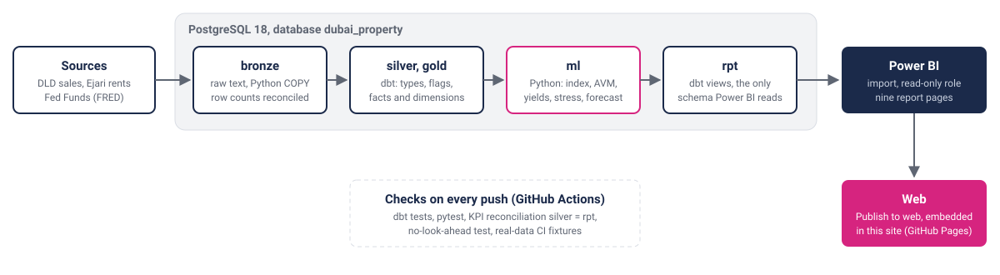
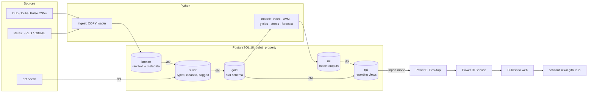

# 03. Architecture

How the platform is laid out: principles, data flow, layers, stack, repository structure, local setup, performance settings and the Power BI connection.

## 1. Design principles

1. **Free and local-first.** Everything runs on a Mac with open-source tools; the cloud is used only for Power BI Service and GitHub.
2. **Medallion layers.** Raw files → bronze → silver → gold, as schemas in one PostgreSQL database, each tested.
3. **ELT.** Python only loads raw files. All cleaning and modelling of data happens in SQL (dbt). Python fits the models and writes results back to Postgres.
4. **Scale-aware.** `COPY` instead of row inserts, indexed fact tables, aggregation in SQL, only model-sized frames in Python.
5. **Reproducible.** One command rebuilds everything: uv pins the Python environment, and dbt rebuilds the database from the raw files.

## 2. Flow





## 3. Layers (PostgreSQL schemas)

| Layer | Where | Built by | Content | Rules |
|---|---|---|---|---|
| Raw files | `data/raw/dld/<dataset>/` | Manual download / `ingest` | CSVs as downloaded | Immutable; SHA-256 recorded in the load manifest |
| Bronze | `bronze.*` | Python `COPY … FROM STDIN` | Every source column as `text`, plus `_source_file`, `_snapshot_date`, `_ingested_at`, `_row_hash` | No transformation, so any cleaning bug traces back to the source; row counts logged |
| Silver | `silver.*` | dbt `staging` + `intermediate` | Typed, de-duplicated, decoded, quality flags (docs/04 §2) | Every rule documented and tested |
| Gold | `gold.*` | dbt `marts` | Star schema: facts, dimensions, aggregates | Tested keys, reconciled totals, indexed |
| ML | `ml.*` | Python | Price index, yields, AVM scores, stress grid, forecast | Versioned by `model_version` |
| Reporting | `rpt.*` | dbt views | Friendly names, only the columns Power BI needs | The **only** schema Power BI reads, via a read-only role |

## 4. Tech stack

| Concern | Tool | Why |
|---|---|---|
| Database | **PostgreSQL 18** (Homebrew `postgresql@18`) | Free, no limits, mature dbt and Power BI connectors |
| Environment | Python 3.11+, **uv** | Fast, locked, reproducible |
| Python ↔ Postgres | **psycopg 3** (COPY), SQLAlchemy, **connectorx** (fast reads) | Bulk-speed I/O both ways |
| Transformations | **dbt Core + dbt-postgres**, `dbt_utils`, `dbt_expectations` | SQL models, tests, lineage, index configs |
| DataFrames | **Polars**; pandas for model-sized frames | Memory-efficient |
| Modelling | **LightGBM**, statsmodels (SARIMAX), scipy (sparse OLS), scikit-learn, **SHAP**, Optuna | Standard AVM and econometrics toolkit |
| Quality | dbt tests, pytest, ruff, pre-commit | |
| CI | GitHub Actions with a `postgres:18` service | Lint, pytest and `dbt build` on the committed fixtures (`tests/fixtures/`, ~2k real DLD lines per table) |
| BI | Power BI Desktop (PBIP: TMDL + PBIR) → Power BI Service | Import mode, Publish to web |
| Website | Static HTML/CSS/JS on GitHub Pages, in its own repository (docs/07) | Free |

## 5. Repository structure

```
dubai-property-analytics/
├── README.md  LICENSE  Makefile  pyproject.toml  uv.lock
├── .env.example                # PG_* settings, passwords, SITE_REPO_DIR
├── .github/workflows/ci.yml    # ruff, pytest, dbt build on tests/fixtures
├── sql/                        # database, roles (dpa_owner, pbi_reader), schemas, grants
├── data/                       # gitignored: raw/, sample/
├── src/dubai_property/
│   ├── config.py  db.py        # paths, split dates, thresholds; connections
│   ├── ingest/                 # load_bronze (COPY), download_rates, sample, fixtures, geocode_areas
│   ├── quality/                # profiling, reconciliation, dq report, KPI reconciliation, data dictionary
│   ├── analysis/               # Phase 3 EDA functions (the notebooks call these)
│   ├── features/               # AVM features with the as-of rule (no look-ahead)
│   ├── models/                 # hedonic index, yields, AVM, stress test, forecast, report writers
│   ├── powerbi/                # TMDL and PBIR generators / validators
│   └── website/                # `make site`: numbers and figures into the site repository
├── dbt/
│   ├── seeds/  macros/  tests/
│   └── models/                 # staging/ intermediate/ marts/ reporting/
├── notebooks/                  # 01 market cycles, 02 financing mix, 03 prices and rents
├── powerbi/                    # PBIP project, theme, vendored Microsoft schemas, BUILD.md, VISUALS.md
├── reports/                    # findings, model cards, dq and reconciliation reports, figures/
├── tests/                      # pytest; fixtures/ (committed CI extracts, CC BY 4.0)
└── docs/                       # 01–08, data dictionary, images/
```

## 6. Environment setup (macOS)

```bash
brew install postgresql@18 uv libomp      # libomp: LightGBM needs OpenMP on macOS
brew services start postgresql@18
echo 'export PATH="$(brew --prefix postgresql@18)/bin:$PATH"' >> ~/.zshrc   # postgresql@18 is keg-only
uv python install 3.11
cp .env.example .env                       # set PG_* values and passwords
make setup                                 # uv sync, pre-commit install, dbt deps
make db                                    # database, roles, schemas, grants; idempotent
make dbt-debug                             # dbt connection check
```

Homebrew's Postgres trusts local connections from the macOS user. The project still creates password-protected roles (`dpa_owner`, `pbi_reader`), because Power BI connects over a virtual network with `scram-sha-256`. A GUI client (DBeaver or pgAdmin) is optional. Config and data live in `$(brew --prefix)/var/postgresql@18/`.

## 7. Performance settings

- Load with `COPY`, then `ANALYZE`. Bronze has no indexes.
- Gold indexes via dbt `indexes` config: `fct_transaction(txn_date)`, `(area_key)`, `(is_market_sale, txn_date)`; the same pattern on rents.
- Materialisations: staging = view, intermediate = table, marts = table, reporting = view.
- Server settings for a 16 GB Mac, applied 2026-09-30 with `alter system set …` (in `postgresql.auto.conf`): `shared_buffers = 2GB`, `work_mem = 128MB`, `maintenance_work_mem = 1GB`, `effective_cache_size = 8GB`, `max_wal_size = 4GB`. Raising `max_wal_size` fixed "checkpoints are occurring too frequently" during the rent load: one 483 MB file went from 91 s to ~12 s (reports/phase1_findings.md §0). `shared_buffers` needs a restart; the rest take effect on reload. Loaders raise `work_mem` per session where they need more.
- Full rebuild target: under 20 minutes. Measured: `make dbt` 7–8 minutes on full data (docs/08).

## 8. Power BI on macOS: Parallels and the Postgres connection

Power BI Desktop runs in a **Windows 11 VM under Parallels Desktop**; Postgres and the pipeline run natively on macOS. Power BI connects over the Parallels Shared network (set up and verified 2026-09-30).

| Setting | Value |
|---|---|
| VM network adapter | `net0`, type **Shared** |
| Mac's address on that network | **10.211.55.2** (`bridge100`) |
| Subnet | 10.211.55.0/24 |
| Postgres | port 5432, SSL off, `password_encryption = scram-sha-256` |

Server changes (made as the macOS superuser, not stored in the repo):

```text
# postgresql.conf
listen_addresses = 'localhost,10.211.55.2'

# pg_hba.conf
host    dubai_property  pbi_reader      10.211.55.0/24          scram-sha-256
```

Only `pbi_reader` may connect from the VM subnet, only to `dubai_property` and only with a password; Postgres doesn't listen on the Wi-Fi address. Verified: `pbi_reader` reads `rpt.report_info` over 10.211.55.2; `dpa_owner` from the subnet is refused; a wrong password fails; `pbi_reader` reading `gold` is denied.

**Refresh routine:** start Parallels → `make pbi-ready` on the Mac → refresh in Desktop. The address 10.211.55.2 exists only while Parallels runs, so if Postgres started first it listens on localhost only. `make pbi-ready` checks the interface, restarts Postgres, waits for it and runs a test query as `pbi_reader`, printing `OK: Power BI can connect …` or what to check. `PBI_HOST` overrides the address.

In Desktop: Get Data → PostgreSQL database → server `10.211.55.2:5432`, database `dubai_property`, **Import**; credentials **Database**, user `pbi_reader`, password `PBI_READER_PASSWORD` from `.env`. Untick *Encrypt connections* for this source if asked (traffic stays on the Mac's private virtual network). Server and database are the parameters `PgServer` / `PgDatabase`.

## 9. Power BI Service licensing

Publish to web needs a work account, a Pro (or trial) licence and the tenant setting enabled. I use a work account on my own domain:

1. **Licence:** free users can't create Publish-to-web embed codes, so a Power BI Pro trial was started on 2026-09-29 (ends ~2026-11-27; docs/08 Publishing record).
2. **Tenant admin:** a self-service sign-up leaves the domain in an unmanaged Entra tenant. Admin takeover via a DNS TXT record made the account Global Admin.
3. **Tenant setting:** Admin portal → Tenant settings → Export and sharing → **Publish to web: Enabled**.

Tested on 2026-09-29 with a one-visual report rendered in a private browser window.

**Risk:** the embed stops working if the licence lapses. Mitigation: the website switches to report screenshots on a configured end date (docs/07 §5); renewal or one Pro licence before the trial ends.

Sources: [Publish to web](https://learn.microsoft.com/power-bi/collaborate-share/service-publish-to-web), [Features for free users](https://learn.microsoft.com/power-bi/fundamentals/end-user-features), [Admin takeover](https://learn.microsoft.com/entra/identity/users/domains-admin-takeover).

## 10. Optional Fabric track (not built)

Gold tables could be copied into a Fabric Lakehouse to rebuild one or two marts there. The local Postgres pipeline stays the primary path. Direct Lake and DirectQuery models can't use Publish to web, so the public report must stay import mode.
