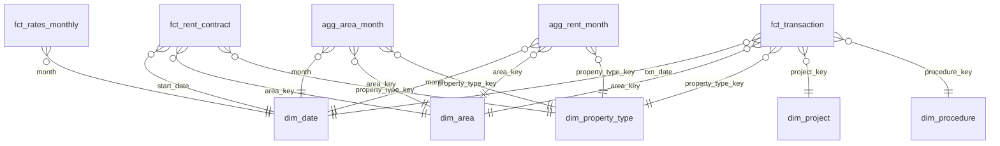

# 04. Pipeline and data quality

How raw files become the bronze, silver and gold layers: the loader, every cleaning rule, the star schema, the tests and the run order. Row counts per rule are in `reports/dq_report.md`.

## 1. Ingestion (raw files → bronze)

| Step | Script | Detail |
|---|---|---|
| Database setup | `make db` → `sql/00_create_database.sql`, `sql/01_schemas_grants.sql` | UTF-8 database `dubai_property`; roles `dpa_owner` (pipeline) and `pbi_reader` (read-only on `rpt`); schemas `bronze`, `silver`, `gold`, `ml`, `rpt` |
| DLD files | `ingest/load_bronze.py` (`make bronze`) | Per CSV: SHA-256, skip if already in `bronze._load_manifest`; a Python pre-pass checks BOM, encoding and header and **counts records with a CSV parser**; the bronze table is created from the header with **every column as `text`**; raw bytes stream through `COPY … FROM STDIN (FORMAT csv, HEADER true)`; the file commits only if COPY rows = parser records; `ANALYZE`; `data/raw/manifest.json` exported. `quality/reconcile.py` then re-checks live counts per file |
| DLD increments | `ingest/download_dld_increment.py` | Stub in v1 (Decisions). Refresh = a new bulk snapshot in `data/raw/dld/<dataset>/` |
| Rates | `ingest/download_rates.py` (`make download`) | FRED `FEDFUNDS`, `DCOILBRENTEU` → dated snapshots in `data/raw/fred/`; EIBOR from CSVs placed in `data/raw/cbuae/` (skipped with a log line if none) |
| Profiling | `quality/profile.py`, `quality/investigate.py` (`make profile`) | SQL-only column profiles → `reports/profile_<table>.md`; Phase 1 investigations → `reports/phase1_evidence.md` |
| Sample | `ingest/sample.py` (`make sample`) | 2% of deals / contracts per year × area, whole groups, deterministic → `data/sample/` |

**Bronze rules**
- Column names snake_cased from the header; values untouched. DLD quotes every field, so missing values arrive as `''`; staging applies `nullif(col, '')`.
- A UTF-8 BOM is stripped; a non-UTF-8 file is converted on the fly and logged.
- Metadata columns: `_source_file`, `_source`, `_snapshot_date` (from the file name, else mtime), `_ingested_at`, `_row_hash` (md5 of the row's values, a stored generated column).
- Append-only: re-loading a file is a no-op; new snapshots are appended and de-duplicated in silver (C1).
- Every file is logged to `reports/ingest_log.csv` (status, encoding, rows in file, rows loaded, match, timings).
- Schema drift (a column added or missing in a later snapshot) fails the load; it is never altered silently.
- On the main database the loader refuses any root other than `data/raw` and any `--reset` without `ALLOW_MAIN_RESET=1` (docs/05 §8, incident of 2026-10-01).

## 2. Cleaning rules (dbt → silver)

Silver = `stg_*` views (typing, C1, seeds) and `int_*` tables (flags). Thresholds are dbt vars in `dbt/dbt_project.yml`. Rows affected per rule: `reports/dq_report.md` (`make dq`).

| # | Field | Issue | Rule | Model |
|---|---|---|---|---|
| C1 | Transaction / contract-line key | Duplicates across snapshots | Typing happens here: `nullif(trim(x), '')` before every cast; numbers cast directly (a failure means the format changed), dates through `safe_iso_date` (ISO only, `pg_input_is_valid`). De-duplicate with `row_number()` over `transaction_id` (rents: `contract_id, line_number`), keeping the latest `_snapshot_date`. The only rule that removes rows | `stg_transactions`, `stg_rent_contracts` |
| C2 | `procedure_name_en` | 58 (group, procedure) pairs | Map via `seed_procedure_map`, keyed on **(trans_group, procedure_id)** → `procedure_category` (market_sale, offplan_sale, mortgage, lease_to_own, gift, development, inheritance, other), `is_market_sale`, `is_lease_to_own`, `is_new_mortgage` (individual), `is_portfolio_mortgage`, `amount_is_loan`. An unmapped procedure fails a not_null test | `stg_transactions` |
| C3 | Gifts, inheritance, grants, development | Not arm's-length prices | `is_market_sale = false`; the rows stay in `int_market_sales` for volume counts and are excluded from `is_clean_market_sale` | `int_market_sales` |
| C4 | `actual_worth` | AED 1–1,000 values; AED bn portfolio deals | `is_price_below_floor` (< AED 50k); `is_ppsqm_outlier`: price per sq m outside P0.5–P99.5 of clean market sales by **area × property type** (n ≥ 20, else the property type's Dubai-wide band); `is_price_invalid` = either. The planned `bulk_deal` flag is implemented as C16 | `int_market_sales` |
| C5 | `procedure_area` | < 0.01 sq m; implausible sizes | `is_area_invalid`: units outside 15–3,000 sq m, villas outside 15–10,000, land and buildings under 1 sq m, or no area | `int_market_sales` |
| C6 | `price_per_sqm` | Provided vs computed disagree | `price_per_sqm_aed = actual_worth / area`; `is_ppsqm_mismatch` if > 5% off a non-zero `meter_sale_price` | `int_market_sales` |
| C7 | `rooms_en` | Mixed labels | `seed_rooms_map` → `bedrooms` (Studio = 0), `room_class`, `is_penthouse`, `is_commercial_unit`. Every label in the data must be mapped (test) | `stg_transactions` |
| C8 | Area names | Spelling variants, renamed communities | `seed_area` (all 265 area IDs) → canonical `area_name`, `zone`; source name kept in `area_name_source`; drift is a warn test | `stg_*` |
| C9 | Project/building missing | 26% of transactions | NULL kept, `has_project` flag; gold labels it "Unknown" | `stg_transactions` |
| C10 | Mortgage rows | `actual_worth` meaning | `mortgage_amount_aed = actual_worth` only where `amount_is_loan` (Mortgage Registration, Delayed Mortgage); NULL for pre-registration, modify, transfer, portfolio, development, lease finance and lease-to-own (count only). `mortgage_amount_once_aed` counts portfolio loans once (C16) | `int_mortgages` |
| C11 | Rent: multi-unit contracts | Amount repeated per line | **Option 1:** `line_count` = lines counted (not `no_of_prop`), `is_multi_unit`, `annual_rent_alloc_aed = annual rent / line_count` (the only rent column to SUM). Market rent and yields use single-line contracts only. Tests: allocations sum to the contract amount; line numbers 1..n; Σ allocated ≤ naive Σ | `int_rent_contracts` |
| C12 | Rent: annualisation | Contracts shorter or longer than 12 months | `annual_rent_contract_aed` = `annual_amount`; if missing, `contract_amount × 365 / contract_days` | `int_rent_contracts` |
| C13 | Rent: renewals vs new | Renewals lag the market | `contract_reg_type`, `is_new`; `is_market_rent` requires a new contract | `int_rent_contracts` |
| C14 | Rent outliers | AED 0 or extreme per sq m | `is_rent_below_floor` (allocated < AED 1,000); `is_rent_outlier` also when rent per sq m (or, with no usable area, annual rent) is outside P0.5–P99.5 by **area × Ejari sub-type** (n ≥ 20, else the sub-type's Dubai-wide band), fitted on single-line, market-type contracts | `int_rent_contracts` |
| C15 | Commercial vs residential | Mixed | `is_residential` helper in silver; the residential filter is applied in marts | marts |
| C16 | `actual_worth` on portfolio deals | One deal value repeated on every unit line (Phase 1 §2b) | The Phase 1 `REPEATED_VALUE_GROUP` rule in SQL: same group, procedure, date, value, ID-year; ≥ 2 lines; ID span ≤ 2 × lines; sizes differ > 10% → `is_repeated_deal_value`, `deal_group_id` (lead line's id), `actual_worth_once_aed` (value on the lead line, 0 on the rest). Same pattern with sizes within 10% → `is_similar_size_batch` + `batch_group_id`, **not** corrected. Reconciled to the Phase 1 SQL on any data and to the Phase 1 figures on the Phase 1 snapshot | `int_transaction_deal_groups` → `int_market_sales`, `int_mortgages` |
| C17 | Lease-to-own | One deal registered as a Sales leg and a Mortgages leg | `is_lease_to_own`; the Sales leg has `is_market_sale = false` (volume counts only), the Mortgages leg is financing | seed, `int_*` |
| C18 | Dates | 4 Hijri dates, 18,208 pre-2004 rows; rent dates up to year 5013 | Transactions: `is_date_invalid` (unparseable, year < 1900, after the extract; `txn_date` NULL, raw text kept), `is_pre_2004`. Rents: `is_date_invalid` (start unparseable or > 1 year after the extract), `is_start_after_snapshot` (valid start after the **data snapshot date** = latest transaction date, `int_data_snapshot`: registered ahead, not yet a market rent), `is_pre_2004`, `is_end_date_implausible` (end missing, before start, or > 10 years) | `stg_transactions`, `int_rent_contracts` |
| C19 | `property_usage_en` | Label `أخرى` in the EN column (6,322 rows) | Mapped to `Other`; test: no Arabic script in the column | `stg_transactions` |
| C20 | Rent property type | Virtual units (flexi-desks), labour camps and bed-spaces aren't market rents | `is_non_market_property_type` (bus type `Virtual Unit`, type `Labor Camps`, sub-type `Room in labor Camp` / `Labor Camp`); excluded from `is_market_rent` and the C14 bands | `int_rent_contracts` |
| C21 | Rent `actual_area` | Blank / 0 / 1 sq m placeholders (1.55M lines); community / plot / building areas | `area_sqm` NULL and `is_area_placeholder`, or `is_area_implausible` when above the cap for the property class: **Apartment 1,000 sq m, Villa / Townhouse 3,000, Office and Retail 5,000, every other class 10,000** (vars `area_cap_*`, macro `class_area_cap`); no `rent_per_sqm_aed`, rent kept. The same caps keep plot-sized sales areas out of the area-weighted price sums (`fct_transaction.is_area_above_class_cap`) | `int_rent_contracts`, `fct_transaction` |
| C22 | Rent bedrooms | Bedrooms are only in the Ejari sub-type label | `seed_rent_subtype_map` → `bedrooms` (Studio = 0) for residential layouts | `stg_rent_contracts` |

Every flag is kept as a column (never silently deleted), and `reports/dq_report.md` shows rows affected per rule.

## 3. Gold star schema

`dbt/models/marts/` → `gold`, `dbt/models/reporting/` → `rpt`. Views over the model outputs carry the dbt tag `post_ml` and are built by `make score`.

**Conventions.** Integer keys (`area_key` = DLD area_id, `project_key` = project_number, `procedure_key` and `property_type_key` from seeds), with `-1` / `999` as the Unknown member. Facts join `dim_date` on the date itself; aggregates on the first day of the month. **Reporting scope** = 2004-01-01 (var `dim_date_start`) to the **data snapshot date**, the latest transaction date (`silver.int_data_snapshot`, 2026-09-25 on the current extract). The facts keep every silver line, and `is_in_report_scope` marks what the aggregates and `rpt.transactions` carry. `dim_date` runs on to 2027-12-31 (var `dim_date_end`) for the forecast, with `is_after_snapshot` to hide empty future dates; `rpt.report_info` "Data As Of" is the snapshot date. Gold AED is `numeric(18,2)`, except `annual_rent_alloc_aed` (full precision, see Decisions).

| Table | Grain | Rows (full data) | Key columns |
|---|---|---|---|
| `fct_transaction` (indexed: transaction_id unique, txn_date, area_key, (is_market_sale, txn_date)) | Transaction line, all groups | 1,788,150 | keys, trans_group, procedure_category, is_market_sale, is_clean_market_sale, has_quality_flag, is_new_mortgage, is_portfolio_mortgage, is_offplan, bedrooms, area_sqm, actual_worth_aed, **aed_counted_once** (the only AED to SUM), price_per_sqm_aed, mortgage_amount_once_aed, portfolio_mortgage_value_once_aed, deal_group_id, has_purchase_mortgage / is_purchase_mortgage / purchase_ltv, every C-flag, is_in_report_scope |
| `fct_rent_contract` (indexed: (contract_id, line_number) unique, start_date, area_key, (is_market_rent, start_date)) | Contract line | 10,538,926 | keys, is_new, is_multi_unit, line_count, **annual_rent_alloc_aed** (the only rent to SUM), annual_rent_contract_aed, area_sqm, rent_per_sqm_aed, bedrooms, tenant_type, flags, is_rent_comparable, is_market_rent. **Not exposed to Power BI** |
| `agg_area_month` | Month × area × property type × bedrooms × off-plan | 120,799 | market_sales, market_sales_value_aed, clean_sales (n), clean_sales_aw_n, clean_sales_value_aed and clean_sales_area_sqm (clean sales within the class area cap; per property type, so area-weighted AED/sq m is computed within a class), median_price_per_sqm_aed, median_price_aed, purchase_mortgages (matched, on the sale line), new_mortgages, new_mortgage_loans_aed, portfolio_mortgage_deals / lines / value_aed |
| `agg_rent_month` | Month × area × property type × bedrooms × new/renewal | 392,190 | rent_lines, contracts, annual_rent_alloc_aed, comparable_contracts (n), market_rent_contracts, median_annual_rent_aed, rent_per_sqm_n, median_rent_per_sqm_aed, comparable_area_sqm, comparable_rent_with_area_aed. The rent table Power BI uses |
| `fct_rates_monthly` | Month (2004 →) | 273 | fed_funds_rate, brent_usd, eibor_1m/3m/6m/12m (NULL until the CBUAE file is loaded) |
| `dim_date` | Day | 8,766 | year, quarter, month, month_start, year_month, year_quarter, day_of_week |
| `dim_area` | Area | 266 | 265 DLD areas + Unknown; area_name, zone, latitude/longitude (OpenStreetMap centroids) |
| `dim_property_type` | Usage group × property class | 66 | Conformed across DLD and Ejari (`int_property_type_lookup`, seeds `seed_property_usage_map`, `seed_property_type_map`, `seed_property_class`); key = usage_group_id × 100 + property_class_id |
| `dim_procedure` | (trans_group, procedure_id) | 58 | procedure_key (stable, in the seed), category, is_market_sale, is_new_mortgage, is_portfolio_mortgage |
| `dim_project` | DLD project | 3,421 (incl. Unknown) | project_name, master_project (most frequent), first/last txn date. No developer until the DLD projects file is loaded |
| `rpt.*` views | One per table Power BI needs | 22 views (docs/06 §1) | Title Case names, AED rounded to whole dirhams (bigint), no `_ar`, no individual C-flags, no text ids, medians only where n ≥ 20. The **only** objects Power BI reads |
| `ml.fct_price_index` (Phase 4a) | Segment × published period | 2,432 | Written by `models/hedonic_index.py` (COPY). segment_id / level / property_type_key / zone, frequency, period_start, n_obs (≥ 20), log_coef, index_value (Jan 2019 = 100), index_3m, mom, yoy, vol_12m, running_peak, drawdown, episode_id, is_partial_period, model_version. 18 segments: Dubai, apartments, villas + 15 zone × type |
| `ml.agg_yield_quarter` (Phase 4a) | Quarter × area or zone × property type × bedrooms | 5,919 | Written by `models/yields.py` (COPY). n_rent, n_sale (both ≥ 20), median_annual_rent_aed, median_price_aed, gross_yield, is_outside_sanity, areas_rolled_up (zone rows), is_partial_period, model_version |
| `rpt.price_index`, `rpt.yield_quarter` | Views over the two ml tables | | dbt tag `post_ml` (built by `make score`), filtered to the model version in dbt vars |
| `ml.avm_score` (Phase 4b) | Clean residential market sale since 2011 (champion model) | 904,551 | Written by `models/avm.py` (COPY). model_version, scored_at, model, transaction_id, txn_date, area_key, property_type_key, bedrooms, is_offplan, area_sqm, model_set (train 480,489 / validation 148,360 / test 275,702), actual_price_aed, predicted_value_aed, predicted_ppsqm_aed, abs_pct_error, gap_pct, is_review (NULL on train rows: out of sample only; 12,813 validation + 18,710 test flagged), comps_value_aed (baseline, for comparison) |
| `ml.avm_performance` (Phase 4b) | Model × split × breakdown × segment | 436 | Four models (LightGBM, comparables, index-adjusted comparables, rolling hedonic OLS) on validation and test: overall, by reg type, property type, price band (predicted and actual), top 20 areas, month, plus `_common` subsets every model can value. n_total, n_scored, coverage, mdape, hit10, hit20, mape, r2_log_price, is_champion; segments below min-n left out |
| `ml.feature_importance` (Phase 4b) | LightGBM feature | 35 | feature, feature_group, mean_abs_shap (TreeSHAP on 20,000 seeded test sales), gain, rank |
| `rpt.avm_score`, `rpt.avm_performance`, `rpt.feature_importance` | Views over the three ml tables | | dbt tag `post_ml` (`make score`), filtered to `avm_model_version`; dbt tests on keys and ranges; `tests/test_avm_model.py` checks every model and one champion |
| `ml.stress_grid` (Phase 4c) | Segment (Dubai / type / zone × type / area × type) × ready or off-plan × scenario × loan basis | 25,454 | Written by `models/stress_test.py` (COPY, `make score`). Illustrative. snapshot_date, window_start / window_end (36 complete months), scenario (`grid`, `replay_2014_2020` = each buyer's own series, upper range, `replay_2014_2020_dubai` = Dubai-wide −24%), shock_pct (integer 0 to −50; NULL on replay rows), applied_shock, ltv_basis (`grid`, `cbuae_cap`, `actual_loan`), ltv_pct (integer 50 / 60 / 70 / 80 / 85; NULL off the grid), purchases, loan_aed, current_value_aed, negative_equity_count / share / aed (NULL under min-n), index_zone_share, is_published. No row pools ready with off-plan |
| `ml.stress_replay` (Phase 4c) | Published index series | 18 | Peak, trough and drawdown inside Jan 2014 – Dec 2021, is_used (zone series only if published from June 2014), note |
| `ml.forecast` (Phase 4c) | Target (index / volume) × segment × month × scenario | 1,344 | Written by `models/forecast.py` (`make train`). Actual rows (scenario `actual`) from 2011, then 12 forecast months per scenario (`rates_flat`, `rates_up_100bp`, `rates_down_100bp`): forecast, lower_80 / upper_80, lower_95 / upper_95, rate_path |
| `ml.forecast_backtest` (Phase 4c) | Target × segment × model × horizon | 72 | Rolling origin, 24 origins, index on real-time vintages: n_origins, mape, mdape, coverage_80 / 95 (SARIMAX), is_baseline |
| `rpt.stress_grid`, `rpt.stress_replay`, `rpt.forecast`, `rpt.forecast_backtest` | Views over the four ml tables | | dbt tag `post_ml` (`make score`, via `models/score.py`), filtered to `stress_model_version` / `forecast_model_version` |

**Area-weighted AED per sq m is per property class.** Σ AED / Σ sq m across classes mixes land, buildings and units, so the sums sit on the property-type key and Power BI computes the ratio within a class. The headline KPI (`reports/kpi_reconciliation.md`) is residential apartments + villas / townhouses; a pytest checks that for residential apartments it stays within ±40% of the median in every year from 2010.

**Min-n in the aggregates.** Gold keeps every cell's median with its n (`clean_sales`, `comparable_contracts`, `rent_per_sqm_n`). The rpt views blank a median whose n is under 20 and always show n. Medians of cells can't be combined, so rollups in Power BI use the additive sums: Σ value / Σ sq m is an exact area-weighted price (or rent) per sq m at any level. Exact medians at coarser grains (zone × quarter) are recomputed from rows in `ml.agg_yield_quarter`.

## 4. Data-quality tests

| Level | Test |
|---|---|
| Keys | `unique`/`not_null` on PKs; `relationships` from facts to dims |
| Domains | `accepted_values` for trans_group, reg_type, procedure_category, bedrooms 0–10 |
| Ranges (`dbt_expectations`) | price_per_sqm between the per-area bands for clean sales; area_sqm in valid ranges; dates 2004 → today |
| Reconciliation | Row counts and Σ AED: bronze → silver → gold, with every exclusion accounted for. Silver: `dbt/tests/reconciliation/` (row partitions; AED once per deal/contract vs the Phase 1 SQL on any data, and vs the Phase 1 figures on the Phase 1 snapshot). Gold: `recon_gold_transactions_vs_silver` / `recon_gold_rents_vs_silver` (rows and AED exact), `recon_agg_*_vs_fct` (every additive aggregate column = the fact over the reporting scope; out-of-scope lines = the C18 exclusions) |
| KPI reconciliation (pytest) | `tests/test_kpi_reconciliation.py` → `reports/kpi_reconciliation.md`: each pre-ML docs/01 §4 KPI from silver vs from `rpt.transactions`, `rpt.area_month`, `rpt.rent_month`, by all-time / year / month; counts exact, AED within rpt rounding. The figures the Power BI cards must match |
| rpt access (pytest) | `tests/test_rpt_access.py`: rpt holds exactly the Power BI views; pbi_reader reads all of them and nothing in any other schema; Title Case names only |
| Volume anomalies | Monthly sales per area within ±5σ of the rolling mean (warn, not fail) |
| Rent de-duplication | Σ annual rent after allocation ≤ raw Σ; allocations sum to each contract's amount; line numbers 1..n (`dbt/tests/rules/c11_*`) |
| Yield sanity | Gross yields between 2% and 15% for segments with n ≥ 20: logged warning, `is_outside_sanity` flag (`models/yields.py`); the dbt test only enforces [0, 1] |
| Model outputs | Price index: base period = 100 in every segment (`dbt/tests/models/price_index_base_period_is_100.sql`), n ≥ min_n, drawdown ≤ 0, unique segment × period; yields: n ≥ min_n on both sides, yield ∈ [0, 1] (rpt YAML + `tests/test_hedonic_index.py`, `tests/test_yields.py`). AVM: value > 0, review flag only out of sample. Stress grid (4c): shares ∈ [0, 1], published rows n ≥ min_n, integer shock / LTV keys, negative equity never falls as the shock deepens or the LTV rises (`dbt/tests/models/stress_grid_monotone.sql`), none at 0% shock and 50% LTV (`stress_grid_zero_shock.sql`), `tests/test_stress_test.py`. Forecast: lower_95 ≤ lower_80 ≤ forecast ≤ upper_80 ≤ upper_95, unique keys, no look-ahead in the backtest (`tests/test_forecast.py`) |
| Leakage (pytest) | AVM features use only data available at transaction time (docs/05) |

## 5. Orchestration

The `Makefile` runs the steps in order: `db` (once) → `download` → `bronze` → `dbt` (pre-ML models; excludes `tag:post_ml`, then writes `reports/dq_report.md`) → `train` (models write `ml.*` with `COPY`) → `score` (stress test, ml table checks, then `dbt build --select tag:post_ml`) → `test`. `make model-reports` writes `reports/price_index.md`, `yields.md`, `avm_model_card.md`, `stress_test.md` and `forecast.md`. `make pipeline` runs `download` through `score`; `make update` (the monthly refresh) is a stub until incremental DLD downloads are built.

## 6. Decisions

| Date | Decision | Why |
|---|---|---|
| 2026-09-30 | **Load manifest lives in `bronze._load_manifest`**, written in the same transaction as each file's COPY. `data/raw/manifest.json` is exported from it | A JSON file can't be atomic with the database: a crash between COPY and the JSON write would leave the file loaded but unrecorded (or the reverse). The JSON is kept for humans and diffs, for review |
| 2026-09-30 | **Raw bytes stream straight into COPY**; a separate Python `csv` pass counts records | Postgres's parser does the load, and Python's parser is an independent check. The file commits only if both agree. Faster than parsing rows in Python and re-serialising them |
| 2026-09-30 | **Per-file metadata is set via temporary column DEFAULTs** inside the load transaction | COPY can only fill columns from the file. Defaults keep it a single pass: the alternatives are a temp table plus INSERT (writes 5.9 GB twice) or an UPDATE (rewrites every row) |
| 2026-09-30 | **`_row_hash` = md5 of the row's values**, not of the raw line | It's computed by Postgres as a stored generated column during COPY, and it serves the same purpose (C1 de-duplication of identical rows across snapshots). NULL and `''` hash differently |
| 2026-09-30 | **Table names follow docs/04** (`bronze.dld_transactions`, `bronze.dld_rent_contracts`, `bronze.rates_*`), mapped from folder names in `config.DATASETS` | Folder names (`rents/`) are short. Table names say what the data is |
| 2026-09-30 | **`transactions_increment/` is disabled for v1**; `download_dld_increment.py` is a stub | The portal export has a 22-column schema whose IDs don't match the bulk `transaction_id`, and the bulk snapshot already covers it (to 2026-09-25). Revisit at the first monthly refresh |
| 2026-09-30 | **EIBOR is a manual download**; the pipeline skips it when absent | CBUAE has no stable CSV endpoint. Fed Funds is the fallback rate driver (AED/USD peg) |
| 2026-09-30 | **`seed_procedure_map` keyed on (trans_group, procedure_id)**, 58 rows, categories market_sale, offplan_sale, mortgage, lease_to_own, gift, development, other, and **inheritance kept but empty** (listed in `seed_procedure_category`) | Six lease-to-own codes are registered under both Sales and Mortgages (phase1_findings §1). No inheritance procedure exists in this extract, but a future snapshot needs somewhere to land. An unmapped procedure fails a not_null test instead of slipping through |
| 2026-09-30 | **Market sales = Sell, Delayed Sell, Sale On Payment Plan (market_sale) and Sell - Pre registration (offplan_sale)** | They are the arm's-length transfers. Off-plan vs ready is still read from `reg_type` (it lines up exactly with the procedure: only Sell - Pre registration is Off-Plan) |
| 2026-09-30 | **Lease-to-own Sales leg: `is_lease_to_own`, `is_market_sale = false`** (C17), kept in `int_market_sales` for volume counts only; the Mortgages leg is financing | One deal is registered twice with different values (phase1_findings §1). Its "price" is a financed-lease figure, not an arm's-length sale price |
| 2026-09-30 | **C10: `amount_is_loan` only for Mortgage Registration and Delayed Mortgage**; `mortgage_amount_aed` NULL for pre-registration, Modify, Transfer, portfolio, development, lease finance and lease-to-own | Only these two are proven loans (median ratio 0.795 / 0.800 to the same-day sale price; phase1_findings §2). Pre-registration is 43% equal to the price |
| 2026-09-30 | **(Superseded the same day, see below.) Mortgage share uses individual new mortgages only.** `is_new_mortgage` = Mortgage Registration, Delayed Mortgage, Mortgage Pre-Registration. The three portfolio registrations (Portfolio Mortgage Registration, its Pre-Registration, Delayed Portfolio Mortgage) get their own flag, `is_portfolio_mortgage`, and are reported separately: deals = `count(distinct deal_group_id)`, value = `portfolio_mortgage_value_once_aed` (once per deal, C16). | A portfolio loan covers several units (often a developer or investor), so counting it in a per-purchase ratio would distort the share. Modifications and transfers aren't new loans; development mortgages are developer finance; lease finance (810) and lease-to-own stay out until their amounts are verified. Yearly inputs are in reports/dq_report.md §5 |
| 2026-09-30 | **CHANGED: the headline mortgage KPI is the purchase-mortgage share of ready sales**, not new mortgages ÷ (new mortgages + market sales). New model `int_purchase_mortgage_pairs`: a Mortgage Registration (Delayed Mortgage) and a Sell (Delayed Sell) of the same unit on the same day, keyed on date, area, building, project, sq m, rooms, type and sub-type, the key unique on both sides, inferred portfolio lines (C16) excluded; 110,266 pairs. `fct_transaction` gets `has_purchase_mortgage` (sale line), `is_purchase_mortgage` and `purchase_ltv` (mortgage line); `agg_area_month.purchase_mortgages` counts sale lines; rpt exposes "Has / Is Purchase Mortgage", "Purchase LTV" and "Purchase Mortgages". New mortgages per 100 market sales stays as the secondary indicator. The KPI reconciliation re-derives the pairs from silver with a different formulation (window counts vs GROUP BY). Decided at the Phase 3 review | The old ratio double-counted: a mortgaged purchase registers both a sale and a mortgage line, and new mortgages include refinancing. The match is a **lower bound**: only 26–58% of Mortgage Registrations a year find a same-day sale, and that match rate rose over time, so the trend partly reflects matching; the upper bound (all ready-unit mortgages ÷ ready sales) is reported alongside. The model is a single GROUP BY on an md5 unit key: a self-join on the key columns got a 1-row estimate and a nested loop that didn't finish in 10 minutes |
| 2026-09-30 | **`seed_ltv_rules` verified and dated.** All rows `verified = true` (checked by hand against the CBUAE rulebook). The current caps cite the Regulations Regarding Mortgage Loans, Art. 3(2), as amended by Board Resolution 31/2/2020, with `effective_from` 2020-04-08. The pre-2020 regime (Circular No. 31/2013: nationals first home ≤ AED 5M 80%, > 5M 70%, second+ 65%; expatriates 75% / 65% / 60%; off-plan 50%) is added as separate rows, `effective_from` 2013-10-28 (the circular's date; per its Art. 11 it came into force one month after Official Gazette publication, and the exact gazette date is not verified) to `effective_to` 2020-04-07, citing the circular's PDF in the CBUAE rulebook. Tests: `max_ltv` in (0, 1], `effective_from <= effective_to`, every row verified, and no two rows for the same rule (borrower × status × home number × value band) overlapping in time (`ltv_rules_no_overlapping_periods`) | The Phase 4 stress test must apply the caps in force on each purchase date, and cite them (docs/01 §7). The dated rules also explain the observed LTV shift in April 2020 (findings F2.4). A NULL bound is an open interval in the overlap test |
| 2026-09-30 | **C16 repeated deal values: the Phase 1 `REPEATED_VALUE_GROUP` rule in SQL**, with `deal_group_id` (lead line's id), `is_deal_group_lead` and `actual_worth_once_aed` (value on the lead line, 0 on the rest). Similar-size batches get their own flag (`is_similar_size_batch`, `batch_group_id`) and are **not** corrected | The bulk file doesn't mark portfolio groups; a naive Σ overstates mortgages by AED 130.9bn (phase1_findings §2b). Identical units at identical prices are real prices. Silver reproduces every Phase 1 figure exactly (reports/dq_report.md §4) |
| 2026-09-30 | **C11 option 1**: `is_multi_unit`, `line_count` (lines counted, not `no_of_prop`), `annual_rent_alloc_aed = annual rent / line_count`; market rent and yields use single-line contracts only; `rent_per_sqm_aed` only for single-line contracts | 100% of multi-line contracts repeat the full amount per line (5.24× inflation). A bulk lease isn't a like-for-like unit rent, and an equal split over units of different sizes isn't a unit's rent. Option 2 (split by area) fails on the 1.55M lines without a real area |
| 2026-09-30 | **Rents: C20 excludes Virtual Unit, Labor Camps and Room in labor Camp / Labor Camp from market rent**; C21 blank / 0 / 1 sq m area → no rent per sq m; C12 annualises only if `annual_amount` is missing (never, today) | Flexi-desks and bed-spaces are not market rents for a home or office. Placeholder areas would create absurd per-sq-m rents |
| 2026-09-30 | **Outlier bands (C4, C14) by area × property type (sales) / area × Ejari sub-type (rents)**, P0.5–P99.5, fitted on clean market rows; segments under the min-n rule (20) fall back to the type's Dubai-wide band | docs/04 said "area-level"; per sq m prices of land, villas and flats in one area differ by an order of magnitude, so an area-only band would flag the wrong rows. The fallback follows the min-n rule. Bands span 2004–2026; a 1% tail is wide enough that the price cycle doesn't flag whole years |
| 2026-09-30 | **C1 de-duplicates on the key alone** (`transaction_id`; `contract_id, line_number`), keeping the latest `_snapshot_date` | docs/04 had `_row_hash` in the key, which would keep two versions of a corrected row. The latest snapshot wins; `_row_hash` is only a tie-breaker. Today it removes 0 rows (one snapshot per table) |
| 2026-09-30 | **Casting: `nullif(trim(x), '')` before every cast; numbers cast directly, dates via `safe_iso_date`** (regex + `pg_input_is_valid`, PG 16+) | A non-numeric value would be a format change and should stop the build. Bad dates are known (Hijri years, year 5013) and become flags |
| 2026-09-30 | **Dates (C18): Hijri rows flagged `is_date_invalid` with `txn_date` NULL, not converted; 1900–2003 → `is_pre_2004`**. Rents: `is_date_invalid` = start unparseable or > 1 year after the extract; `is_end_date_implausible` = end missing, before start or > 10 years | phase1_findings §4. Contracts are often registered before they start, so only a start more than a year out is an error (100 lines, up to 2205). Leases over 10 years (401 lines) are keying errors or land leases, not market rents |
| 2026-09-30 | **C19: `property_usage_en = 'أخرى'` → `Other`** | EN/AR labels swapped for 6,322 rows (phase1_findings §5) |
| 2026-09-30 | **`seed_area` covers the 265 area IDs, all zoned**: 223 assigned from the DLD names and master projects, the 42 uncertain ones zoned by hand (below) | Phase 1's "266" counted the blank `area_id` on 3 rent lines as a value; those lines keep `area_id` NULL. Uncertain areas were reviewed by hand rather than guessed, because a wrong zone silently mis-rolls-up a thin segment |
| 2026-09-30 | **Structure: `int_transaction_deal_groups` → `int_market_sales` (Sales + Gifts) and `int_mortgages` (Mortgages)**; nothing is filtered after C1 | The C16 groups span all three groups, so they are computed once. The two outputs partition `stg_transactions` exactly (test `recon_transactions_partition`), so gold can union them |
| 2026-09-30 | **Reconciliation in two layers:** (1) method tests on any data recompute the Phase 1 SQL on bronze and require an exact match with silver; (2) figure tests compare with `seed_phase1_reconciliation`, gated on the Phase 1 snapshot's bronze row count | The CI fixtures can't reproduce AED 856.5bn, but they can prove the method; the full data proves the figures. A new snapshot turns (2) off automatically; update the seed then |
| 2026-09-30 | **CI data: commit `tests/fixtures/`** (~2k real DLD lines per table, CC BY 4.0 with attribution in its README), chosen by `make fixtures` to exercise every rule; CI runs `make bronze BRONZE_ROOT=tests/fixtures && make dbt` | Synthetic data wouldn't contain the real edge cases (Hijri dates, portfolio groups, swapped labels) |
| 2026-09-30 | **`load_bronze --reset` drops with CASCADE** | After dbt has run, the silver views depend on bronze and a plain DROP fails. `make dbt` rebuilds the views |
| 2026-09-30 | **Conformed `dim_property_type` = usage group × property class** (66 rows), mapped from DLD and Ejari labels by `seed_property_usage_map` and `seed_property_type_map` via `int_property_type_lookup`; the source type / sub-type labels stay on the facts. | DLD (Unit/Villa/Land/Building × Flat/Office…) and Ejari (~70 property types × layout sub-types) share no vocabulary, but one Power BI slicer must filter sales, rents and both aggregates (docs/06 §2). The shared key is also what Phase 4 yields need to match a sale to a rent. A source label missing from the seeds fails a test (`is_usage_mapped`, `is_type_mapped`) rather than landing in Other |
| 2026-09-30 | **Integer keys; natural where one exists** (`area_key` = area_id, `project_key` = project_number), seed-held for procedures (`procedure_key` column in `seed_procedure_map`), arithmetic for property types (usage_group_id × 100 + class id); `-1` / `999` = Unknown | Integers compress best in Power BI's VertiPaq engine and relationships on them are fastest. A readable key (101 = Residential × Apartment) is explainable; `row_number()` keys would renumber when a procedure or area is added and break saved report filters |
| 2026-09-30 | **Reporting scope = 2004-01-01 to the data snapshot date**. Facts keep every silver line; aggregates and `rpt.transactions` keep `is_in_report_scope` rows. Out of scope: 18,208 pre-2004 + 4 Hijri-dated transactions; rent lines with an invalid start (100), a start after the snapshot, or before 2004 (1) | Gold must reconcile to silver exactly, but a row with no date in `dim_date` has nowhere to sit in a time-based report. The charter's window is 2004 onwards. `recon_agg_*_vs_fct` prove the out-of-scope rows are exactly these C18 exclusions |
| 2026-09-30 | **`aed_counted_once` on `fct_transaction`** (= `actual_worth_once_aed`) is the AED column to SUM; market sales count lines where `is_market_sale` and value them once per deal. `has_quality_flag` = market sale excluded from price statistics | The docs/01 §4 definition counts every market sale (not only clean ones). Clean sales are the price population (medians, AED per sq m). docs/06 §3's first DAX draft filtered volume on quality flags and summed the repeated value; corrected there |
| 2026-09-30 | **`annual_rent_alloc_aed` kept at full precision in gold**, the one exception to `numeric(18,2)` | 659,498 allocations (contract ÷ lines) have repeating decimals. Rounding each to fils would stop the shares summing back to the contract amount, which the C11 tests check. rpt rounds the aggregated totals to whole AED anyway |
| 2026-09-30 | **Aggregates: every count and AED column is additive**. Contracts count on line 1, portfolio deals on the lead line; medians are per cell with n, and Σ value / Σ area columns give an exact area-weighted price and rent per sq m (added: `clean_sales_value_aed`, `clean_sales_area_sqm`, `comparable_area_sqm`, `comparable_rent_with_area_aed`). Rent measures live in `agg_rent_month`, not on `agg_area_month` as docs/04 first sketched | Power BI sums whatever it's given, so a non-additive column (a count distinct, a median) would be silently wrong above its grain. Both aggregates share the area, month and property-type keys, so rent sits beside sales in the report without widening the sales table |
| 2026-09-30 | **Min-n: gold keeps every median with its n; rpt blanks medians with n < 20.** | The rule (docs/01 §7) is about what's published. Gold stays complete for analysis; the report can't show a thin median by accident, and the n column shows why a cell is blank |
| 2026-09-30 | **rpt: Title Case column names, AED as whole-dirham bigint, no text ids, no individual C-flags**. `rpt.transactions` drops transaction / deal / batch ids and building names (they stay in gold). | Names display as-is on visuals. Bigint and dropping ~1.8M distinct text values keep the .pbix small (docs/06 §1). `Is Clean Market Sale` / `Has Quality Flag` carry what the report needs; the rule-level flags are for the DQ report |
| 2026-09-30 | **`is_rent_comparable`** on `fct_rent_contract` = `is_market_rent` without the new-contract condition | Lets `agg_rent_month` show renewal rents on the same like-for-like basis as new contracts (new vs renewal is in the grain), while market rent stays new-only (C13) |
| 2026-09-30 | **C21 extended: rent area above a per-class cap → `is_area_implausible`, no area and no rent per sq m (rent kept)**: Apartment 1,000 sq m, Villa / Townhouse 3,000, Office / Retail 5,000, other 10,000 (vars `area_cap_*`). Found in Phase 2b; a flat 10,000 cap first, then per-class caps | Ejari records some leases with a whole community's, plot's or building's area (378,236 sq m on hundreds of 3-bed villas; one line at 375M sq m). With no cap they were 0.29% of comparable lines but 89.5% of their summed area, and the area-weighted rent came out at 53 AED/sq m all-time. The C14 band couldn't catch them because it is fitted on the same polluted areas. A 1,000 sq m apartment or 3,000 sq m villa is already at the top of the real market. Effect: 85,298 lines flagged (Apartment 42,347, Villa / Townhouse 30,140, Unknown type 5,278, Retail 2,944, Office 1,838, other classes 2,751); 58,127 of them are caught by the class caps below 10,000 sq m. Area-weighted new rent for residential apartments + villas rose by 5-10% a year (2025: 789 → 852 AED/sq m); medians barely move |
| 2026-09-30 | **Area-weighted price: same class caps on sales (`is_area_above_class_cap`), headline = residential apartments + villas / townhouses**. | The caps keep plot-sized areas out of Σ sq m without changing the clean-sale (median) population; C5 already bounds sales areas more loosely. A Dubai-wide Σ AED / Σ sq m mixes land and buildings with units, so the headline covers homes only and the aggregates keep per-class sums |
| 2026-09-30 | **Data snapshot date = latest transaction date** (`int_data_snapshot`): ends the reporting scope, is "Data As Of" and anchors "last 12 months"; rent contracts starting after it are flagged `is_start_after_snapshot` (C18), excluded from `is_market_rent`, the rent aggregates and rpt. | Ejari registers leases up to a year ahead, which put 2027 months in the report. A market rent is a lease that has started; the snapshot comes from the transactions because both extracts are taken together and sales are the market's clock. Effect: 24,223 rent lines start after 2026-09-25 (8,086 of them would otherwise be market rents); market-rent lines 3,593,480; `rent_month` 392,190 cells; no 2027 period anywhere in the report |
| 2026-09-30 | **Rent bedrooms tested 0-15**, sales 0-10 | Ejari has real 11- and 15-bedroom sub-type labels (225 lines); the range guards against a mapping error, not real values |
| 2026-09-30 | **`dim_project` from the transaction register**, master project = most frequent (ties alphabetical); no rent → project link | The DLD projects file is deferred. A handful of projects are registered under two or three master projects; `master_project_count` shows them. 8 rent-only project numbers would need the projects file to be named reliably |
| 2026-09-30 | **`fct_rent_contract` is a plain table**, not incremental by year | It builds in 35-52 s on full data and the whole `make dbt` takes 7 min 09 s, well inside the 20-minute target (docs/01 §6). Incremental-by-year would add a second code path and a full-refresh rule for C11/C14, whose bands span every year, for no real gain yet. Revisit if the monthly refresh gets slow |

### Areas without a zone

None since 2026-09-30. The 42 areas first left blank were zoned by hand: 485 Me'Aisem First (IMPZ / Jumeirah Golf Estates, consistent with Sports City and Motor City), 506, 486, 510 → Dubailand; 405 Bukadra, 340, 285, 386 → MBR City, Meydan & Dubai Hills; 248 Um Ramool → Industrial; the other 33 (mostly rural sectors with no recent market sales) → Outer Dubai & Hatta. `make unzoned` writes `reports/unzoned_areas.md`, which must list 0 areas; re-run it after any new area appears in a snapshot.
