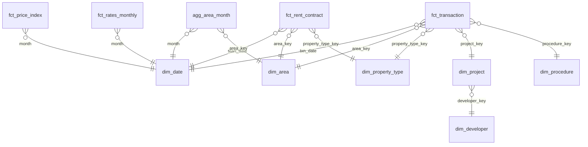

# 04 – Pipeline, Cleaning & Data Quality

## 1. Ingestion (raw files → PostgreSQL bronze)

| Step | Script | Detail |
|---|---|---|
| Database setup | `make db` → `sql/00_create_database.sql`, `sql/01_schemas_grants.sql` | UTF-8 database `dubai_property`; roles `dpa_owner` (pipeline) and `pbi_reader` (read-only on `rpt`); schemas `bronze`, `silver`, `gold`, `ml`, `rpt` |
| Bulk + incremental DLD files | `ingest/load_bronze.py` (`make bronze`) | For each CSV in a registered dataset folder (`config.DATASETS`): SHA-256 → skip if already in `bronze._load_manifest`; Python pre-pass (BOM, encoding, header, **record count with a CSV parser**); create the bronze table from the header with **every column as `text`**; stream the raw bytes with psycopg `COPY … FROM STDIN (FORMAT csv, HEADER true)`; commit only if COPY rows = parser records; `ANALYZE`; export `data/raw/manifest.json`. Then `quality/reconcile.py` re-checks live bronze counts per file |
| DLD increments | `ingest/download_dld_increment.py` | **Deferred (stub) for v1**, see Decisions. Refresh by dropping a new bulk snapshot into `data/raw/dld/<dataset>/` |
| Rates / macro | `ingest/download_rates.py` (`make download`) | FRED (`FEDFUNDS`, `DCOILBRENTEU`) via the CSV endpoint → dated snapshots in `data/raw/fred/<series>/`; EIBOR from CSVs placed in `data/raw/cbuae/` (skipped with a log message if none); loaded to `bronze.rates_fedfunds`, `rates_brent`, `rates_eibor` by `load_bronze` |
| Profiling | `quality/profile.py`, `quality/investigate.py` (`make profile`) | SQL-only column profiles → `reports/profile_<table>.md`; Phase 1 investigations → `reports/phase1_evidence.md` |
| Sample | `ingest/sample.py` (`make sample`) | 2% of deals/contracts per year × area stratum, whole groups, deterministic (`md5(key)` order) → `data/sample/`, loadable with `make bronze BRONZE_ROOT=data/sample` |

**Bronze rules (load only, no transformation)**
- Tables: `bronze.dld_transactions`, `bronze.dld_rent_contracts`, `bronze.dld_projects`, … Column names are snake_cased from the header; values untouched (`text`). DLD quotes every field, so missing values arrive as `''`, not `NULL`: staging applies `nullif(col, '')`.
- Encoding: the database is UTF-8. Detect and strip a UTF-8 BOM; if a file isn't UTF-8, convert it on the fly and log that.
- Metadata: `_source_file` (path relative to `data/`, e.g. `raw/dld/rents/…csv`), `_source` (bulk / increment / fred / cbuae), `_snapshot_date` (from the file name, else mtime), `_ingested_at`, `_row_hash` (md5 of the row's values, a stored generated column; see Decisions).
- Append-only: re-loading the same file is a no-op (manifest check). New snapshots are appended, and de-duplication happens in silver (C1).
- Log to `reports/ingest_log.csv`: file, status (loaded / skipped / disabled / failed), encoding, rows_in_file, rows_loaded, rows_match, inspect and COPY seconds, rows/s.
- Schema drift (a new or missing column in a later snapshot) fails the load loudly; it is never altered silently.

## 2. Cleaning rules (dbt → silver)

| # | Field | Issue | Rule | Model |
|---|---|---|---|---|
| C1 | Transaction key | Duplicates across snapshots | Cast types here (dates: check `dd-mm-yyyy` vs ISO; AED and area to numeric). De-duplicate on `transaction_id` + procedure + `_row_hash` keeping the latest `_snapshot_date` (`row_number()` window); test uniqueness on the chosen key | `stg_transactions` |
| C2 | `procedure_name_en` | ~40+ procedure types | Map via `seed_procedure_map` → `procedure_category`, `is_market_sale` | `stg_transactions` |
| C3 | Gifts, inheritance, grants | Not arm's-length prices | Exclude from all price, index, yield and AVM models (keep them for volume stats) | `int_market_sales` |
| C4 | `actual_worth` | AED 1–1,000 values; AED 600M+ bulk deals | Flag `price_invalid` if < AED 50k (unit) or price/sq m outside the area-level P0.5–P99.5 band; flag `bulk_deal` if a transaction spans multiple units | `int_market_sales` |
| C5 | `procedure_area` | < 0.01 sq m; implausible sizes | Units: valid 15–3,000 sq m; villas up to 10,000; land treated separately; otherwise flag | `int_market_sales` |
| C6 | `price_per_sqm` | Provided vs computed disagree | Recompute `actual_worth / procedure_area`; flag if > 5% off the provided `meter_sale_price` | `int_market_sales` |
| C7 | `rooms_en` | Mixed labels | Map via `seed_rooms_map` → `bedrooms` (Studio = 0), `is_penthouse`, `is_commercial_unit` | `stg_transactions` |
| C8 | Area names | Spelling variants, renamed communities | Standardise via `area_id` + `seed_area`; name drift tested | `stg_transactions` |
| C9 | Project/building missing | 11–18% null | Keep as "Unknown"; flag `has_project` | `stg_transactions` |
| C10 | Mortgage rows | `actual_worth` meaning | Per the Phase 1 finding: if it's the loan amount, expose `mortgage_amount`; otherwise treat as count-only | `int_mortgages` |
| C11 | Rent: multi-unit contracts | Amount repeated per line | Where `no_of_prop > 1`, allocate `annual_amount / no_of_prop`, or keep single-property contracts only for yield (decide, document, test) | `int_rent_contracts` |
| C12 | Rent: annualisation | Contracts shorter or longer than 12 months | Use `annual_amount`; if missing, `contract_amount × 365 / contract_days` | `int_rent_contracts` |
| C13 | Rent: renewals vs new | Renewals lag the market | Keep `contract_reg_type`; market rent analysis defaults to **new** contracts | `int_rent_contracts` |
| C14 | Rent outliers | AED 0 or extreme per sq m | Same P0.5–P99.5 banding by area × sub-type | `int_rent_contracts` |
| C15 | Commercial vs residential | Mixed | `property_usage` filter. The core analysis is **residential**; commercial is a secondary view | marts |

Every flag is kept as a column (never silently deleted), and `reports/dq_report.md` shows rows affected per rule.

## 3. Gold star schema

| Table | Grain | ~Rows | Key columns |
|---|---|---|---|
| `fct_transaction` (indexed: txn_date, area_key, is_market_sale) | Transaction line | ~1.5–1.8M | ids, keys, trans_group, procedure_category, is_market_sale, is_offplan, bedrooms, area_sqm, price_aed, price_per_sqm, mortgage_amount, quality flags, **avm_value, avm_gap_pct**, model_set |
| `fct_rent_contract` | Contract line (de-duplicated) | 10M+ | keys, is_new, annual_rent_aed, rent_per_sqm, area_sqm, bedrooms, tenant_type. Indexed on start_date, area_key; **not exposed to Power BI in detail** |
| `agg_rent_month` | Area × month × sub-type × bedrooms × new/renewal × usage | ~300–600K | contracts, median_annual_rent, median_rent_per_sqm, total_annual_rent. The rent table Power BI uses |
| `agg_area_month` | Area × month × sub-type × bedrooms × offplan flag | ~200–400K | sales_count, sales_value, median_ppsqm, mortgage_count, new_rent_count, median_rent_per_sqm |
| `agg_yield_quarter` | Area × quarter × sub-type × bedrooms | ~50K | median_price, median_annual_rent, gross_yield, sample sizes (min-n rule) |
| `fct_price_index` | Month × segment (Dubai, zone, top areas, apartment/villa) | ~20K | index_value, yoy, drawdown_from_peak, volatility_12m |
| `fct_rates_monthly` | Month | ~270 | eibor_3m, fed_funds, brent |
| `ml_avm_performance` | Model × segment × metric | small | MdAPE, hit rate ±10/±20, R² |
| `ml_feature_importance` | Model × feature | ~40 | mean_abs_shap, rank |
| `ml_stress_grid` | Area × shock % × LTV % | ~50K | purchases, negative-equity count/share, AED at risk |
| `ml_forecast` | Segment × month (history + 12 months ahead) | ~5K | actual, forecast, lower, upper, scenario |
| `dim_date` | **Day** | ~9K | Day grain for Power BI time intelligence |
| `rpt.*` views | One per table Power BI needs | — | Friendly names, only needed columns, `_ar` and raw flags excluded. The **only** objects Power BI reads |
| `dim_area` | Area | ~200+ | name, zone, lat/long |
| `dim_property_type` | Type × sub-type × usage | small | |
| `dim_project` / `dim_developer` | Project / developer | ~few K | status, completion date, developer |
| `dim_procedure` | Procedure | ~50 | group, category, is_market_sale |

## 4. Data-quality tests

| Level | Test |
|---|---|
| Keys | `unique`/`not_null` on PKs; `relationships` from facts to dims |
| Domains | `accepted_values` for trans_group, reg_type, procedure_category, bedrooms 0–10 |
| Ranges (`dbt_expectations`) | price_per_sqm between the per-area bands for clean sales; area_sqm in valid ranges; dates 2004 → today |
| Reconciliation | Row counts and Σ AED: bronze → silver → gold, with every exclusion accounted for |
| Volume anomalies | Monthly sales per area within ±5σ of the rolling mean (warn, not fail) |
| Rent de-duplication | Σ annual rent after allocation ≤ raw Σ; singular test on multi-line contracts |
| Yield sanity | Gross yields between 2% and 15% for segments with n ≥ 20 (warn) |
| Model outputs | avm_value > 0; stress shares ∈ [0, 1] |
| Leakage (pytest) | AVM features use only data available at transaction time (docs/05) |

## 5. Orchestration

The `Makefile` runs the steps in order: `db (once) → download → bronze → dbt build (pre-ML) → train → score → dbt build --select tag:post_ml (incl. rpt views) → test`. Incremental runs use `make update`, which pulls the latest month and rebuilds.

## 6. Decisions

| Date | Decision | Why |
|---|---|---|
| 2026-09-30 | **Load manifest lives in `bronze._load_manifest`**, written in the same transaction as each file's COPY. `data/raw/manifest.json` is exported from it | A JSON file can't be atomic with the database: a crash between COPY and the JSON write would leave the file loaded but unrecorded (or the reverse). The JSON is kept for humans and diffs, as docs/03 specifies |
| 2026-09-30 | **Raw bytes stream straight into COPY**; a separate Python `csv` pass counts records | Postgres's parser does the load, and Python's parser is an independent check. The file commits only if both agree. Faster than parsing rows in Python and re-serialising them |
| 2026-09-30 | **Per-file metadata is set via temporary column DEFAULTs** inside the load transaction | COPY can only fill columns from the file. Defaults keep it a single pass: the alternatives are a temp table plus INSERT (writes 5.9 GB twice) or an UPDATE (rewrites every row) |
| 2026-09-30 | **`_row_hash` = md5 of the row's values**, not of the raw line | It's computed by Postgres as a stored generated column during COPY, and it serves the same purpose (C1 de-duplication of identical rows across snapshots). NULL and `''` hash differently |
| 2026-09-30 | **Table names follow docs/04** (`bronze.dld_transactions`, `bronze.dld_rent_contracts`, `bronze.rates_*`), mapped from folder names in `config.DATASETS` | Folder names (`rents/`) are short. Table names say what the data is |
| 2026-09-30 | **`transactions_increment/` is disabled for v1**; `download_dld_increment.py` is a stub | The portal export has a 22-column schema whose IDs don't match the bulk `transaction_id`, and the bulk snapshot already covers it (to 2026-09-25). Revisit at the first monthly refresh |
| 2026-09-30 | **EIBOR is a manual download**; the pipeline skips it when absent | CBUAE has no stable CSV endpoint. Fed Funds is the fallback rate driver (AED/USD peg) |
| 2026-09-30 | **Seed keys: (trans_group, procedure_id)** | Six lease-to-own codes are registered under both Sales and Mortgages with different values (reports/phase1_findings.md §1) |
| 2026-09-30 | **Mortgage `actual_worth` = loan amount** for Mortgage Registration / Delayed Mortgage (C10) | Median 0.795 of the same-day sale price, following the CBUAE LTV caps (phase1_findings §2) |
| 2026-09-30 | **Repeated deal values are flagged, not split**: new flag `is_repeated_deal_value` (rule in `quality/investigate.py`); AED totals count each group's value once | The bulk file doesn't mark portfolio groups; a naive Σ overstates mortgages by AED 130.9bn (phase1_findings §2b) |
| open | **C11 rent allocation**: recommended single-line contracts only for market rent / yields; multi-line contracts kept with `annual_amount / lines` and `is_multi_unit` | 100% of multi-line contracts repeat the full amount per line; a naive Σ is 5.24× (phase1_findings §3). To confirm in Phase 2 |
| open | **CI data**: `data/sample/` is gitignored (CLAUDE.md: never commit `data/`), so CI tests use synthetic fixtures built in `tmp_path`. For Phase 2 `dbt build` in CI, either commit a small sample (a smaller fraction than the 2% dev sample, a few MB; CC BY 4.0 allows it with attribution) under a gitignore exception, or keep generating synthetic seed data | Needs the owner's call because it changes a CLAUDE.md rule |
