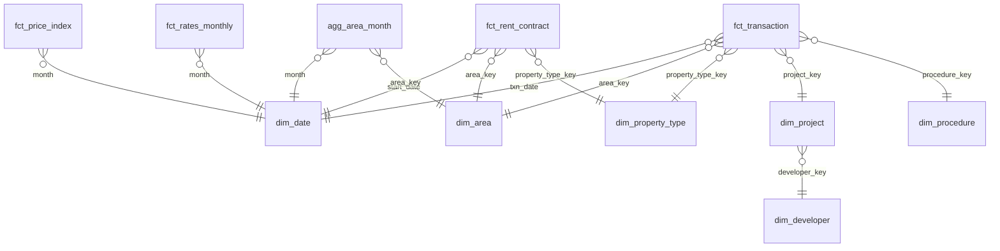

# 04 – Pipeline, Cleaning & Data Quality

## 1. Ingestion (raw files → PostgreSQL bronze)

| Step | Script | Detail |
|---|---|---|
| Database setup | `make db` → `sql/00_create_database.sql`, `sql/01_schemas_grants.sql` | UTF-8 database `dubai_property`; roles `dpa_owner` (pipeline) and `pbi_reader` (read-only on `rpt`); schemas `bronze`, `silver`, `gold`, `ml`, `rpt` |
| Bulk + incremental DLD files | `ingest/load_bronze.py` (`make bronze`) | For each CSV in a registered dataset folder (`config.DATASETS`): SHA-256 → skip if already in `bronze._load_manifest`; Python pre-pass (BOM, encoding, header, **record count with a CSV parser**); create the bronze table from the header with **every column as `text`**; stream the raw bytes with psycopg `COPY … FROM STDIN (FORMAT csv, HEADER true)`; commit only if COPY rows = parser records; `ANALYZE`; export `data/raw/manifest.json`. Then `quality/reconcile.py` re-checks live bronze counts per file |
| DLD increments | `ingest/download_dld_increment.py` | **Deferred (stub) for v1**, see Decisions. Refresh by dropping a new bulk snapshot into `data/raw/dld/<dataset>/` |
| Rates / macro | `ingest/download_rates.py` (`make download`) | FRED (`FEDFUNDS`, `DCOILBRENTEU`) via the CSV endpoint → dated snapshots in `data/raw/fred/<series>/`; EIBOR from CSVs placed in `data/raw/cbuae/` (skipped with a log message if none); loaded to `bronze.rates_fedfunds`, `rates_brent`, `rates_eibor` by `load_bronze` |
| Profiling | `quality/profile.py`, `quality/investigate.py` (`make profile`) | SQL-only column profiles → `reports/profile_<table>.md`; Phase 1 investigations → `reports/phase1_evidence.md` |
| Sample | `ingest/sample.py` (`make sample`) | 2% of deals/contracts per year × area stratum, whole groups, deterministic (`md5(key)` order) → `data/sample/`, loadable with `make bronze BRONZE_ROOT=data/sample` |

**Bronze rules (load only, no transformation)**
- Tables: `bronze.dld_transactions`, `bronze.dld_rent_contracts`, `bronze.dld_projects`, … Column names are snake_cased from the header; values untouched (`text`). DLD quotes every field, so missing values arrive as `''`, not `NULL`: staging applies `nullif(col, '')`.
- Encoding: the database is UTF-8. Detect and strip a UTF-8 BOM; if a file isn't UTF-8, convert it on the fly and log that.
- Metadata: `_source_file` (path relative to `data/`, e.g. `raw/dld/rents/…csv`), `_source` (bulk / increment / fred / cbuae), `_snapshot_date` (from the file name, else mtime), `_ingested_at`, `_row_hash` (md5 of the row's values, a stored generated column; see Decisions).
- Append-only: re-loading the same file is a no-op (manifest check). New snapshots are appended, and de-duplication happens in silver (C1).
- Log to `reports/ingest_log.csv`: file, status (loaded / skipped / disabled / failed), encoding, rows_in_file, rows_loaded, rows_match, inspect and COPY seconds, rows/s.
- Schema drift (a new or missing column in a later snapshot) fails the load loudly; it is never altered silently.

## 2. Cleaning rules (dbt → silver)

Silver = `stg_*` views (typing, C1, seeds) and `int_*` tables (flags). Thresholds are dbt vars in `dbt/dbt_project.yml`. Rows affected per rule: `reports/dq_report.md` (`make dq`).

| # | Field | Issue | Rule | Model |
|---|---|---|---|---|
| C1 | Transaction / contract-line key | Duplicates across snapshots | Typing happens here: `nullif(trim(x), '')` before every cast; numbers cast directly (a failure means the format changed), dates through `safe_iso_date` (ISO only, `pg_input_is_valid`). De-duplicate with `row_number()` over `transaction_id` (rents: `contract_id, line_number`), keeping the latest `_snapshot_date`. The only rule that removes rows | `stg_transactions`, `stg_rent_contracts` |
| C2 | `procedure_name_en` | 58 (group, procedure) pairs | Map via `seed_procedure_map`, keyed on **(trans_group, procedure_id)** → `procedure_category` (market_sale, offplan_sale, mortgage, lease_to_own, gift, development, inheritance, other), `is_market_sale`, `is_lease_to_own`, `is_new_mortgage` (individual), `is_portfolio_mortgage`, `amount_is_loan`. An unmapped procedure fails a not_null test | `stg_transactions` |
| C3 | Gifts, inheritance, grants, development | Not arm's-length prices | `is_market_sale = false`; the rows stay in `int_market_sales` for volume counts and are excluded from `is_clean_market_sale` | `int_market_sales` |
| C4 | `actual_worth` | AED 1–1,000 values; AED bn portfolio deals | `is_price_below_floor` (< AED 50k); `is_ppsqm_outlier`: price per sq m outside P0.5–P99.5 of clean market sales by **area × property type** (n ≥ 20, else the property type's Dubai-wide band); `is_price_invalid` = either. The planned `bulk_deal` flag is implemented as C16 | `int_market_sales` |
| C5 | `procedure_area` | < 0.01 sq m; implausible sizes | `is_area_invalid`: units outside 15–3,000 sq m, villas outside 15–10,000, land and buildings under 1 sq m, or no area | `int_market_sales` |
| C6 | `price_per_sqm` | Provided vs computed disagree | `price_per_sqm_aed = actual_worth / area`; `is_ppsqm_mismatch` if > 5% off a non-zero `meter_sale_price` | `int_market_sales` |
| C7 | `rooms_en` | Mixed labels | `seed_rooms_map` → `bedrooms` (Studio = 0), `room_class`, `is_penthouse`, `is_commercial_unit`. Every label in the data must be mapped (test) | `stg_transactions` |
| C8 | Area names | Spelling variants, renamed communities | `seed_area` (all 265 area IDs) → canonical `area_name`, `zone`; source name kept in `area_name_source`; drift is a warn test | `stg_*` |
| C9 | Project/building missing | 26% of transactions | NULL kept, `has_project` flag; gold labels it "Unknown" | `stg_transactions` |
| C10 | Mortgage rows | `actual_worth` meaning | `mortgage_amount_aed = actual_worth` only where `amount_is_loan` (Mortgage Registration, Delayed Mortgage); NULL for pre-registration, modify, transfer, portfolio, development, lease finance and lease-to-own (count only). `mortgage_amount_once_aed` counts portfolio loans once (C16) | `int_mortgages` |
| C11 | Rent: multi-unit contracts | Amount repeated per line | **Option 1:** `line_count` = lines counted (not `no_of_prop`), `is_multi_unit`, `annual_rent_alloc_aed = annual rent / line_count` (the only rent column to SUM). Market rent and yields use single-line contracts only. Tests: allocations sum to the contract amount; line numbers 1..n; Σ allocated ≤ naive Σ | `int_rent_contracts` |
| C12 | Rent: annualisation | Contracts shorter or longer than 12 months | `annual_rent_contract_aed` = `annual_amount`; if missing, `contract_amount × 365 / contract_days` | `int_rent_contracts` |
| C13 | Rent: renewals vs new | Renewals lag the market | `contract_reg_type`, `is_new`; `is_market_rent` requires a new contract | `int_rent_contracts` |
| C14 | Rent outliers | AED 0 or extreme per sq m | `is_rent_below_floor` (allocated < AED 1,000); `is_rent_outlier` also when rent per sq m (or, with no usable area, annual rent) is outside P0.5–P99.5 by **area × Ejari sub-type** (n ≥ 20, else the sub-type's Dubai-wide band), fitted on single-line, market-type contracts | `int_rent_contracts` |
| C15 | Commercial vs residential | Mixed | `is_residential` helper in silver; the residential filter is applied in marts | marts |
| C16 | `actual_worth` on portfolio deals | One deal value repeated on every unit line (Phase 1 §2b) | The Phase 1 `REPEATED_VALUE_GROUP` rule in SQL: same group, procedure, date, value, ID-year; ≥ 2 lines; ID span ≤ 2 × lines; sizes differ > 10% → `is_repeated_deal_value`, `deal_group_id` (lead line's id), `actual_worth_once_aed` (value on the lead line, 0 on the rest). Same pattern with sizes within 10% → `is_similar_size_batch` + `batch_group_id`, **not** corrected. Reconciled to the Phase 1 SQL on any data and to the Phase 1 figures on the Phase 1 snapshot | `int_transaction_deal_groups` → `int_market_sales`, `int_mortgages` |
| C17 | Lease-to-own | One deal registered as a Sales leg and a Mortgages leg | `is_lease_to_own`; the Sales leg has `is_market_sale = false` (volume counts only), the Mortgages leg is financing | seed, `int_*` |
| C18 | Dates | 4 Hijri dates, 18,208 pre-2004 rows; rent dates up to year 5013 | Transactions: `is_date_invalid` (unparseable, year < 1900, after the extract; `txn_date` NULL, raw text kept), `is_pre_2004`. Rents: `is_date_invalid` (start unparseable or > 1 year after the extract), `is_pre_2004`, `is_end_date_implausible` (end missing, before start, or > 10 years) | `stg_transactions`, `int_rent_contracts` |
| C19 | `property_usage_en` | Label `أخرى` in the EN column (6,322 rows) | Mapped to `Other`; test: no Arabic script in the column | `stg_transactions` |
| C20 | Rent property type | Virtual units (flexi-desks), labour camps and bed-spaces aren't market rents | `is_non_market_property_type` (bus type `Virtual Unit`, type `Labor Camps`, sub-type `Room in labor Camp` / `Labor Camp`); excluded from `is_market_rent` and the C14 bands | `int_rent_contracts` |
| C21 | Rent `actual_area` | Blank / 0 / 1 sq m placeholders (1.55M lines) | `area_sqm` NULL and `is_area_placeholder`; no `rent_per_sqm_aed` | `int_rent_contracts` |
| C22 | Rent bedrooms | Bedrooms are only in the Ejari sub-type label | `seed_rent_subtype_map` → `bedrooms` (Studio = 0) for residential layouts | `stg_rent_contracts` |

Every flag is kept as a column (never silently deleted), and `reports/dq_report.md` shows rows affected per rule.

## 3. Gold star schema

| Table | Grain | ~Rows | Key columns |
|---|---|---|---|
| `fct_transaction` (indexed: txn_date, area_key, is_market_sale) | Transaction line | ~1.5–1.8M | ids, keys, trans_group, procedure_category, is_market_sale, is_offplan, bedrooms, area_sqm, price_aed, price_per_sqm, mortgage_amount, quality flags, **avm_value, avm_gap_pct**, model_set |
| `fct_rent_contract` | Contract line (de-duplicated) | 10M+ | keys, is_new, annual_rent_aed, rent_per_sqm, area_sqm, bedrooms, tenant_type. Indexed on start_date, area_key; **not exposed to Power BI in detail** |
| `agg_rent_month` | Area × month × sub-type × bedrooms × new/renewal × usage | ~300–600K | contracts, median_annual_rent, median_rent_per_sqm, total_annual_rent. The rent table Power BI uses |
| `agg_area_month` | Area × month × sub-type × bedrooms × offplan flag | ~200–400K | sales_count, sales_value, median_ppsqm, mortgage_count, new_rent_count, median_rent_per_sqm |
| `agg_yield_quarter` | Area × quarter × sub-type × bedrooms | ~50K | median_price, median_annual_rent, gross_yield, sample sizes (min-n rule) |
| `fct_price_index` | Month × segment (Dubai, zone, top areas, apartment/villa) | ~20K | index_value, yoy, drawdown_from_peak, volatility_12m |
| `fct_rates_monthly` | Month | ~270 | eibor_3m, fed_funds, brent |
| `ml_avm_performance` | Model × segment × metric | small | MdAPE, hit rate ±10/±20, R² |
| `ml_feature_importance` | Model × feature | ~40 | mean_abs_shap, rank |
| `ml_stress_grid` | Area × shock % × LTV % | ~50K | purchases, negative-equity count/share, AED at risk |
| `ml_forecast` | Segment × month (history + 12 months ahead) | ~5K | actual, forecast, lower, upper, scenario |
| `dim_date` | **Day** | ~9K | Day grain for Power BI time intelligence |
| `rpt.*` views | One per table Power BI needs | — | Friendly names, only needed columns, `_ar` and raw flags excluded. The **only** objects Power BI reads |
| `dim_area` | Area | ~200+ | name, zone, lat/long |
| `dim_property_type` | Type × sub-type × usage | small | |
| `dim_project` / `dim_developer` | Project / developer | ~few K | status, completion date, developer |
| `dim_procedure` | Procedure | ~50 | group, category, is_market_sale |

## 4. Data-quality tests

| Level | Test |
|---|---|
| Keys | `unique`/`not_null` on PKs; `relationships` from facts to dims |
| Domains | `accepted_values` for trans_group, reg_type, procedure_category, bedrooms 0–10 |
| Ranges (`dbt_expectations`) | price_per_sqm between the per-area bands for clean sales; area_sqm in valid ranges; dates 2004 → today |
| Reconciliation | Row counts and Σ AED: bronze → silver → gold, with every exclusion accounted for. Silver: `dbt/tests/reconciliation/` (row partitions; AED once per deal/contract vs the Phase 1 SQL on any data, and vs the Phase 1 figures on the Phase 1 snapshot) |
| Volume anomalies | Monthly sales per area within ±5σ of the rolling mean (warn, not fail) |
| Rent de-duplication | Σ annual rent after allocation ≤ raw Σ; allocations sum to each contract's amount; line numbers 1..n (`dbt/tests/rules/c11_*`) |
| Yield sanity | Gross yields between 2% and 15% for segments with n ≥ 20 (warn) |
| Model outputs | avm_value > 0; stress shares ∈ [0, 1] |
| Leakage (pytest) | AVM features use only data available at transaction time (docs/05) |

## 5. Orchestration

The `Makefile` runs the steps in order: `db (once) → download → bronze → dbt build (pre-ML) → train → score → dbt build --select tag:post_ml (incl. rpt views) → test`. Incremental runs use `make update`, which pulls the latest month and rebuilds.

## 6. Decisions

| Date | Decision | Why |
|---|---|---|
| 2026-09-30 | **Load manifest lives in `bronze._load_manifest`**, written in the same transaction as each file's COPY. `data/raw/manifest.json` is exported from it | A JSON file can't be atomic with the database: a crash between COPY and the JSON write would leave the file loaded but unrecorded (or the reverse). The JSON is kept for humans and diffs, as docs/03 specifies |
| 2026-09-30 | **Raw bytes stream straight into COPY**; a separate Python `csv` pass counts records | Postgres's parser does the load, and Python's parser is an independent check. The file commits only if both agree. Faster than parsing rows in Python and re-serialising them |
| 2026-09-30 | **Per-file metadata is set via temporary column DEFAULTs** inside the load transaction | COPY can only fill columns from the file. Defaults keep it a single pass: the alternatives are a temp table plus INSERT (writes 5.9 GB twice) or an UPDATE (rewrites every row) |
| 2026-09-30 | **`_row_hash` = md5 of the row's values**, not of the raw line | It's computed by Postgres as a stored generated column during COPY, and it serves the same purpose (C1 de-duplication of identical rows across snapshots). NULL and `''` hash differently |
| 2026-09-30 | **Table names follow docs/04** (`bronze.dld_transactions`, `bronze.dld_rent_contracts`, `bronze.rates_*`), mapped from folder names in `config.DATASETS` | Folder names (`rents/`) are short. Table names say what the data is |
| 2026-09-30 | **`transactions_increment/` is disabled for v1**; `download_dld_increment.py` is a stub | The portal export has a 22-column schema whose IDs don't match the bulk `transaction_id`, and the bulk snapshot already covers it (to 2026-09-25). Revisit at the first monthly refresh |
| 2026-09-30 | **EIBOR is a manual download**; the pipeline skips it when absent | CBUAE has no stable CSV endpoint. Fed Funds is the fallback rate driver (AED/USD peg) |
| 2026-09-30 | **`seed_procedure_map` keyed on (trans_group, procedure_id)**, 58 rows, categories market_sale, offplan_sale, mortgage, lease_to_own, gift, development, other, and **inheritance kept but empty** (listed in `seed_procedure_category`) | Six lease-to-own codes are registered under both Sales and Mortgages (phase1_findings §1). No inheritance procedure exists in this extract, but a future snapshot needs somewhere to land. An unmapped procedure fails a not_null test instead of slipping through |
| 2026-09-30 | **Market sales = Sell, Delayed Sell, Sale On Payment Plan (market_sale) and Sell - Pre registration (offplan_sale)** | They are the arm's-length transfers. Off-plan vs ready is still read from `reg_type` (it lines up exactly with the procedure: only Sell - Pre registration is Off-Plan) |
| 2026-09-30 | **Lease-to-own Sales leg: `is_lease_to_own`, `is_market_sale = false`** (C17), kept in `int_market_sales` for volume counts only; the Mortgages leg is financing | One deal is registered twice with different values (phase1_findings §1). Its "price" is a financed-lease figure, not an arm's-length sale price |
| 2026-09-30 | **C10: `amount_is_loan` only for Mortgage Registration and Delayed Mortgage**; `mortgage_amount_aed` NULL for pre-registration, Modify, Transfer, portfolio, development, lease finance and lease-to-own | Only these two are proven loans (median ratio 0.795 / 0.800 to the same-day sale price; phase1_findings §2). Pre-registration is 43% equal to the price |
| 2026-09-30 | **Mortgage share uses individual new mortgages only.** `is_new_mortgage` = Mortgage Registration, Delayed Mortgage, Mortgage Pre-Registration. The three portfolio registrations (Portfolio Mortgage Registration, its Pre-Registration, Delayed Portfolio Mortgage) get their own flag, `is_portfolio_mortgage`, and are reported separately: deals = `count(distinct deal_group_id)`, value = `portfolio_mortgage_value_once_aed` (once per deal, C16). Owner decision | A portfolio loan covers several units (often a developer or investor), so counting it in a per-purchase ratio would distort the share. Modifications and transfers aren't new loans; development mortgages are developer finance; lease finance (810) and lease-to-own stay out until their amounts are verified. Yearly inputs are in reports/dq_report.md §5 |
| 2026-09-30 | **C16 repeated deal values: the Phase 1 `REPEATED_VALUE_GROUP` rule in SQL**, with `deal_group_id` (lead line's id), `is_deal_group_lead` and `actual_worth_once_aed` (value on the lead line, 0 on the rest). Similar-size batches get their own flag (`is_similar_size_batch`, `batch_group_id`) and are **not** corrected | The bulk file doesn't mark portfolio groups; a naive Σ overstates mortgages by AED 130.9bn (phase1_findings §2b). Identical units at identical prices are real prices. Silver reproduces every Phase 1 figure exactly (reports/dq_report.md §4) |
| 2026-09-30 | **C11 option 1**: `is_multi_unit`, `line_count` (lines counted, not `no_of_prop`), `annual_rent_alloc_aed = annual rent / line_count`; market rent and yields use single-line contracts only; `rent_per_sqm_aed` only for single-line contracts | 100% of multi-line contracts repeat the full amount per line (5.24× inflation). A bulk lease isn't a like-for-like unit rent, and an equal split over units of different sizes isn't a unit's rent. Option 2 (split by area) fails on the 1.55M lines without a real area |
| 2026-09-30 | **Rents: C20 excludes Virtual Unit, Labor Camps and Room in labor Camp / Labor Camp from market rent**; C21 blank / 0 / 1 sq m area → no rent per sq m; C12 annualises only if `annual_amount` is missing (never, today) | Flexi-desks and bed-spaces are not market rents for a home or office. Placeholder areas would create absurd per-sq-m rents |
| 2026-09-30 | **Outlier bands (C4, C14) by area × property type (sales) / area × Ejari sub-type (rents)**, P0.5–P99.5, fitted on clean market rows; segments under the min-n rule (20) fall back to the type's Dubai-wide band | docs/04 said "area-level"; per sq m prices of land, villas and flats in one area differ by an order of magnitude, so an area-only band would flag the wrong rows. The fallback follows the min-n rule. Bands span 2004–2026; a 1% tail is wide enough that the price cycle doesn't flag whole years |
| 2026-09-30 | **C1 de-duplicates on the key alone** (`transaction_id`; `contract_id, line_number`), keeping the latest `_snapshot_date` | docs/04 had `_row_hash` in the key, which would keep two versions of a corrected row. The latest snapshot wins; `_row_hash` is only a tie-breaker. Today it removes 0 rows (one snapshot per table) |
| 2026-09-30 | **Casting: `nullif(trim(x), '')` before every cast; numbers cast directly, dates via `safe_iso_date`** (regex + `pg_input_is_valid`, PG 16+) | A non-numeric value would be a format change and should stop the build. Bad dates are known (Hijri years, year 5013) and become flags |
| 2026-09-30 | **Dates (C18): Hijri rows flagged `is_date_invalid` with `txn_date` NULL, not converted; 1900–2003 → `is_pre_2004`**. Rents: `is_date_invalid` = start unparseable or > 1 year after the extract; `is_end_date_implausible` = end missing, before start or > 10 years | phase1_findings §4. Contracts are often registered before they start, so only a start more than a year out is an error (100 lines, up to 2205). Leases over 10 years (401 lines) are keying errors or land leases, not market rents |
| 2026-09-30 | **C19: `property_usage_en = 'أخرى'` → `Other`** | EN/AR labels swapped for 6,322 rows (phase1_findings §5) |
| 2026-09-30 | **`seed_area` covers the 265 area IDs; zones assigned where certain, 42 left blank** (listed below) | Phase 1's "266" counted the blank `area_id` on 3 rent lines as a value; those lines keep `area_id` NULL. A wrong zone would silently mis-roll-up a thin segment, so uncertain areas stay blank for the owner |
| 2026-09-30 | **Structure: `int_transaction_deal_groups` → `int_market_sales` (Sales + Gifts) and `int_mortgages` (Mortgages)**; nothing is filtered after C1 | The C16 groups span all three groups, so they are computed once. The two outputs partition `stg_transactions` exactly (test `recon_transactions_partition`), so gold can union them |
| 2026-09-30 | **Reconciliation in two layers:** (1) method tests on any data recompute the Phase 1 SQL on bronze and require an exact match with silver; (2) figure tests compare with `seed_phase1_reconciliation`, gated on the Phase 1 snapshot's bronze row count | The CI fixtures can't reproduce AED 856.5bn, but they can prove the method; the full data proves the figures. A new snapshot turns (2) off automatically; update the seed then |
| 2026-09-30 | **CI data: commit `tests/fixtures/`** (~2k real DLD lines per table, CC BY 4.0 with attribution in its README), chosen by `make fixtures` to exercise every rule; CI runs `make bronze BRONZE_ROOT=tests/fixtures && make dbt` | Owner decision (CLAUDE.md updated). Synthetic data wouldn't contain the real edge cases (Hijri dates, portfolio groups, swapped labels) |
| 2026-09-30 | **`load_bronze --reset` drops with CASCADE** | After dbt has run, the silver views depend on bronze and a plain DROP fails. `make dbt` rebuilds the views |

### Areas without a zone

42 areas in `seed_area` have no zone yet: the assignment wasn't certain, and a wrong zone would silently mis-roll-up a thin segment. The worksheet is **`reports/unzoned_areas.md`** (`make unzoned`): market sales since 2020, top master projects and projects, and an empty zone column. It is sorted by volume; six areas matter (Me'Aisem First, Al Yelayiss 1, Bukadra, Me'Aisem Second, Ghadeer Al tair, Al Yelayiss 5), and most of the rest have no recent market sales. Fill the zones into `dbt/seeds/seed_area.csv` and run `make dbt`.
