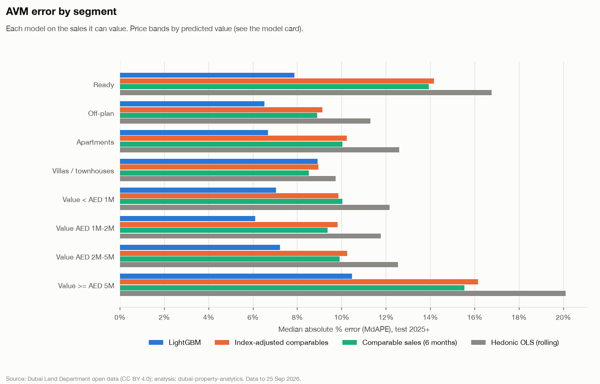
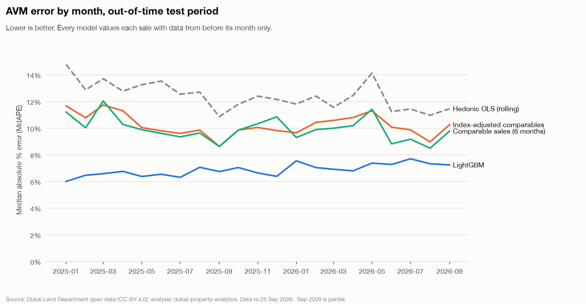
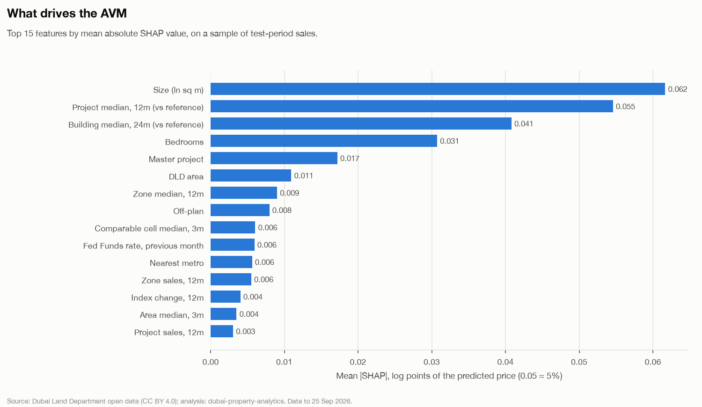
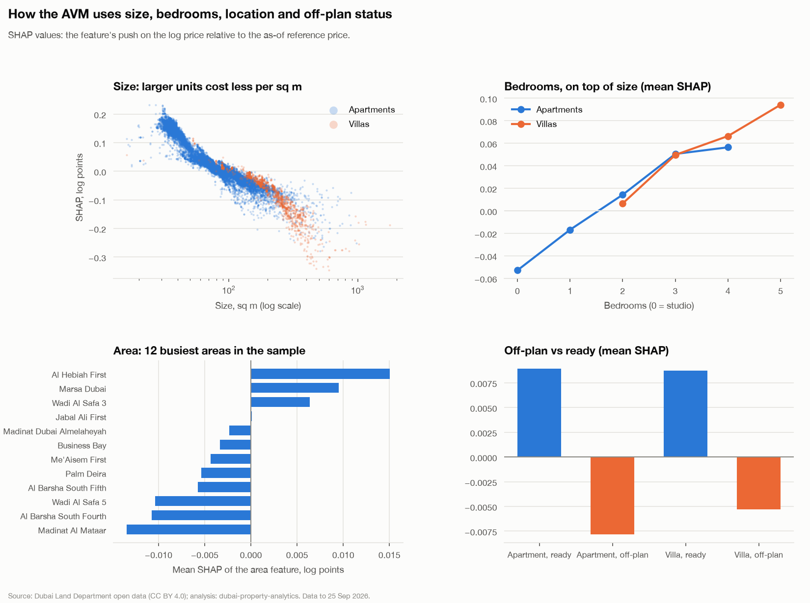
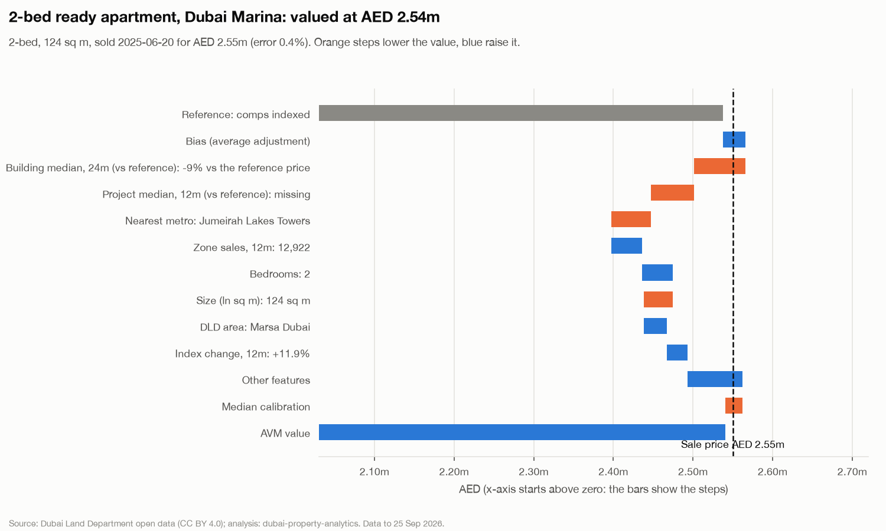
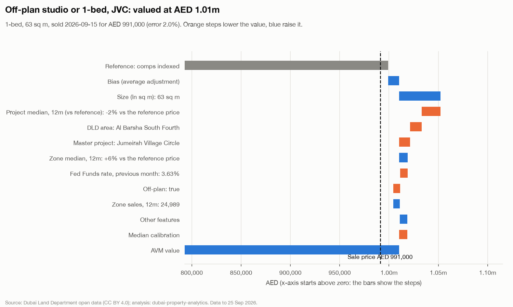
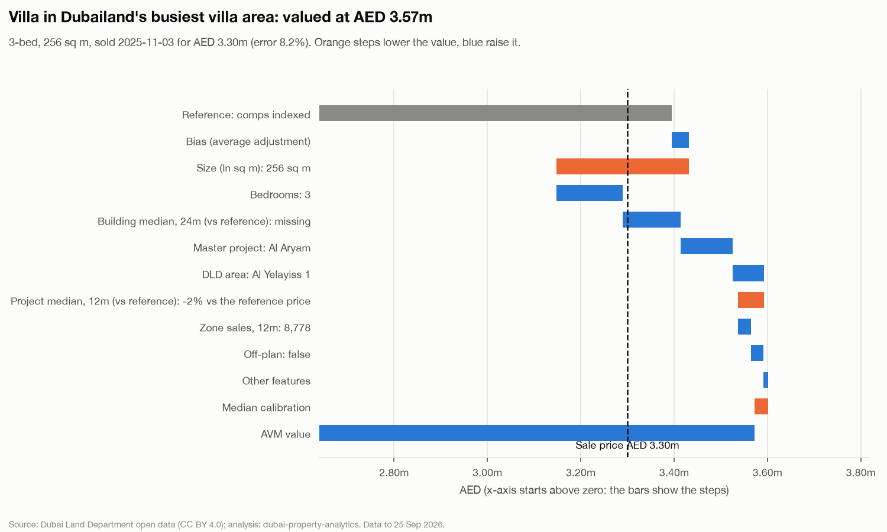
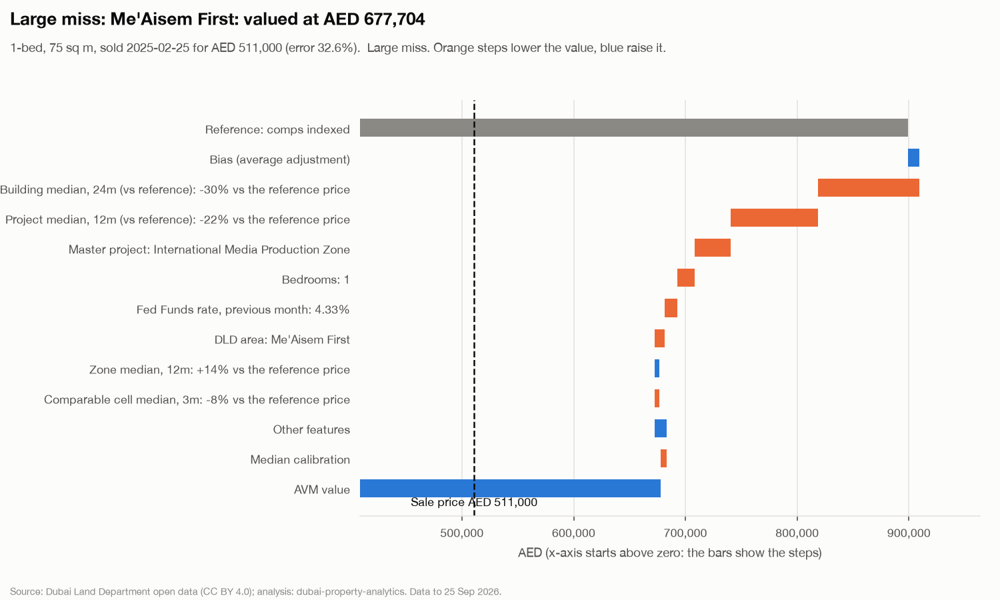
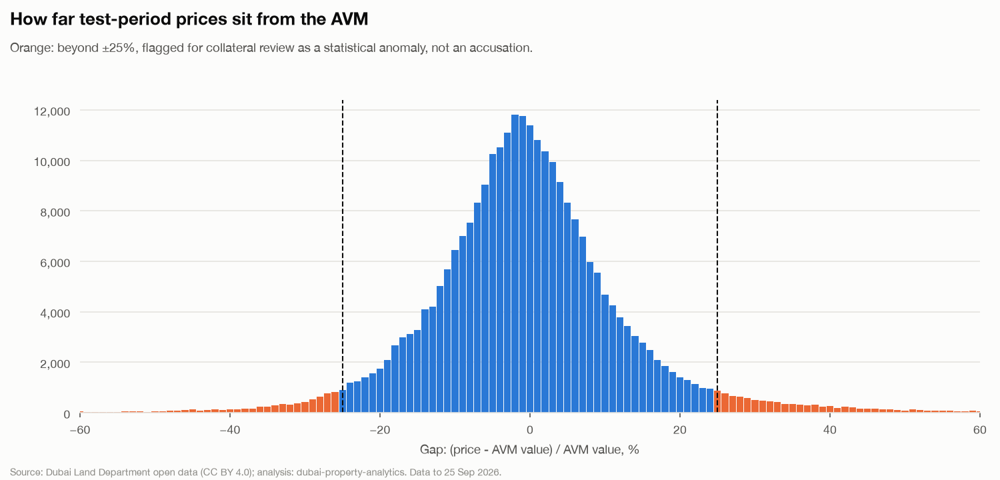

# AVM model card

Phase 4b (docs/05 §1). Automated valuation model for Dubai residential sales: what a unit was worth on the day it sold, from what was known before that day.

- **Data:** clean residential market sales to the snapshot date, **25 Sep 2026**. Model `avm-lgbm-v1`, fitted 2026-10-01 19:37.
- **Tables:** `ml.avm_score`, `ml.avm_performance`, `ml.feature_importance`; Power BI views `rpt.avm_score`, `rpt.avm_performance`, `rpt.feature_importance`.
- **Regenerate:** `make train score model-reports`. Code: `src/dubai_property/features/`, `models/avm.py`, `avm_eval.py`, `avm_explain.py`; this card: `models/report_avm.py`.
- **Intended use:** collateral screening for a bank's mortgage book and market analytics. Not a RICS valuation, not lending advice; the review flag marks statistical anomalies, not wrongdoing.

## Summary

1. **LightGBM values 65% of 2025–26 sales within ±10% (MdAPE 6.8%)**, against 50% (MdAPE 9.9%) for the comparable-sales baseline and 50% (10.1%) for index-adjusted comparables. Out of time: trained to 2023, tuned on 2024, never shown 2025+. ([chart](figures/avm_accuracy_by_segment.png))
2. **Head to head** on the 271,974 test sales every model can value: MdAPE 6.8% LightGBM vs 9.9% comparables vs 10.1% index-adjusted. Coverage: LightGBM 100.0%, comparables 98.6%.
3. **Index-adjusted comparables did not beat plain comparables** (MdAPE 10.13% vs 9.90%). The adjustment does its job: it removes the lag bias of a 12-month window (raw 12-month comparables under-value by a median ~3%, adjusted ones by ~0.5%). The likely reason it still loses is that six months of raw comparables carry only ~2% of drift, small next to the ~10% unit-to-unit spread, while the extra six older months bring in sales less like today's that no index can align; and at the 2026 turn the zone-level real-time index misjudged how individual cells moved. It edged ahead in rising 2025 and fell behind in 2026 (figures from the 2026-10-01 decomposition in docs/05 §8).
4. **On villas, comparables are slightly better than LightGBM on MdAPE** (on the 20,527 test villas both can value, MdAPE 8.66% LightGBM vs 8.51% comparables; ±20%: 84.6% vs 81.5%). LightGBM's edge is in the tails, and its 8.9% on all villas includes 1,283 villas with too few comparables to value. The likely reason: villa communities repeat a few layouts, so the cell median (area × bedrooms × off-plan) is already a close match, and villas are about one in eight training sales, so the shared model's splits are shaped mostly by apartments.
5. **Accuracy by month** ranges from 6.0% (2025-01) to 7.7% (2026-07); see the table below for the 2026 slowdown months. ([chart](figures/avm_accuracy_by_month.png))
6. **What drives it:** Size (ln sq m), Project median, 12m (vs reference), Building median, 24m (vs reference). The model mostly asks *where in the market this unit's project and building trade* relative to the comparables. ([chart](figures/avm_shap_importance.png))
7. **Review flags:** 18,740 of 275,702 test-period sales (6.8%) sit more than 25% from the AVM (11,366 above, 7,374 below). Statistical anomalies for a collateral review, not accusations. ([chart](figures/avm_gap_distribution.png))
8. **No sign of leakage:** test MdAPE and hit rates are within the range of production AVMs, far from the alarm thresholds (MdAPE < 3% or ±10% > 90%), and a pytest proves no feature of a month-M sale changes when every sale from M on is rewritten.

## Data and split

**Population:** `is_clean_market_sale` (arm's-length market sales without a C3–C6 / C16 / C18 quality flag) apartments and villas / townhouses, within the class area cap; villas with a known bedroom count only (the index's basis: bedroom-less villa areas are plots, findings F3.1).

| Type | Clean sales since 2010 | Above class cap (out) | Villas without bedrooms (out) |
| --- | ---: | ---: | ---: |
| Apartments | 832,403 | 397 | 0 |
| Villas / townhouses | 129,694 | 194 | 33,436 |

| Set | Months | Sales | Use |
| --- | --- | ---: | --- |
| history | 2010 | 23,519 | trailing features of early-2011 sales only |
| train | 2011-01 – 2023-12 | 480,489 | fit |
| validation | 2024-01 – 2024-12 | 148,360 | early stopping, Optuna, champion choice, median calibration |
| test | 2025-01 – 2026-09 | 275,702 | every number in this card |

0 sales without any earlier sale of their type (the first month of the history) have no reference price and are not modelled. The split is by date, never random: a random split would put a 2025 sale's neighbours, month and building in training. **The test period includes the 2026 slowdown** (Jan–Aug 2026 sales −19% on 2025, ready −37%; findings F1), which is why accuracy is also shown by month.

**Why fitting starts in 2011** (owner, 2026-10-01): 30–50% of 2009–10 sales were registered after their application year (the Law 13/2008 backlog, findings F1.3), so their prices date from the 2006–08 boom. The index starts in 2011 for the same reason.

**Reproducibility.** On 2026-10-01 the model was re-tuned from scratch (a new 20-trial Optuna study) when the database was restored (docs/05 §8): test MdAPE moved 6.82% → 6.83% and the ±10% hit rate 65.2% → 65.0%, so the result is stable across tuning runs. The tuned parameters are committed (`artifacts/avm/best_params.json`): a rebuild with the same features reuses them and reproduces this model, up to small differences from LightGBM's multithreading.
 Ablation (train-only models, same parameters): starting in 2011 gives test MdAPE 7.50% (±10%: 61.3%); starting in 2010, 7.54% (61.2%).

## Features and the no-look-ahead rule

Every market feature of a sale dated in month M uses **only sales dated in months before M** (sales earlier in the same month are excluded too, which is stricter than "before the sale"). `tests/test_avm_features.py` proves it on a synthetic market: it reprices every sale dated M or later (including the ones being valued), drops later sales, adds new ones, rebuilds everything and requires month M's features and baseline values to be unchanged; a power check shows they do move when month M−1 changes.

| Group | Features |
| --- | --- |
| Property | type, DLD sub-type, bedrooms (6+ pooled), ln(sq m), off-plan, parking, penthouse, month of year |
| Location | DLD area, zone, nearest metro (or none), master project (native LightGBM categoricals) |
| Comparable sales | median AED/sq m and count of the cell (area × type × bedrooms × off-plan) over 3 / 6 / 12 months; area × type 3 / 12; zone × type 12; index-adjusted cell comparables 12 |
| Project / building | trailing median AED/sq m and count: project × type 12 months, building 24 months |
| Market state | real-time index change over 3 and 12 months (zone × type vintage, else type), Fed Funds rate of the previous month (EIBOR proxy) |

- **Real-time index, not the published one.** A published index point comes from a 36-month window that also contains later sales (and the sale itself), and the last window is revised as months arrive. So for each month V the same rolling-window method is re-chained on the sales before V only (a *vintage*); a sale in month V reads vintage V (43,177 vintage points).
- **Relative target.** LightGBM predicts ln(AED/sq m) minus an as-of *reference* price (index-adjusted cell comparables if ≥ 5, else cell, area, zone or type medians), and the medians enter relative to it. Trees can't extrapolate: trained on 2011–2023 levels, a level model would cap 2025 prices at what it had seen.
- **No static target encoding**: projects and buildings enter as trailing medians, which can't see the future and work for projects launched after 2023. No time-trend feature (a tree can't extrapolate it). Not available: property age and developer (the DLD projects file isn't loaded) — limitations below.

## Models

| Model | How it values a sale in month M |
| --- | --- |
| Comparable sales (docs/05 §1 baseline) | median AED/sq m of the cell over months M−6 … M−1 (≥ 5 sales) × sq m |
| Index-adjusted comparables | the cell's sales of M−12 … M−1, each × the real-time index change from its month to M−1; median (≥ 5) |
| Hedonic OLS (rolling) | the index's time-dummy regression (area fixed effects, bedrooms, off-plan, parking, penthouse, ln sq m) re-fitted on M−36 … M−1, priced at the latest month's effect; median-calibrated |
| LightGBM | Huber loss, native categoricals, early stopping on 2024, Optuna TPE (20 trials, validation MdAPE), re-fitted on 2011–2024 with the tuned 866 trees; median-calibrated on 2024 (-0.0084 log points) |

**Tuning was flat:** across 20 Optuna trials the validation MdAPE stayed between 7.1% and 7.3% (best: trial 8). The flat results suggest the remaining error likely comes from what the register doesn't record (view, floor, finish), rather than from tuning; it is also why 20 trials rather than 50 were enough (docs/05 §8).

**Champion: LightGBM**, chosen on the 2024 validation MdAPE (common subset), never on test:

| Model | Sales valued | Coverage | MdAPE | ±10% | ±20% | MAPE | R² ln(price) |
| --- | ---: | ---: | ---: | ---: | ---: | ---: | ---: |
| LightGBM | 145,985 | 100.0% | **7.0%** | 64.0% | 87.0% | 10.7% | 0.954 |
| Index-adjusted comparables | 145,985 | 100.0% | **10.5%** | 48.1% | 73.5% | 16.4% | 0.898 |
| Comparable sales (6 months) | 145,985 | 100.0% | **10.3%** | 48.7% | 74.3% | 15.8% | 0.900 |
| Hedonic OLS (rolling) | 145,985 | 100.0% | **13.0%** | 40.7% | 66.9% | 18.3% | 0.888 |

## Results on the test set (2025-01 to the snapshot)

Each model on every sale it can value:

| Model | Sales valued | Coverage | MdAPE | ±10% | ±20% | MAPE | R² ln(price) |
| --- | ---: | ---: | ---: | ---: | ---: | ---: | ---: |
| LightGBM | 275,702 | 100.0% | **6.8%** | 65.0% | 88.2% | 10.1% | 0.959 |
| Index-adjusted comparables | 272,824 | 99.0% | **10.1%** | 49.5% | 75.3% | 15.1% | 0.911 |
| Comparable sales (6 months) | 271,974 | 98.6% | **9.9%** | 50.3% | 76.1% | 14.9% | 0.909 |
| Hedonic OLS (rolling) | 274,746 | 99.7% | **12.3%** | 41.7% | 71.0% | 16.6% | 0.906 |

Head to head, on the sales every model can value:

| Model | Sales valued | Coverage | MdAPE | ±10% | ±20% | MAPE | R² ln(price) |
| --- | ---: | ---: | ---: | ---: | ---: | ---: | ---: |
| LightGBM | 271,974 | 100.0% | **6.8%** | 65.5% | 88.6% | 10.0% | 0.959 |
| Index-adjusted comparables | 271,974 | 100.0% | **10.1%** | 49.5% | 75.3% | 15.1% | 0.910 |
| Comparable sales (6 months) | 271,974 | 100.0% | **9.9%** | 50.3% | 76.1% | 14.9% | 0.909 |
| Hedonic OLS (rolling) | 271,974 | 100.0% | **12.3%** | 41.8% | 71.2% | 16.5% | 0.905 |

### By segment (MdAPE / ±10% hit rate)

| Segment | LightGBM MdAPE / ±10% | Index-adjusted comparables MdAPE / ±10% | Comparable sales (6 months) MdAPE / ±10% | Hedonic OLS (rolling) MdAPE / ±10% |
| --- | ---: | ---: | ---: | ---: |
| ready | 7.9% / 59% | 14.2% / 38% | 13.9% / 39% | 16.8% / 32% |
| off-plan | 6.5% / 67% | 9.1% / 54% | 8.9% / 54% | 11.3% / 45% |

| Segment | LightGBM MdAPE / ±10% | Index-adjusted comparables MdAPE / ±10% | Comparable sales (6 months) MdAPE / ±10% | Hedonic OLS (rolling) MdAPE / ±10% |
| --- | ---: | ---: | ---: | ---: |
| apartment | 6.7% / 66% | 10.2% / 49% | 10.0% / 50% | 12.6% / 41% |
| villa | 8.9% / 55% | 8.9% / 54% | 8.5% / 56% | 9.7% / 51% |

**Price bands by predicted value** (owner, 2026-10-01). Banding by the sale price builds in regression to the mean: a sale that closed unusually low lands in a low band *because* it was low, so low bands look over-valued and high bands under-valued even for a perfect model. The AVM value is known before the sale, so its bands are fair. The sale-price version follows, labelled, for comparison only.

| Segment | LightGBM MdAPE / ±10% | Index-adjusted comparables MdAPE / ±10% | Comparable sales (6 months) MdAPE / ±10% | Hedonic OLS (rolling) MdAPE / ±10% |
| --- | ---: | ---: | ---: | ---: |
| < AED 1M | 7.0% / 65% | 9.8% / 51% | 10.0% / 50% | 12.2% / 42% |
| AED 1M-2M | 6.1% / 69% | 9.8% / 51% | 9.4% / 52% | 11.8% / 44% |
| AED 2M-5M | 7.2% / 63% | 10.3% / 49% | 9.9% / 50% | 12.5% / 41% |
| >= AED 5M | 10.5% / 48% | 16.1% / 33% | 15.5% / 34% | 20.1% / 28% |

*By sale price (biased by regression to the mean; for comparison):*

| Segment | LightGBM MdAPE / ±10% | Index-adjusted comparables MdAPE / ±10% | Comparable sales (6 months) MdAPE / ±10% | Hedonic OLS (rolling) MdAPE / ±10% |
| --- | ---: | ---: | ---: | ---: |
| < AED 1M | 7.3% / 63% | 10.2% / 49% | 10.1% / 49% | 12.2% / 42% |
| AED 1M-2M | 5.9% / 70% | 9.6% / 52% | 9.2% / 53% | 11.8% / 43% |
| AED 2M-5M | 7.1% / 64% | 10.0% / 50% | 9.8% / 51% | 12.4% / 42% |
| >= AED 5M | 11.0% / 46% | 17.1% / 31% | 16.6% / 31% | 19.7% / 26% |

### Top 20 areas by test-period sales

| Segment | LightGBM MdAPE / ±10% | Index-adjusted comparables MdAPE / ±10% | Comparable sales (6 months) MdAPE / ±10% | Hedonic OLS (rolling) MdAPE / ±10% |
| --- | ---: | ---: | ---: | ---: |
| Al Barsha South Fourth | 7.3% / 63% | 11.4% / 45% | 11.8% / 43% | 12.2% / 42% |
| Madinat Al Mataar | 6.1% / 70% | 11.6% / 45% | 11.0% / 47% | 12.6% / 40% |
| Wadi Al Safa 5 | 6.5% / 69% | 9.7% / 52% | 9.4% / 53% | 11.3% / 45% |
| Business Bay | 8.7% / 56% | 13.8% / 38% | 13.6% / 39% | 14.8% / 33% |
| Jabal Ali First | 5.7% / 73% | 14.5% / 37% | 14.1% / 40% | 13.4% / 39% |
| Wadi Al Safa 3 | 8.4% / 57% | 13.2% / 40% | 13.2% / 37% | 14.8% / 37% |
| Marsa Dubai | 9.4% / 53% | 23.4% / 22% | 23.0% / 23% | 29.5% / 17% |
| Al Hebiah First | 4.0% / 76% | 6.3% / 65% | 5.9% / 66% | 12.7% / 36% |
| Me'Aisem First | 7.5% / 62% | 11.0% / 46% | 10.8% / 45% | 12.9% / 41% |
| Palm Deira | 8.0% / 59% | 13.8% / 36% | 14.8% / 34% | 13.9% / 38% |
| Madinat Dubai Almelaheyah | 6.5% / 69% | 10.9% / 47% | 10.3% / 49% | 12.3% / 40% |
| Al Barsha South Fifth | 6.7% / 65% | 9.1% / 54% | 9.9% / 50% | 9.5% / 52% |
| Al Khairan First | 5.9% / 73% | 6.1% / 69% | 6.3% / 68% | 12.6% / 38% |
| Dubai Investment Park Second | 5.5% / 79% | 5.2% / 83% | 4.1% / 85% | 5.8% / 74% |
| Al Barshaa South Second | 10.1% / 50% | 7.9% / 59% | 8.2% / 58% | 8.3% / 59% |
| Al Barshaa South Third | 6.8% / 68% | 10.5% / 48% | 10.3% / 49% | 11.1% / 46% |
| Bukadra | 4.3% / 89% | 5.5% / 74% | 5.9% / 73% | 6.7% / 71% |
| Hadaeq Sheikh Mohammed Bin Rashid | 6.0% / 70% | 9.1% / 54% | 8.6% / 57% | 11.6% / 44% |
| Wadi Al Safa 4 | 5.4% / 75% | 6.5% / 68% | 5.0% / 73% | 16.1% / 21% |
| Al Thanyah Fifth | 7.0% / 63% | 10.3% / 48% | 10.3% / 49% | 15.9% / 30% |

### By month

| Month | LightGBM MdAPE | Index-adjusted comparables MdAPE | Comparable sales (6 months) MdAPE | Hedonic OLS (rolling) MdAPE | LightGBM ±10% | Sales |
| --- | ---: | ---: | ---: | ---: | ---: | ---: |
| 2025-01 | 6.0% | 11.7% | 11.2% | 14.8% | 70% | 10,514 |
| 2025-02 | 6.5% | 10.8% | 10.0% | 12.9% | 66% | 12,494 |
| 2025-03 | 6.6% | 11.7% | 12.0% | 13.7% | 67% | 12,496 |
| 2025-04 | 6.8% | 11.3% | 10.3% | 12.8% | 65% | 14,032 |
| 2025-05 | 6.4% | 10.0% | 9.9% | 13.3% | 68% | 14,159 |
| 2025-06 | 6.5% | 9.8% | 9.6% | 13.5% | 66% | 12,891 |
| 2025-07 | 6.3% | 9.6% | 9.3% | 12.5% | 69% | 16,224 |
| 2025-08 | 7.1% | 9.9% | 9.6% | 12.7% | 63% | 15,658 |
| 2025-09 | 6.7% | 8.6% | 8.6% | 10.9% | 64% | 17,468 |
| 2025-10 | 7.0% | 9.9% | 9.9% | 11.8% | 64% | 16,744 |
| 2025-11 | 6.6% | 10.1% | 10.3% | 12.4% | 66% | 16,208 |
| 2025-12 | 6.4% | 9.8% | 10.9% | 12.2% | 69% | 16,632 |
| 2026-01 | 7.6% | 9.7% | 9.3% | 11.8% | 62% | 13,539 |
| 2026-02 | 7.0% | 10.4% | 9.9% | 12.4% | 63% | 13,800 |
| 2026-03 | 6.9% | 10.6% | 10.0% | 11.6% | 64% | 11,635 |
| 2026-04 | 6.8% | 10.8% | 10.2% | 12.5% | 65% | 11,699 |
| 2026-05 | 7.4% | 11.3% | 11.4% | 14.1% | 61% | 8,558 |
| 2026-06 | 7.3% | 10.1% | 8.8% | 11.2% | 64% | 11,257 |
| 2026-07 | 7.7% | 9.9% | 9.2% | 11.4% | 60% | 11,554 |
| 2026-08 | 7.3% | 9.0% | 8.5% | 11.0% | 63% | 10,074 |
| 2026-09 | 7.2% | 10.3% | 9.8% | 11.5% | 63% | 8,066 |

## Explainability (SHAP)

TreeSHAP from LightGBM (`pred_contrib`, the same algorithm as `shap.TreeExplainer`) on 20,000 seeded test sales. Values are log points of the predicted price relative to the reference price (0.05 ≈ +5%).

| Rank | Feature | Group | Mean abs. SHAP | Split gain |
| ---: | --- | --- | ---: | ---: |
| 1 | Size (ln sq m) | property | 0.0617 | 3,248 |
| 2 | Project median, 12m (vs reference) | project / building history | 0.0546 | 12,897 |
| 3 | Building median, 24m (vs reference) | project / building history | 0.0408 | 7,363 |
| 4 | Bedrooms | property | 0.0307 | 604 |
| 5 | Master project | location | 0.0172 | 2,741 |
| 6 | DLD area | location | 0.0109 | 2,377 |
| 7 | Zone median, 12m | comparable sales | 0.0090 | 768 |
| 8 | Off-plan | property | 0.0080 | 257 |
| 9 | Comparable cell median, 3m | comparable sales | 0.0061 | 1,054 |
| 10 | Fed Funds rate, previous month | market state | 0.0059 | 756 |
| 11 | Nearest metro | location | 0.0056 | 1,364 |
| 12 | Zone sales, 12m | comparable sales | 0.0055 | 716 |
| 13 | Index change, 12m | market state | 0.0040 | 922 |
| 14 | Area median, 3m | comparable sales | 0.0035 | 704 |
| 15 | Project sales, 12m | project / building history | 0.0031 | 752 |

## Worked examples

**Selection rule** (published with the examples in `reports/avm_examples.json`): Test-period sales (2025 onwards) only. Accurate examples: among sales of the profile valued within 10% (APE < 10%), the sale whose AVM value is closest to the median AVM value of those sales (ties: lowest transaction id), so a typical unit of the profile. Profiles: a 2-bed ready apartment in Dubai Marina (DLD area Marsa Dubai); an off-plan studio or 1-bed in JVC (DLD area Al Barsha South Fourth); a villa in the Dubailand area with the most test-period villa sales. Large miss: among test sales in the 20 areas with most test sales that the AVM missed by more than 25%, the one with the median APE (ties: lowest transaction id).

### Example: 2-bed ready apartment, Dubai Marina

2-bed apartment, 124 sq m, ready, Marsa Dubai (Marina, JBR & JLT), sold 2025-06-20 for **AED 2,550,000**. AVM value **AED 2,540,845** (error 0.4%, gap +0.4%). Reference: comps indexed at AED 20,418/sq m; 765 comparable sales in the previous 6 months.

### Example: Off-plan studio or 1-bed, JVC

1-bed apartment, 63 sq m, off-plan, Al Barsha South Fourth (JVC, JVT & Arjan), sold 2026-09-15 for **AED 991,000**. AVM value **AED 1,010,352** (error 2.0%, gap -1.9%). Reference: comps indexed at AED 15,962/sq m; 1296 comparable sales in the previous 6 months.

### Example: Villa in Dubailand's busiest villa area

3-bed villa, 256 sq m, ready, Al Yelayiss 1 (Dubailand), sold 2025-11-03 for **AED 3,300,000**. AVM value **AED 3,571,860** (error 8.2%, gap -7.6%). Reference: comps indexed at AED 13,265/sq m; 95 comparable sales in the previous 6 months.

### Large miss: Me'Aisem First

1-bed apartment, 75 sq m, ready, Me'Aisem First (Dubailand), sold 2025-02-25 for **AED 511,000**. AVM value **AED 677,704** (error 32.6%, gap -24.6%). Reference: comps indexed at AED 11,924/sq m; 225 comparable sales in the previous 6 months.

Why the model missed:

- The sale closed 25% below the AVM value. Against the reference price (AED 11,924/sq m) the sale was at AED 6,777/sq m (-43%) and the AVM at AED 8,988/sq m (-25%).
- The price was -19% from its building's trailing median (AED 8,345/sq m, 105 sales in 24 months): the difference is specific to the unit, not the building.
- Largest model input: Building median, 24m (vs reference), -30% vs the reference price, which moved the value -0.105 log points (≈ -10%).
- What the register doesn't record: floor, view, layout, condition, furnishing, or the circumstances of the sale (a distressed or related-party sale, a bundled payment plan). Any of these can move one unit's price by 25% or more.

## Review flags (|gap| > 25%)

`gap = (price − AVM value) / AVM value`. A sale more than 25% above or below its AVM value is flagged **for collateral review as a statistical anomaly, not as an accusation**: the register doesn't record floor, view, condition, furnishing or the circumstances of a sale, any of which can explain a gap. **Flags are set only out of sample** (validation 2024 and test 2025+; owner, 2026-10-01): for 2011–2023 the model has fitted the sales, so their gaps understate how unusual the price was, and the flag is left blank.

| Set | Sales valued | Flagged | Share | Median gap |
| --- | ---: | ---: | ---: | ---: |
| train | 480,489 | 0 | not flagged | +0.8% |
| validation | 148,360 | 12,805 | 8.6% | +0.0% |
| test | 275,702 | 18,740 | 6.8% | -0.4% |

## Limitations

- **Unit quality is unobserved:** floor, view, layout, finish, condition and age aren't in the DLD register. Building and project medians absorb some of it; a penthouse flag is the only within-building signal.
- **No property age or developer:** the DLD projects file (completion dates, developers) isn't loaded (docs/08 Phase 0).
- **One month of lag:** a sale is valued with data to the end of the previous month, so in a fast market the AVM trails the last few weeks.
- **Off-plan prices** include payment-plan terms the register doesn't show.
- **Villas** are the bedroom-known subset; villa areas mix plot and built-up sizes (findings F3.1).
- **Rates:** Fed Funds is a proxy for EIBOR (not loaded); its effect is an association.
- **Training rows are in sample**; out-of-sample accuracy is the validation and test figures.

Decisions: docs/05 §8.

*Source: Dubai Land Department open data (transactions), CC BY 4.0.*
