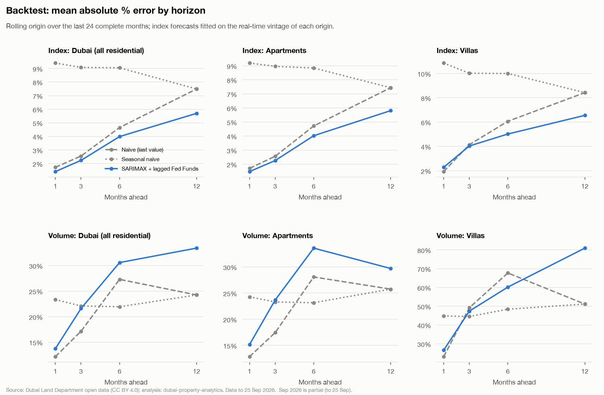
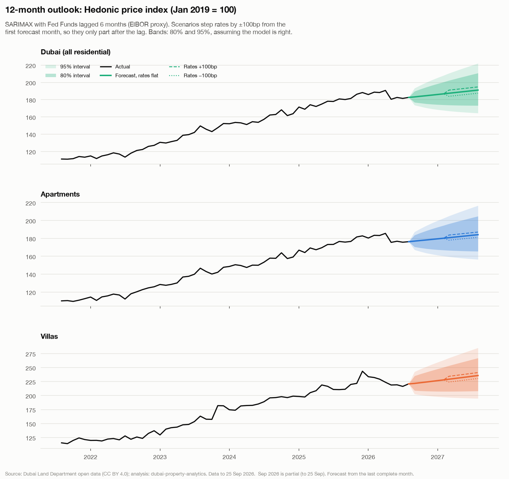
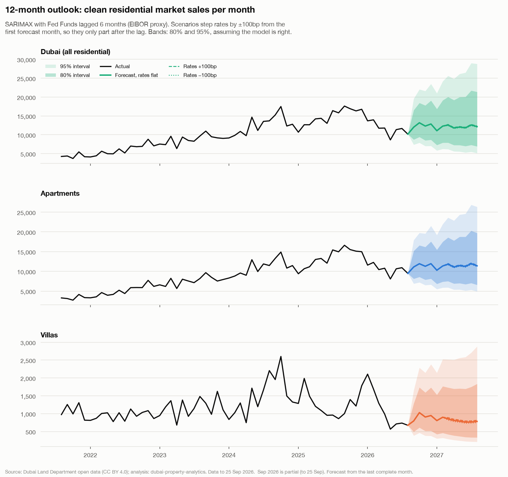

# Market outlook: 12-month forecast

Phase 4c (docs/05 §5). Where are prices and sales volumes heading over the next 12 months under different rate paths (docs/01 Q8)? A statistical extrapolation with honest uncertainty, **not investment advice**.

- **Data:** the hedonic index (`ml.fct_price_index`, Dubai / apartments / villas, monthly) and clean residential market sales per month, to **Aug 2026** (Sep 2026 is partial and dropped). Model `forecast-sarimax-v1`, run 2026-10-01 19:50.
- **Tables:** `ml.forecast` (history + 12 months per scenario, 80% / 95% intervals), `ml.forecast_backtest`; views `rpt.forecast`, `rpt.forecast_backtest`.
- **Regenerate:** `make train` (forecast step) then `make score model-reports`. Code: `src/dubai_property/models/forecast.py`.

## Summary

1. **Central path with rates flat: Dubai +4.6% over 12 months** (to Aug 2027; Dubai (all residential) +4.6%, 80% band -5% to +15%; Apartments +4.4%, 80% band -6% to +16%; Villas +6.7%, 80% band -6% to +21%). The model carries a drift of +4.7% a year (the 2011–2026 average growth) forward, while the index's latest year-on-year change is +1.0%: the central path assumes the 2026 pause gives way to the long-run trend. It is a statistical baseline, not a call on the 2026 turn; the bands include a fall.
2. **Backtest (last 24 months):** SARIMAX beats the better naive baseline in 11 of 12 index cells and 1 of 12 volume cells (segment × horizon; table below). On volume it mostly does not: monthly sales swing with launches and the 2026 slowdown, which a seasonal model with one rate driver can't anticipate, and last month's count is the better guide. Errors grow with the horizon for every model.
3. **Interval coverage in the backtest:** the 80% interval contained the outcome in 92% of index forecasts and 87% of volume forecasts (95%: 99% / 98%). Coverage at or above nominal over 24 origins is reassuring but covers one market phase; read the bands as a floor on uncertainty, not a ceiling.
4. **The rate effect has the wrong sign and isn't significant.** The lagged Fed Funds coefficient is positive (higher rates, higher prices and volumes) in 6 of 6 series and significant (p < 0.05) in 0. 2022–23 had rising rates *and* a boom, so the data can't separate a rate effect from the cycle; the ±100bp paths show the model's sensitivity, not a causal estimate.

## Method

**Targets.** The monthly hedonic index for Dubai, apartments and villas, and the monthly count of clean residential market sales (same three segments), both modelled in logs.

**Models.**

- *Naive (last value)*: next month = this month. *Seasonal naive*: next month = the same month a year earlier. The better of the two (lower mean MAPE over the horizons) is each series' baseline.
- *SARIMAX*: ARIMA with the Fed Funds rate lagged 6 months as the exogenous driver. Fed Funds stands in for EIBOR (docs/01: the AED is pegged to the US dollar, so EIBOR tracks it; the CBUAE EIBOR file isn't loaded yet). With the index differenced, the coefficient is the % change in prices per unit change in the rate, a permanent level effect arriving 6 months later. The order is picked by AIC once, on data before the first backtest origin, then held fixed; the published forecast uses the same order, so the backtest scores the published model.
- *LightGBM on lags*: not built (docs/05 makes it optional): ~190 monthly points are too few for trees to add anything over these, and doing it honestly (lags only, out-of-time tuning) isn't simple.

| Series | Specification | AIC (pre-backtest) | Drift a year | Rate β | p | +100bp → level |
| --- | --- | ---: | ---: | ---: | ---: | ---: |
| `index:dubai` | ARIMA(1,1,0) + drift | -688.2 | +4.7% | 1.906 | 0.24 | +1.92% |
| `index:apartment` | ARIMA(1,1,0) + drift | -669.4 | +4.4% | 1.582 | 0.38 | +1.59% |
| `index:villa` | ARIMA(0,1,1) + drift | -514.0 | +7.0% | 2.230 | 0.28 | +2.26% |
| `volume:dubai` | SARIMA(1,1,1)(0,1,1,12) | 40.3 | – | 1.216 | 0.87 | +1.22% |
| `volume:apartment` | SARIMA(1,1,1)(0,1,1,12) | 33.5 | – | 1.522 | 0.84 | +1.53% |
| `volume:villa` | SARIMA(0,1,1)(0,1,1,12) | 146.8 | – | 4.058 | 0.67 | +4.14% |

## Backtest: rolling origin, real-time vintages

24 origins, Sep 2024 to Aug 2026: at each origin O the models see only data dated before O and forecast 1–12 months ahead; horizons 1, 3, 6 and 12 are scored where the target month has happened (so h = 12 has 13 origins).

**Why vintages.** The published index is not what a forecaster had at the time. Each published point comes from 36-month regression windows that also contain *later* sales, and the latest window is re-fitted every month, so recent points get revised. Backtesting on today's series would give every origin a smoothed, revised history it couldn't have known, and flatter the models. So the index at origin O is the **real-time vintage**: the same rolling-window method re-chained on sales before O only (the 4b AVM code, `features/asof_index.py`). Forecasts are scored on the *change* they predicted against the change in today's published series (vintage levels aren't rebased, so only changes compare). Sales volumes aren't revised, so they're simply cut at O. Future rates are held flat at the origin's last value (no look-ahead; `tests/test_forecast.py` proves a forecast at O ignores everything dated O or later).

**Price index** (MAPE)

| Segment | h | Origins | Naive | Seasonal naive | SARIMAX | SARIMAX vs baseline | Baseline | 80% cover | 95% cover |
| --- | ---: | ---: | ---: | ---: | ---: | --- | ---: | ---: | ---: |
| Dubai (all residential) | 1 | 24 | 1.73% | 9.40% | 1.41% | beats | Naive (last value) | 88% | 100% |
| Dubai (all residential) | 3 | 22 | 2.56% | 9.08% | 2.24% | beats | Naive (last value) | 91% | 100% |
| Dubai (all residential) | 6 | 19 | 4.65% | 9.05% | 3.99% | beats | Naive (last value) | 95% | 100% |
| Dubai (all residential) | 12 | 13 | 7.49% | 7.49% | 5.70% | beats | Naive (last value) | 85% | 100% |
| Apartments | 1 | 24 | 1.70% | 9.20% | 1.47% | beats | Naive (last value) | 92% | 100% |
| Apartments | 3 | 22 | 2.57% | 8.96% | 2.26% | beats | Naive (last value) | 95% | 100% |
| Apartments | 6 | 19 | 4.72% | 8.84% | 4.03% | beats | Naive (last value) | 95% | 100% |
| Apartments | 12 | 13 | 7.44% | 7.44% | 5.81% | beats | Naive (last value) | 92% | 100% |
| Villas | 1 | 24 | 1.93% | 10.86% | 2.28% | loses to | Naive (last value) | 92% | 96% |
| Villas | 3 | 22 | 4.14% | 10.02% | 4.04% | beats | Naive (last value) | 91% | 95% |
| Villas | 6 | 19 | 6.07% | 10.00% | 5.02% | beats | Naive (last value) | 100% | 100% |
| Villas | 12 | 13 | 8.43% | 8.43% | 6.56% | beats | Naive (last value) | 85% | 100% |

**Sales volume** (MAPE)

| Segment | h | Origins | Naive | Seasonal naive | SARIMAX | SARIMAX vs baseline | Baseline | 80% cover | 95% cover |
| --- | ---: | ---: | ---: | ---: | ---: | --- | ---: | ---: | ---: |
| Dubai (all residential) | 1 | 24 | 12.18% | 23.33% | 13.75% | loses to | Naive (last value) | 92% | 100% |
| Dubai (all residential) | 3 | 22 | 17.15% | 22.09% | 21.60% | loses to | Naive (last value) | 91% | 95% |
| Dubai (all residential) | 6 | 19 | 27.29% | 21.93% | 30.58% | loses to | Naive (last value) | 84% | 95% |
| Dubai (all residential) | 12 | 13 | 24.24% | 24.24% | 33.41% | loses to | Naive (last value) | 85% | 100% |
| Apartments | 1 | 24 | 12.85% | 24.29% | 15.17% | loses to | Naive (last value) | 92% | 100% |
| Apartments | 3 | 22 | 17.45% | 23.31% | 23.68% | loses to | Naive (last value) | 91% | 95% |
| Apartments | 6 | 19 | 28.08% | 23.16% | 33.60% | loses to | Naive (last value) | 84% | 95% |
| Apartments | 12 | 13 | 25.76% | 25.76% | 29.70% | loses to | Naive (last value) | 85% | 100% |
| Villas | 1 | 24 | 23.13% | 44.83% | 26.60% | beats | Seasonal naive | 92% | 96% |
| Villas | 3 | 22 | 49.19% | 44.54% | 47.40% | loses to | Seasonal naive | 86% | 95% |
| Villas | 6 | 19 | 67.72% | 48.40% | 60.19% | loses to | Seasonal naive | 84% | 100% |
| Villas | 12 | 13 | 51.15% | 51.15% | 80.97% | loses to | Seasonal naive | 77% | 100% |

## Scenarios: rates flat, +100bp, −100bp

Rates step from the first forecast month and stay there. The rate enters with a 6-month lag, so the three paths are identical for the first 6 months and part only after that. Change over 12 months, from Aug 2026:

| Series | Last (Aug 2026) | Rates flat | Rates +100bp | Rates −100bp | 80% (flat) | 95% (flat) |
| --- | ---: | ---: | ---: | ---: | ---: | ---: |
| Index: Dubai (all residential) | 182.6 | +4.6% | +6.7% | +2.7% | -5% to +15% | -10% to +22% |
| Index: Apartments | 176.3 | +4.4% | +6.1% | +2.8% | -6% to +16% | -11% to +23% |
| Index: Villas | 220.8 | +6.7% | +9.2% | +4.4% | -6% to +21% | -12% to +29% |
| Volume: Dubai (all residential) | 10,165 | +19.7% | +21.1% | +18.2% | -32% to +110% | -49% to +183% |
| Volume: Apartments | 9,491 | +20.1% | +22.0% | +18.3% | -31% to +108% | -48% to +178% |
| Volume: Villas | 674 | +16.0% | +20.8% | +11.4% | -51% to +172% | -69% to +328% |

## Limitations

- **2026 is a turning point and the models extrapolate.** Villas are ~8% below their December 2025 peak and 2026 sales volumes run below 2025 (findings F3.x, reports/price_index.md). ARIMA-type models project the recent drift and mean-revert the momentum; they don't know about supply pipelines, policy or sentiment, and the backtest window (2024–26) holds only one turn.
- **Intervals understate uncertainty**: they assume the specification and its parameters are right and ignore index revisions; the backtest coverage above is the honest measure.
- **Rate sensitivity is not causal.** One driver, Fed Funds as an EIBOR proxy, lagged a fixed 6 months; Dubai's market also moves with oil, population and foreign demand, none modelled here.
- **Index revisions:** the forecast starts from today's published index, whose last months will be revised; a rerun next month starts from a slightly different point.
- **Nominal AED**; volumes are counts of clean market sales (registrations), not contracts agreed.

Decisions: docs/05 §8.

*Source: Dubai Land Department open data (transactions, CC BY 4.0); Fed Funds: FRED (Board of Governors of the Federal Reserve System).*
