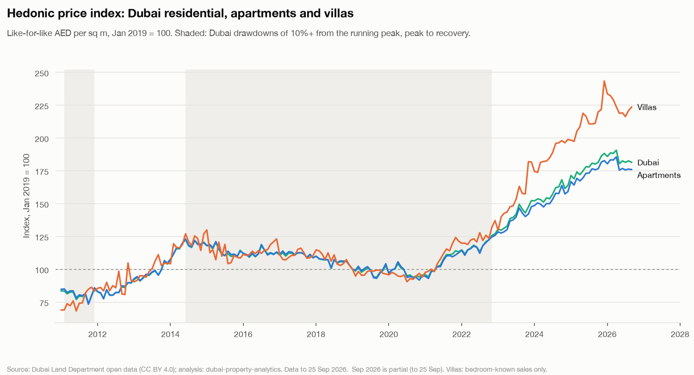
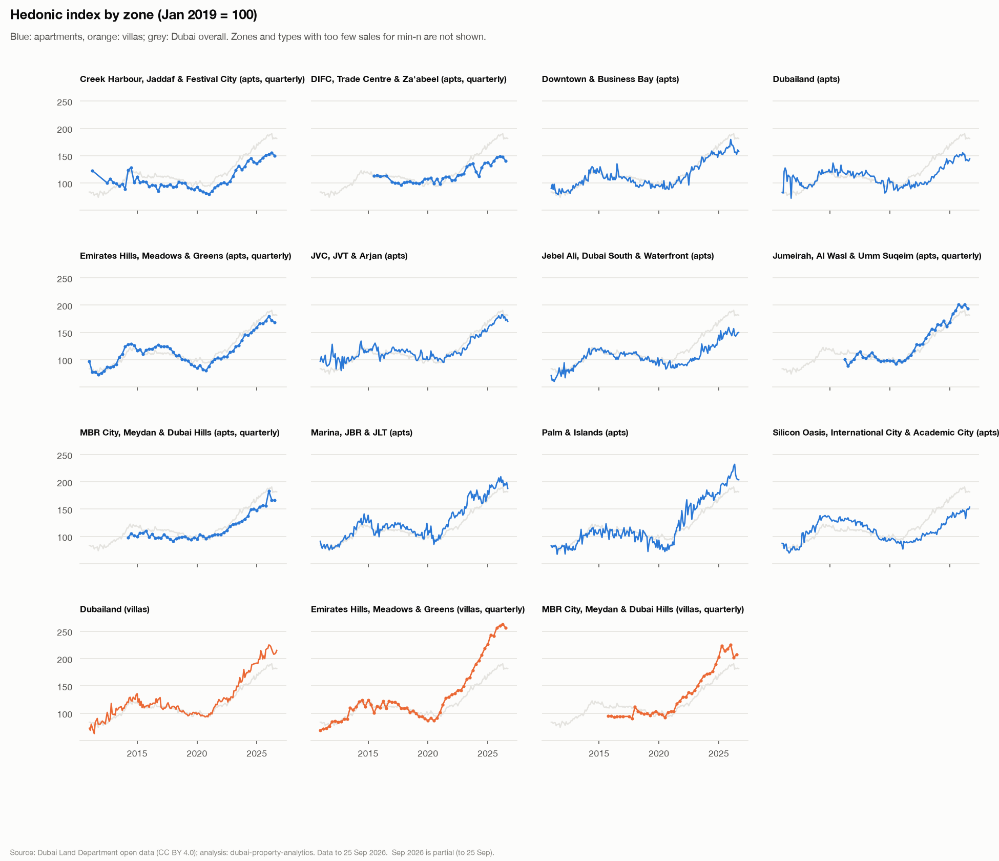
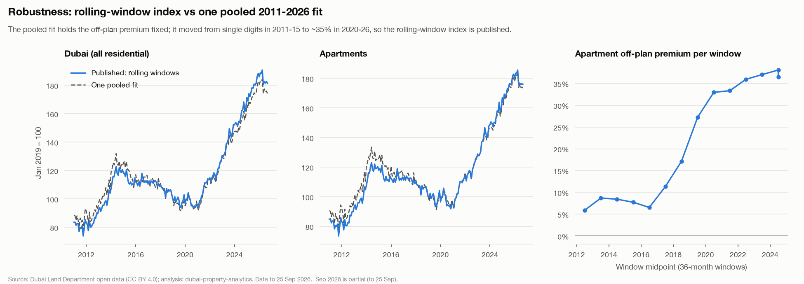
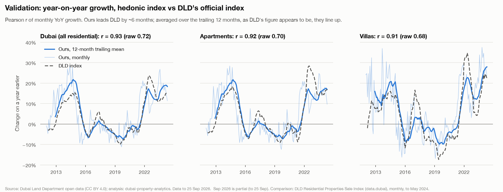
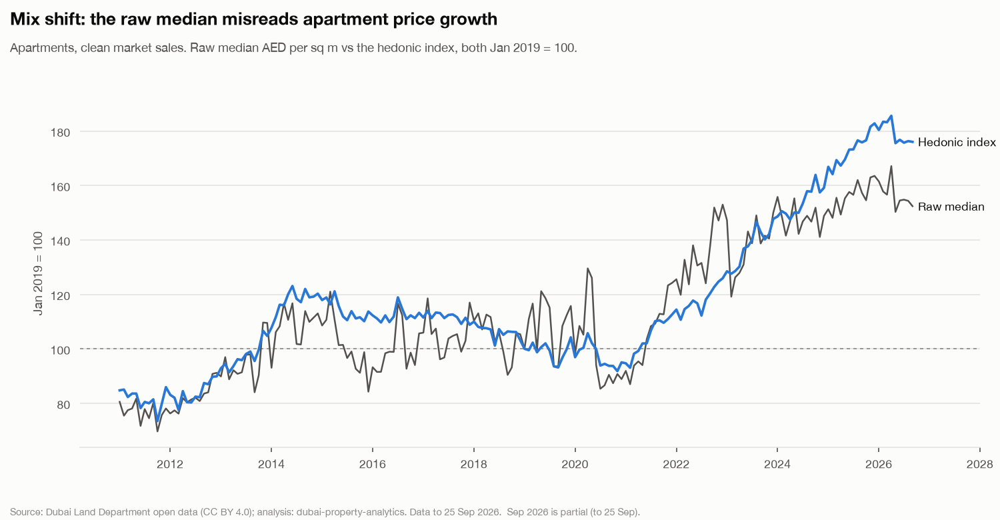

# Hedonic price index

Phase 4a (docs/05 §2). Like-for-like residential price index for Dubai, apartments, villas and the zones with enough sales, validated against DLD's official index.

- **Data:** clean market sales to the snapshot date, **25 Sep 2026** (`Sep 2026`* is a partial month). Model `hedonic-rtd-v1`, fitted 2026-10-01 13:37.
- **Tables:** `ml.fct_price_index` (published periods only), `rpt.price_index` (Power BI).
- **Regenerate:** `make train score model-reports`. Code: `src/dubai_property/models/hedonic_index.py`; this report: `models/report_4a.py`.

## Summary

1. **Prices are +81.5% on January 2019** (Dubai index 181.5 in Sep 2026*). Apartments 176.0, villas 223.6. Year-on-year: Dubai +0.8%, apartments +0.1%, villas +5.9%. ([chart](figures/price_index_levels.png))
2. **One long down-cycle.** The ≥10% rule finds the main Dubai episode from a Jun 2014 peak to a Sep 2020 trough (-23.6%), recovered only in Nov 2022: the 2020 COVID dip came before prices had regained their 2014 peak, so the 2014–19 correction and 2020 are one episode (plus 1 shorter one: Feb 2011 -11.6%). (table below)
3. **Validates against DLD:** YoY correlation **0.93** (Dubai), with every headline series ≥ 0.9 once our index is averaged over the same trailing 12 months as DLD's appears to be. Month for month the correlation is 0.72: our index leads DLD by about 6 months. ([chart](figures/price_index_validation.png))
4. **The raw median misses most of the rise.** Apartment raw median AED per sq m: 152.4 in Sep 2026 (Jan 2019 = 100) against a hedonic 176.0. ([chart](figures/price_index_mix_shift.png))
5. **Published method: rolling windows.** One pooled 2011–2026 fit would hold the apartment off-plan premium fixed, but it moved from +6% to +38% across the windows; the pooled index differs by up to -9.8% (Dubai), so it is kept only as the robustness check (owner decision, 2026-10-01). ([chart](figures/price_index_robustness.png))

## Method

**Model.** A time-dummy hedonic regression on clean residential market sales:

```
ln(AED per sq m) = Σ β_t·period_t + γ·ln(area) + bedroom dummies + off-plan + parking
                   + penthouse + area fixed effects + ε
```

The period dummies carry the price change with the characteristics held constant: `index_t = 100·exp(β_t)`, with January 2019 (Q1 2019 for quarterly series) as the omitted base, so the base is exactly 100. `exp(β)` is a ratio of geometric means, so no smearing correction is needed (that matters for predicting AED levels, not for an index). Dubai overall pools both types and gives bedrooms, off-plan and ln(area) a separate effect per type.

**Rolling windows (published).** The regression is re-fitted on 36-month windows stepped 12 months; each window is chained to the series by the mean log gap over the 24 periods both cover, and contributes only the periods after the series' last one. Every coefficient (off-plan premium, bedroom premia, area effects) is thereby re-estimated every year, which one pooled fit over 15 years can't do.

**Population.** `is_clean_market_sale` (arm's-length, no C3–C6/C16/C18 quality flag) apartments and villas / townhouses, from **January 2011**:

| Property type | Clean sales since 2011 | Above the class area cap (out) | Villas without bedrooms (out) | In the index |
| --- | ---: | ---: | ---: | ---: |
| Apartments | 810,008 | 393 | 0 | 809,615 |
| Villas / townhouses | 127,482 | 189 | 32,357 | 94,936 |

- **Why 2011.** In 2009–10, 30–50% of clean apartment sales were registered after the year they were applied for (the Law 13/2008 backlog, findings F1.3): their prices were agreed in the 2006–08 boom, so a 2008-start index showed prices rising through the 2009 crash. DLD's own index starts in March 2011.
- **Villas: bedroom-known sales only.** DLD doesn't say whether a villa's `procedure_area` is the plot or the built-up area. Villas with a bedroom count have built-up-sized areas (median ~190–200 sq m); without one, plot-sized (550–600 sq m) (findings F3.1). The bedroom-less share fell over the period, which alone would raise a per-sq-m index. Keeping bedroom-known villas holds the area basis constant; bedroom dummies are the main size control and ln(area) a secondary one. Because ln(area) is a regressor, using AED per sq m or AED per unit as the dependent variable gives the same period effects.
- **Area cap.** Areas above the class cap (apartments 1,000 sq m, villas 3,000) are community or plot areas, not the unit's (rule C21).

**Estimation.** Exact OLS through the sparse normal equations: up to ~0.9M rows but only a few hundred columns (period and area dummies), so `XᵀX` is small even though `X` is not. Full run: ~30 s. Pooled apartment fit: R² 0.716, residual SD 0.263 log points.

**Min-n and frequency.** A period is published only with **≥ 20 sales** in the segment; thinner periods stay in the fit but get no index point (never interpolated). A segment is **monthly** if ≥ 90% of its months pass from its first month with 20+ sales, else **quarterly** if ≥ 90% of its quarters do, else not published; the base period must pass either way. A zone that developed after 2011 (MBR City, DIFC) is therefore judged from when it starts trading.

## Published segments

| Segment | Frequency | From | Periods published | Sales | Windows |
| --- | ---: | ---: | ---: | ---: | ---: |
| `dubai` | monthly | Jan 2011 | 189 / 189 | 904,551 | 14 |
| `apartment` | monthly | Jan 2011 | 189 / 189 | 809,615 | 14 |
| `villa` | monthly | Jan 2011 | 189 / 189 | 94,936 | 14 |
| `apartment-creek-harbour-jaddaf-festival-city` | quarterly | Apr 2011 | 58 / 62 | 36,725 | 14 |
| `apartment-difc-trade-centre-za-abeel` | quarterly | Jul 2015 | 43 / 45 | 8,190 | 10 |
| `apartment-downtown-business-bay` | monthly | Jan 2011 | 189 / 189 | 102,493 | 14 |
| `apartment-dubailand` | monthly | Jan 2011 | 189 / 189 | 155,526 | 14 |
| `apartment-emirates-hills-meadows-greens` | quarterly | Jan 2011 | 63 / 63 | 11,931 | 14 |
| `apartment-jvc-jvt-arjan` | monthly | Jan 2011 | 188 / 189 | 124,668 | 14 |
| `apartment-jebel-ali-dubai-south-waterfront` | monthly | Jan 2011 | 189 / 189 | 69,323 | 14 |
| `apartment-jumeirah-al-wasl-umm-suqeim` | quarterly | Apr 2016 | 42 / 42 | 20,135 | 9 |
| `apartment-mbr-city-meydan-dubai-hills` | quarterly | Apr 2014 | 50 / 50 | 72,205 | 11 |
| `apartment-marina-jbr-jlt` | monthly | Jan 2011 | 189 / 189 | 108,918 | 14 |
| `apartment-palm-islands` | monthly | Jan 2011 | 189 / 189 | 27,992 | 14 |
| `apartment-silicon-oasis-international-city-academic-city` | monthly | Jan 2011 | 189 / 189 | 38,704 | 14 |
| `villa-dubailand` | monthly | Jan 2011 | 181 / 189 | 61,800 | 14 |
| `villa-emirates-hills-meadows-greens` | quarterly | Jan 2011 | 63 / 63 | 7,311 | 14 |
| `villa-mbr-city-meydan-dubai-hills` | quarterly | Oct 2015 | 43 / 44 | 6,295 | 9 |

Not published (16): `apartment-al-barsha-al-quoz-tecom` (base month 2019-01-01 under min-n; 86% of quarters pass min-n); `apartment-bur-dubai-karama` (base month 2019-01-01 under min-n; base quarter 2019-01-01 under min-n); `apartment-deira` (no month with 20+ sales; no quarter with 20+ sales); `apartment-industrial` (base month 2019-01-01 under min-n; base quarter 2019-01-01 under min-n); `apartment-mirdif-mizhar-warqa-khawaneej` (base month 2019-01-01 under min-n; base quarter 2019-01-01 under min-n); `apartment-qusais-nahda-twar-muhaisnah` (base month 2019-01-01 under min-n; base quarter 2019-01-01 under min-n); `villa-al-barsha-al-quoz-tecom` (base month 2019-01-01 under min-n; base quarter 2019-01-01 under min-n); `villa-creek-harbour-jaddaf-festival-city` (no month with 20+ sales; no quarter with 20+ sales); `villa-industrial` (base month 2019-01-01 under min-n; base quarter 2019-01-01 under min-n); `villa-jvc-jvt-arjan` (too noisy (period-change SD 0.16 > 0.1)); `villa-jebel-ali-dubai-south-waterfront` (base month 2019-01-01 under min-n; 75% of quarters pass min-n); `villa-jumeirah-al-wasl-umm-suqeim` (base month 2019-01-01 under min-n; base quarter 2019-01-01 under min-n); `villa-marina-jbr-jlt` (no month with 20+ sales; no quarter with 20+ sales); `villa-mirdif-mizhar-warqa-khawaneej` (base month 2019-01-01 under min-n; base quarter 2019-01-01 under min-n); `villa-palm-islands` (base month 2019-01-01 under min-n; base quarter 2019-01-01 under min-n); `villa-silicon-oasis-international-city-academic-city` (base month 2019-01-01 under min-n; base quarter 2019-01-01 under min-n).





## Index by year

Index in December (latest month for the partial year*) and its change on a year earlier.

| Year | Dubai | YoY | Apartments | YoY | Villas | YoY |
| --- | ---: | ---: | ---: | ---: | ---: | ---: |
| 2011 | 85.2 | – | 85.9 | – | 83.5 | – |
| 2012 | 89.5 | +5.0% | 89.9 | +4.6% | 91.7 | +9.8% |
| 2013 | 104.0 | +16.2% | 104.7 | +16.6% | 104.7 | +14.3% |
| 2014 | 120.7 | +16.0% | 120.3 | +14.8% | 126.9 | +21.2% |
| 2015 | 114.5 | -5.1% | 113.7 | -5.5% | 108.5 | -14.6% |
| 2016 | 112.8 | -1.5% | 113.2 | -0.4% | 123.1 | +13.5% |
| 2017 | 108.8 | -3.6% | 108.8 | -3.9% | 110.4 | -10.3% |
| 2018 | 103.1 | -5.2% | 103.2 | -5.2% | 103.1 | -6.7% |
| 2019 | 102.8 | -0.3% | 104.2 | +1.0% | 96.4 | -6.4% |
| 2020 | 95.6 | -7.0% | 95.0 | -8.8% | 94.1 | -2.4% |
| 2021 | 113.3 | +18.6% | 112.6 | +18.5% | 121.4 | +29.0% |
| 2022 | 127.0 | +12.1% | 125.9 | +11.8% | 137.2 | +13.0% |
| 2023 | 152.3 | +19.9% | 147.7 | +17.3% | 181.7 | +32.5% |
| 2024 | 163.7 | +7.5% | 159.1 | +7.7% | 198.9 | +9.5% |
| 2025 | 188.3 | +15.0% | 182.8 | +14.9% | 243.5 | +22.4% |
| 2026* | 181.5 | +0.8% | 176.0 | +0.1% | 223.6 | +5.9% |

## Risk metrics

Latest published period per segment. **Volatility:** annualised standard deviation of the period log changes over the trailing year. **Drawdown:** index / running peak − 1.

| Segment | Latest | Index | YoY | Volatility 12M | Drawdown | Peak |
| --- | ---: | ---: | ---: | ---: | ---: | ---: |
| `dubai` | Sep 2026* | 181.5 | +0.8% | 7.2% | -4.8% | 190.7 |
| `apartment` | Sep 2026* | 176.0 | +0.1% | 7.1% | -5.2% | 185.6 |
| `villa` | Sep 2026* | 223.6 | +5.9% | 12.3% | -8.2% | 243.5 |
| `apartment-creek-harbour-jaddaf-festival-city` | Jul 2026* | 150.0 | +2.6% | 5.9% | -3.5% | 155.4 |
| `apartment-difc-trade-centre-za-abeel` | Jul 2026* | 140.2 | +0.1% | 8.6% | -5.6% | 148.6 |
| `apartment-downtown-business-bay` | Sep 2026* | 157.9 | -4.5% | 13.8% | -12.2% | 179.9 |
| `apartment-dubailand` | Sep 2026* | 144.1 | -3.1% | 10.5% | -7.3% | 155.5 |
| `apartment-emirates-hills-meadows-greens` | Jul 2026* | 168.6 | +1.4% | 8.3% | -6.0% | 179.4 |
| `apartment-jvc-jvt-arjan` | Sep 2026* | 170.4 | -1.8% | 7.9% | -6.6% | 182.4 |
| `apartment-jebel-ali-dubai-south-waterfront` | Sep 2026* | 149.9 | +2.6% | 14.5% | -5.9% | 159.2 |
| `apartment-jumeirah-al-wasl-umm-suqeim` | Jul 2026* | 194.2 | +2.2% | 8.8% | -3.6% | 201.4 |
| `apartment-mbr-city-meydan-dubai-hills` | Jul 2026* | 166.0 | +6.0% | 20.9% | -9.4% | 183.1 |
| `apartment-marina-jbr-jlt` | Sep 2026* | 188.0 | -1.1% | 13.4% | -10.2% | 209.5 |
| `apartment-palm-islands` | Sep 2026* | 203.8 | +5.9% | 14.0% | -12.2% | 232.2 |
| `apartment-silicon-oasis-international-city-academic-city` | Sep 2026* | 153.7 | +8.2% | 16.7% | +0.0% | 153.7 |
| `villa-dubailand` | Sep 2026* | 215.0 | +7.5% | 9.8% | -4.4% | 224.9 |
| `villa-emirates-hills-meadows-greens` | Jul 2026* | 256.2 | +6.2% | 7.1% | -2.6% | 263.1 |
| `villa-mbr-city-meydan-dubai-hills` | Jul 2026* | 207.8 | -2.9% | 13.9% | -7.8% | 225.4 |

### Peak-to-trough episodes

An episode runs from a running peak until the index regains it, and counts if the trough is ≥ 10% below the peak. No list of expected cycles is imposed: what the rule finds is reported. A dip down and back within a couple of months is marked *likely noise*: a monthly hedonic index moves a few percent month to month (see the MoM correlations below).

| Series | Peak | Index | Trough | Index | Depth | Months to trough | Recovered | Kind |
| --- | ---: | ---: | ---: | ---: | ---: | ---: | ---: | ---: |
| Dubai (all residential) | Feb 2011 | 83.5 | Oct 2011 | 73.9 | -11.6% | 8 | Dec 2011 | cycle |
| Dubai (all residential) | Jun 2014 | 122.7 | Sep 2020 | 93.7 | -23.6% | 75 | Nov 2022 | cycle |
| Apartments | Feb 2011 | 85.0 | Oct 2011 | 73.4 | -13.6% | 8 | Dec 2011 | cycle |
| Apartments | Jun 2014 | 123.1 | Nov 2020 | 91.8 | -25.4% | 77 | Nov 2022 | cycle |
| Villas | May 2011 | 76.0 | Jun 2011 | 68.2 | -10.2% | 1 | Sep 2011 | short dip (likely noise) |
| Villas | Aug 2012 | 98.5 | Oct 2012 | 80.7 | -18.1% | 2 | Nov 2012 | short dip (likely noise) |
| Villas | Nov 2012 | 104.9 | Jan 2013 | 90.4 | -13.7% | 2 | Aug 2013 | cycle |
| Villas | Jan 2015 | 130.0 | Jul 2020 | 90.5 | -30.4% | 66 | Nov 2022 | cycle |
| Villas | Dec 2025 | 243.5 | Jul 2026 | 216.4 | -11.1% | 7 | not yet | ongoing |

- The 2014–2019 correction and the 2020 COVID dip are **one episode**: prices hadn't regained the mid-2014 peak when COVID hit, so the trough is in 2020 and recovery only came with the 2021–22 boom.
- 2008–2011 is outside the published index (it starts in 2011; see *Why 2011*). The stress test's historical replay of 2008–11 drawdowns (docs/05 §4) therefore can't use this index; Phase 4c uses the 2014–20 episode.

Zones (all episodes found, of which cycles rather than short dips, and the deepest):

| Segment | Episodes | Cycles | Deepest |
| --- | ---: | ---: | ---: |
| `apartment-creek-harbour-jaddaf-festival-city` | 2 | 2 | -37.8% (Jul 2014 → Jan 2021) |
| `apartment-difc-trade-centre-za-abeel` | 2 | 2 | -17.4% (Oct 2023 → Apr 2024) |
| `apartment-downtown-business-bay` | 4 | 4 | -34.8% (Jul 2016 → Nov 2020) |
| `apartment-dubailand` | 2 | 2 | -43.4% (Apr 2011 → Oct 2011) |
| `apartment-emirates-hills-meadows-greens` | 2 | 2 | -38.0% (Jul 2014 → Oct 2020) |
| `apartment-jvc-jvt-arjan` | 3 | 3 | -37.5% (Jan 2012 → Oct 2012) |
| `apartment-jebel-ali-dubai-south-waterfront` | 7 | 6 | -32.3% (Mar 2015 → Aug 2020) |
| `apartment-jumeirah-al-wasl-umm-suqeim` | 2 | 2 | -19.6% (Jul 2017 → Jul 2020) |
| `apartment-mbr-city-meydan-dubai-hills` | 1 | 1 | -16.8% (Oct 2015 → Jan 2018) |
| `apartment-marina-jbr-jlt` | 4 | 4 | -39.4% (Sep 2014 → Jul 2020) |
| `apartment-palm-islands` | 10 | 8 | -41.3% (Aug 2015 → Jul 2020) |
| `apartment-silicon-oasis-international-city-academic-city` | 5 | 3 | -44.4% (Aug 2014 → Feb 2021) |
| `villa-dubailand` | 5 | 4 | -31.3% (Jan 2015 → Dec 2020) |
| `villa-emirates-hills-meadows-greens` | 1 | 1 | -30.6% (Jan 2015 → Jul 2020) |
| `villa-mbr-city-meydan-dubai-hills` | 2 | 2 | -17.0% (Jan 2018 → Jul 2020) |

## Robustness: rolling windows vs one pooled fit

The owner asked for this check because the pooled fit assumes the off-plan discount, bedroom premia and area effects never change, while the off-plan share swung after 2021. The gap is **material** (> 5% in level or > 3 pp in YoY), so the choice went to the owner, who chose the rolling-window index for every segment (2026-10-01).

| Series | Max level gap (RTD vs pooled) | When | Max YoY gap | When | Mean abs YoY gap | Material |
| --- | ---: | ---: | ---: | ---: | ---: | ---: |
| Dubai (all residential) | -9.8% | Jan 2014 | +11.5% | Jul 2016 | 2.0% | yes |
| Apartments | -11.1% | Jan 2014 | +11.3% | Jul 2016 | 2.0% | yes |
| Villas | +15.3% | Dec 2013 | +20.9% | Apr 2016 | 3.7% | yes |

Apartment windows (36 months, stepped 12; the off-plan premium is relative to a ready unit with the same area, bedrooms and size):

| Window | Sales | Periods linked on | R² | Off-plan premium |
| --- | ---: | ---: | ---: | ---: |
| Jan 2011 – Dec 2013 | 73,274 | 0 | 0.551 | +5.9% |
| Jan 2012 – Dec 2014 | 87,214 | 24 | 0.591 | +8.7% |
| Jan 2013 – Dec 2015 | 89,671 | 24 | 0.603 | +8.4% |
| Jan 2014 – Dec 2016 | 76,017 | 24 | 0.629 | +7.7% |
| Jan 2015 – Dec 2017 | 71,643 | 24 | 0.676 | +6.5% |
| Jan 2016 – Dec 2018 | 68,299 | 24 | 0.707 | +11.3% |
| Jan 2017 – Dec 2019 | 68,663 | 24 | 0.711 | +17.1% |
| Jan 2018 – Dec 2020 | 61,381 | 24 | 0.703 | +27.2% |
| Jan 2019 – Dec 2021 | 76,196 | 24 | 0.704 | +32.9% |
| Jan 2020 – Dec 2022 | 114,168 | 24 | 0.724 | +33.3% |
| Jan 2021 – Dec 2023 | 186,279 | 24 | 0.733 | +36.0% |
| Jan 2022 – Dec 2024 | 284,370 | 24 | 0.728 | +37.0% |
| Jan 2023 – Dec 2025 | 385,749 | 24 | 0.725 | +38.1% |
| Oct 2023 – Sep 2026 | 410,291 | 27 | 0.719 | +36.5% |



The gap is largest before 2017: the pooled fit applies one off-plan premium (+30% for apartments, dominated by the high-volume 2020s) to years when the windows estimate +6%–+9% (the first five windows), and today's area effects to a city with fewer developed areas. From 2017 the largest level gaps are 4.7% (dubai), 4.1% (apartments), 12.8% (villas).

## Validation against DLD's official index

**DLD's file.** The *Residential Properties Sale Index* (data.dubai, issued by DLD) is wide: one row per month with all / flat / villa × monthly / quarterly / yearly × two measures. `*_index` is a ratio, **1.000 in January 2012** (Q1 2012, 2012 for the other frequencies); `*_price_index` is an AED price level of a typical unit, which is *not* the ratio rescaled (their ratio drifts by ~8%). Validation uses the monthly `*_index`. The file was stamped 2026-09-01 but **its data ends in May 2024**, so the comparison covers 2012-01 to 2024-05 and nothing after.

**Method.** Growth rates, not levels (different bases, baskets and methods). Both series rebased to their first common month for the chart only.

- **Headline (aligned):** YoY of our index averaged over the trailing 12 months, vs DLD's YoY, at lag 0. Owner decision 2026-10-01: our monthly index leads DLD's by about six months, and a 12-month trailing average of ours lines up with DLD at lag 0, which suggests DLD's monthly figure averages the last 12 months of sales. That is an inference from the data; the file carries no methodology.
- **Raw:** month-for-month YoY, the best lead, and MoM correlations are shown alongside so nothing is hidden.

| Pair | YoY r, aligned | Months | ≥ 0.9 | YoY r, raw | Best lead, months (r) | MoM r | MoM r, 3m mean | Our growth | DLD growth |
| --- | ---: | ---: | ---: | ---: | ---: | ---: | ---: | ---: | ---: |
| Dubai (all residential) vs DLD `all` | **0.932** | 138 | ✅ | 0.722 | 6 (0.888) | 0.280 | 0.461 | +86.6% | +65.6% |
| Apartments vs DLD `flat` | **0.921** | 138 | ✅ | 0.701 | 6 (0.872) | 0.279 | 0.421 | +80.6% | +82.6% |
| Villas vs DLD `villa` | **0.907** | 138 | ✅ | 0.676 | 5 (0.824) | 0.155 | 0.377 | +113.2% | +70.5% |

Growth = first to last common month (2012-01 to 2024-05).



**Where they diverge** (calendar years with the largest mean absolute aligned YoY gap, ours − DLD):

| Series | Year | Ours (aligned) | DLD | Mean gap |
| --- | ---: | ---: | ---: | ---: |
| Dubai (all residential) | 2014 | +19.4% | +13.3% | +6.1% |
| Dubai (all residential) | 2022 | +14.1% | +19.2% | -5.1% |
| Dubai (all residential) | 2024 | +18.7% | +14.4% | +4.4% |
| Apartments | 2022 | +14.1% | +22.3% | -8.3% |
| Apartments | 2017 | +0.0% | +4.1% | -4.1% |
| Apartments | 2023 | +13.8% | +16.5% | -2.7% |
| Villas | 2012 | +16.0% | +7.6% | +8.4% |
| Villas | 2022 | +19.2% | +26.8% | -7.6% |
| Villas | 2017 | +1.6% | +6.3% | -4.7% |

**Why.**

- **Timing and boom years.** The largest gaps are in 2012, 2014, 2017, 2022, 2023, 2024: turning points and booms, where a 12-month average still lags a monthly index and the exact window DLD uses matters most. Ours turns first; DLD's trailing figure follows a few months later.
- **Cumulative growth (2012-01 to 2024-05):** Dubai (all residential) +86.6% vs DLD +65.6%; Apartments +80.6% vs DLD +82.6%; Villas +113.2% vs DLD +70.5%. Small YoY gaps add up over 12 years, so levels are not comparable even when growth rates track.
- **Villas.** Our villa index uses bedroom-known villas only; DLD's villa basket (and whether it includes plot-sized villa areas) is unknown. Villa months also have far fewer sales (as few as 61, against 877+ for apartments), so the villa series is the noisiest of the three.
- **Off-plan.** Our index includes off-plan sales with an off-plan control that the windows let drift; if DLD weights or treats off-plan differently, the off-plan-led booms are where the two would differ most.
- **Month-to-month noise.** MoM correlations are low: our index is unsmoothed (a monthly hedonic estimate with sampling noise), DLD's is smooth. Use YoY or the 3-month average for month-level reading.

## Mix shift: raw median vs hedonic index



Apartments, annual change: raw median AED per sq m of the same population vs the annual average of the hedonic index. Mix effect = hedonic − raw.

| Year | Raw median | Hedonic | Mix effect |
| --- | ---: | ---: | ---: |
| 2012 | +7.7% | +2.9% | -4.8% |
| 2013 | +13.0% | +16.0% | +3.1% |
| 2014 | +16.3% | +20.8% | +4.5% |
| 2015 | -7.8% | -2.7% | +5.2% |
| 2016 | -0.9% | -1.8% | -0.9% |
| 2017 | +5.6% | -0.6% | -6.1% |
| 2018 | +0.9% | -4.8% | -5.8% |
| 2019 | +3.1% | -6.7% | -9.8% |
| 2020 | -12.8% | -1.9% | +10.9% |
| 2021 | +10.2% | +7.0% | -3.2% |
| 2022 | +30.2% | +13.1% | -17.0% |
| 2023 | +1.2% | +16.6% | +15.4% |
| 2024 | +7.3% | +12.0% | +4.6% |
| 2025 | +5.8% | +12.5% | +6.7% |

The raw median moves with **what** sells, and the mix effect swings both ways: in 2022 the raw median rose +30.2% against +13.1% like for like (the mix of sales moved towards dearer areas and units), while in 2023 it moved +1.2% against +16.6% (the mix moved towards cheaper zones). Phase 3 (findings F3.2) found the same for 2023 with a fixed-basket method (+1.2% raw vs +14.5%).

## Characteristic effects (pooled fits, for interpretation)

Coefficients of the pooled 2011–2026 fits (log points; the % is `exp(β) − 1`), relative to a ready unit without parking with the most common bedroom count (1 for apartments, 3 for villas). Bedroom effects are on top of the size effect (ln(area): larger units cost less per sq m). The rolling windows re-estimate all of these every year; see the window table for the off-plan drift.

**Apartments**

| Coefficient | β | Effect |
| --- | ---: | ---: |
| `bedrooms=0` | -0.011 | -1.1% |
| `bedrooms=2` | +0.090 | +9.5% |
| `bedrooms=3` | +0.193 | +21.2% |
| `bedrooms=4` | +0.397 | +48.7% |
| `bedrooms=5` | +0.491 | +63.4% |
| `bedrooms=6` | +0.271 | +31.2% |
| `has_parking=true` | +0.110 | +11.7% |
| `is_offplan=true` | +0.265 | +30.3% |
| `is_penthouse=true` | -0.172 | -15.8% |

**Villas**

| Coefficient | β | Effect |
| --- | ---: | ---: |
| `bedrooms=1` | -0.646 | -47.6% |
| `bedrooms=2` | -0.263 | -23.1% |
| `bedrooms=4` | +0.035 | +3.6% |
| `bedrooms=5` | +0.232 | +26.1% |
| `bedrooms=6` | +0.605 | +83.2% |
| `has_parking=true` | -0.188 | -17.1% |
| `is_offplan=true` | -0.003 | -0.3% |

## Limitations

- **Revisions.** Re-fitting with new data revises recent periods (the last window changes; earlier periods are fixed once their window has passed). Store the `model_version` with any downstream use.
- **No confidence band is published.** Within-window standard errors exist, but the chaining adds uncertainty they don't capture; the published series carries `n_obs` per period instead.
- **Quality not observed:** finish, view, floor, age and building quality are not in the DLD data; area fixed effects absorb location, not the building. A shift towards newer, better-specified stock within an area shows up as price growth.
- **Villas** are the bedroom-known subset; **2026** is partial; **DLD's index** ends in May 2024 and its method is undocumented, so the validation is indicative.
- **Nominal AED**, not inflation-adjusted.

Decisions: docs/05 §8.

*Source: Dubai Land Department open data (transactions, CC BY 4.0) and DLD Residential Properties Sale Index (data.dubai).*
