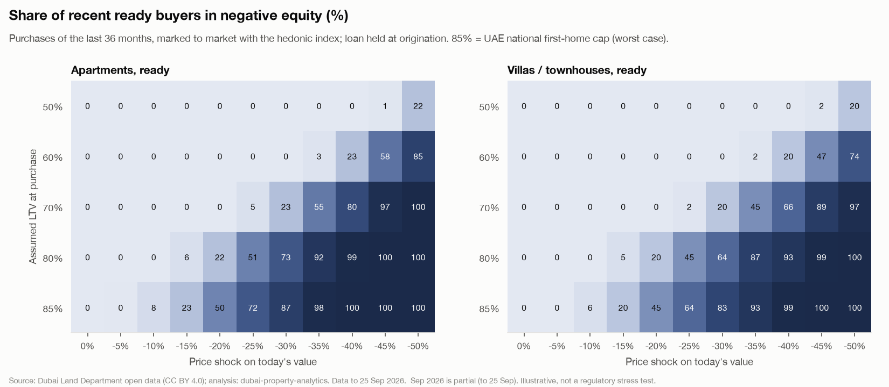
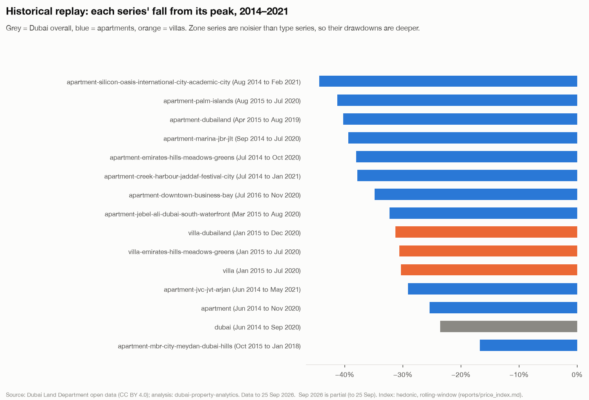
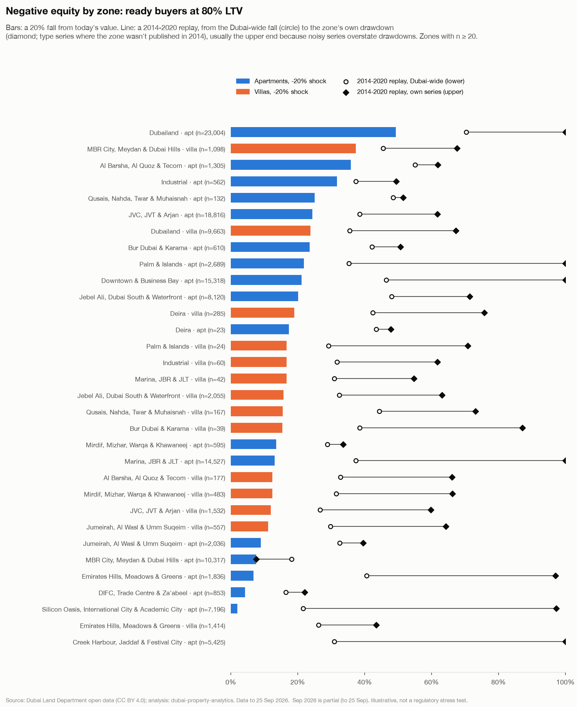

# Collateral stress test

Phase 4c (docs/05 §4). **Illustrative, not a regulatory stress test.** It answers docs/01 Q7: if prices fell X%, what share of recent buyers would owe more than their home is worth, at typical loan-to-value ratios, and where? Every number below rests on stated assumptions (next section); none is a forecast of losses.

- **Data:** clean residential market sales, Sep 2023 to Aug 2026 (36 complete months; Sep 2026 is partial and left out), marked to market with the hedonic index as of **Aug 2026**. Model `stress-mtm-v1`, run 2026-10-01 20:34.
- **Tables:** `ml.stress_grid`, `ml.stress_replay`; Power BI views `rpt.stress_grid`, `rpt.stress_replay` (Shock % and LTV % are integer keys for the what-if slicers).
- **Regenerate:** `make score model-reports`. Code: `src/dubai_property/models/stress_test.py`; this report: `models/report_4c.py`.

## Summary

1. **Almost no recent buyer is under water today.** With the index as of Aug 2026, a ready apartment bought in the window at 80% LTV is in negative equity in 0.0% of cases, a ready villa in 0.0%, and 0.1% of matched apartment loans: prices are above most purchase prices (median mark-to-market 1.053× the price paid).
2. **A 20% fall is the threshold that matters.** At 80% LTV, a 10% fall puts 0.0% of ready apartment buyers under water, a 20% fall 22% and a 30% fall 73% (villas 0.0% / 20% / 64%). Recent buyers have little equity cushion beyond their deposit, so negative equity jumps once the fall exceeds 1 − LTV. ([chart](figures/stress_heatmap.png))
3. **A repeat of 2014→2020 would leave 43% to 80% of ready apartment buyers at 80% LTV in negative equity** (villas 34% to 64%). The lower figure applies the Dubai-wide fall (-24%) to everyone; the upper one each buyer's own zone × type series (average applied -34% for apartments, -31% for villas). Zone series are noisier, and a maximum drawdown measured on a noisy series overstates the true fall, so the own-series figure is the **upper end of the range** (exceptions noted in the replay section). ([chart](figures/stress_by_zone.png))
4. **Registered loans tell the same story.** 48,235 of 130,972 ready purchases (37%, a lower bound) are matched to their mortgage. Median LTV at purchase 80%, today 74%; a 20% fall would put 23% of matched apartment loans and 14% of villa loans under water.
5. **Off-plan is a separate risk.** 328,672 of the 459,644 purchases are off-plan. At the 50% off-plan cap, a 20% fall leaves 0.0% of off-plan apartment buyers under water and a 50% fall 30%; and most buyers pay the developer in instalments, so the exposure is the developer's and the buyer's more than a bank's.

## Assumptions

| Item | Assumption |
| --- | ---: |
| Population | Clean residential market sales (apartments, villas / townhouses), Sep 2023–Aug 2026: 459,644 purchases |
| Current value | Price × index now / index at purchase. Series: the zone × type index where it is published and has a point for the purchase period (91% of purchases), else the type index. *Now* = the series' latest complete period (Aug 2026 monthly; quarterly zones: their last complete quarter) |
| Loan | Held at the origination amount: **no amortisation**. Real balances are lower, so negative equity is overstated (conservative) |
| Assumed LTV grid | 50 / 60 / 70 / 80 / 85% of the price. **85% = UAE national first home cap (worst case)**: the most permissive CBUAE cap |
| CBUAE cap reference | The cap in force on the sale date for an **expatriate's first home** (nationality and first/second home aren't in the register; the observed median loan/price since 2020 is 0.80, findings F2.4): ready 80% up to AED 5M, 70% above (75% / 65% before 2020-04-08); off-plan 50% |
| Registered loan | Purchase mortgages matched to their sale on the same day and unit key (`int_purchase_mortgage_pairs`, Phase 3): ready sales only, a lower bound |
| Shocks | 0 to −50% in 5-point steps, applied to today's value. −40% / −50% stand in for a 2008-size crash (hypothetical: the index starts in 2011) |
| Historical replay | Two depths of the 2014→2020 episode, each a series' deepest fall from its running peak between Jan 2014 and Dec 2021: **Dubai-wide** (-23.6% for every buyer, the lower range) and **own series** (the buyer's zone × type series if published from Jun 2014 or earlier, else the type series; the upper range, as noisy series overstate drawdowns) |
| Negative equity | Loan > shocked value. AED = Σ (loan − value) over those buyers |
| Min-n | Segments with fewer than 20 purchases keep their count but no share or AED |

**LTV caps used (seed `seed_ltv_rules`, verified by the owner against the CBUAE rulebook):**

| Borrower | Status | Value band | Max LTV | In force | Source |
| --- | --- | --- | ---: | --- | --- |
| UAE national | ready | up to AED 5M | 85% | 2020-04-08 → now | [CBUAE Regulations Regarding Mortgage Loans](https://rulebook.centralbank.ae/en/rulebook/regulations-regarding-mortgage-loans) |
| Expatriate | ready | up to AED 5M | 80% | 2020-04-08 → now | [CBUAE Regulations Regarding Mortgage Loans](https://rulebook.centralbank.ae/en/rulebook/regulations-regarding-mortgage-loans) |
| Expatriate | ready | above AED 5M | 70% | 2020-04-08 → now | [CBUAE Regulations Regarding Mortgage Loans](https://rulebook.centralbank.ae/en/rulebook/regulations-regarding-mortgage-loans) |
| Any | off-plan | any | 50% | 2020-04-08 → now | [CBUAE Regulations Regarding Mortgage Loans](https://rulebook.centralbank.ae/en/rulebook/regulations-regarding-mortgage-loans) |
| Expatriate | ready | up to AED 5M | 75% | 2013-10-28 → 2020-04-07 | [CBUAE Circular No. 31/2013](https://rulebook.centralbank.ae/sites/default/files/en_net_file_store/CBUAE_EN_2850_VER1.pdf) |
| Expatriate | ready | above AED 5M | 65% | 2013-10-28 → 2020-04-07 | [CBUAE Circular No. 31/2013](https://rulebook.centralbank.ae/sites/default/files/en_net_file_store/CBUAE_EN_2850_VER1.pdf) |
| Any | off-plan | any | 50% | 2013-10-28 → 2020-04-07 | [CBUAE Circular No. 31/2013](https://rulebook.centralbank.ae/sites/default/files/en_net_file_store/CBUAE_EN_2850_VER1.pdf) |

## Results: ready buyers, assumed LTV

Share of the window's ready buyers in negative equity, by assumed LTV and price shock (type level).

**Apartments** (113,364 ready purchases)

| LTV | 0% | -10% | -20% | -30% | -40% | -50% | Replay, Dubai-wide (-24%) | Replay, own series (upper) |
| --- | ---: | ---: | ---: | ---: | ---: | ---: | ---: | ---: |
| 50% | 0.0% | 0.0% | 0.0% | 0.0% | 0.0% | 22.4% | 0.0% | 0.0% |
| 60% | 0.0% | 0.0% | 0.0% | 0.0% | 22.7% | 85.3% | 0.0% | 15.8% |
| 70% | 0.0% | 0.0% | 0.0% | 23.2% | 79.8% | 99.7% | 1.9% | 55.5% |
| 80% | 0.0% | 0.0% | 22.4% | 73.2% | 98.9% | 100.0% | 43.1% | 79.9% |
| 85% (worst case) | 0.0% | 7.6% | 49.8% | 87.5% | 99.8% | 100.0% | 66.1% | 86.5% |
| CBUAE cap | 0.0% | 0.0% | 21.7% | 71.2% | 98.3% | 100.0% | 41.6% | 79.2% |
| Registered loan | 0.1% | 0.5% | 22.8% | 64.7% | 84.6% | 95.4% | 39.8% | 69.3% |

**Villas / townhouses** (17,608 ready purchases)

| LTV | 0% | -10% | -20% | -30% | -40% | -50% | Replay, Dubai-wide (-24%) | Replay, own series (upper) |
| --- | ---: | ---: | ---: | ---: | ---: | ---: | ---: | ---: |
| 50% | 0.0% | 0.0% | 0.0% | 0.0% | 0.0% | 19.7% | 0.0% | 0.0% |
| 60% | 0.0% | 0.0% | 0.0% | 0.0% | 19.7% | 74.4% | 0.0% | 0.0% |
| 70% | 0.0% | 0.0% | 0.0% | 20.2% | 65.5% | 96.9% | 1.7% | 27.1% |
| 80% | 0.0% | 0.0% | 19.7% | 63.7% | 92.6% | 100.0% | 34.1% | 64.3% |
| 85% (worst case) | 0.0% | 5.8% | 44.5% | 83.0% | 99.1% | 100.0% | 56.8% | 86.5% |
| CBUAE cap | 0.0% | 0.0% | 14.2% | 53.9% | 87.8% | 99.8% | 25.8% | 56.0% |
| Registered loan | 0.1% | 0.4% | 13.6% | 53.0% | 80.4% | 92.8% | 27.8% | 56.7% |

In AED: at a 20% fall and 80% LTV, ready buyers in negative equity would owe **AED 1.87bn** more than their homes' value, against AED 214.9bn of assumed loans (0.9%). Because the loan is held at origination, this is an upper bound for the same assumptions.

## Registered loans

- **Match rate:** 36.8% of ready purchases (48,235 of 130,972). A **lower bound** on mortgaged purchases: a loan registered on another day or with a key field typed differently isn't matched, and the matched loans may not be representative.
- **LTV at purchase:** median 80.0%; 29% of matched loans are above the expatriate first-home cap used as the reference, consistent with UAE nationals' higher caps (85%) or financed fees. The register doesn't say which.
- **Estimated current LTV** (loan at origination / today's value): median 73.7%, 90th percentile 83.5%; 20.7% above 80% and 0.14% above 100%.

## Historical replay: 2014 → 2020

The one historical decline the index covers (it starts in 2011, so there is no 2008–11 replay; docs/05 §8). Each series' deepest fall from its running peak inside Jan 2014–Dec 2021:

| Series | Peak | Trough | Drawdown | Used |
| --- | ---: | ---: | ---: | --- |
| `dubai` | Jun 2014 | Sep 2020 | -23.6% | yes |
| `apartment` | Jun 2014 | Nov 2020 | -25.4% | yes |
| `villa` | Jan 2015 | Jul 2020 | -30.4% | yes |
| `apartment-creek-harbour-jaddaf-festival-city` | Jul 2014 | Jan 2021 | -37.8% | yes |
| `apartment-difc-trade-centre-za-abeel` | – | – | – | no: published from Jul 2015, after the Jun 2014 peak: type used |
| `apartment-downtown-business-bay` | Jul 2016 | Nov 2020 | -34.8% | yes |
| `apartment-dubailand` | Apr 2015 | Aug 2019 | -40.2% | yes |
| `apartment-emirates-hills-meadows-greens` | Jul 2014 | Oct 2020 | -38.0% | yes |
| `apartment-jebel-ali-dubai-south-waterfront` | Mar 2015 | Aug 2020 | -32.3% | yes |
| `apartment-jumeirah-al-wasl-umm-suqeim` | – | – | – | no: published from Apr 2016, after the Jun 2014 peak: type used |
| `apartment-jvc-jvt-arjan` | Jun 2014 | May 2021 | -29.1% | yes |
| `apartment-marina-jbr-jlt` | Sep 2014 | Jul 2020 | -39.4% | yes |
| `apartment-mbr-city-meydan-dubai-hills` | Oct 2015 | Jan 2018 | -16.8% | yes |
| `apartment-palm-islands` | Aug 2015 | Jul 2020 | -41.3% | yes |
| `apartment-silicon-oasis-international-city-academic-city` | Aug 2014 | Feb 2021 | -44.4% | yes |
| `villa-dubailand` | Jan 2015 | Dec 2020 | -31.3% | yes |
| `villa-emirates-hills-meadows-greens` | Jan 2015 | Jul 2020 | -30.6% | yes |
| `villa-mbr-city-meydan-dubai-hills` | – | – | – | no: published from Oct 2015, after the Jun 2014 peak: type used |

**Two replays bracket the episode.** The *Dubai-wide* replay applies the Dubai series' fall (-23.6%) to every buyer: the lower end of the range. The *own-series* replay applies each buyer's zone × type drawdown (type where the zone isn't covered): the upper end. Zone series move more than the type and Dubai series (fewer sales per period, so more sampling noise, plus local cycles), and the maximum drawdown of a noisy series overstates the true fall, because noise adds a spurious high before the peak and a spurious low at the trough. A zone's deepest fall in the window can also start from a later peak than June 2014 (Downtown peaked in 2016). Read the own-series figures as an upper range, not a central estimate. **Exception:** `apartment-mbr-city-meydan-dubai-hills` fell -17% (Oct 2015 → Jan 2018), less than Dubai: for those buyers the Dubai-wide replay is the harsher of the two.

## Where: zones

Ready buyers at 80% LTV, zones with ≥ 20 purchases (sorted by the −20% share):

| Zone | Type | Purchases | −10% | −20% | −30% | Replay, Dubai-wide (-24%) | Own-series shock | Replay, own series (upper) |
| --- | --- | ---: | ---: | ---: | ---: | ---: | ---: | ---: |
| Dubailand | Apartments | 23,004 | 0.0% | 49.3% | 86.4% | 70.3% | -40% | 100.0% |
| MBR City, Meydan & Dubai Hills | Villas | 1,098 | 0.0% | 37.3% | 58.0% | 45.5% | -30% | 67.6% |
| Al Barsha, Al Quoz & Tecom | Apartments | 1,305 | 0.0% | 35.9% | 74.4% | 55.1% | -25% | 61.8% |
| Industrial | Apartments | 562 | 0.0% | 31.7% | 68.1% | 37.4% | -25% | 49.5% |
| Qusais, Nahda, Twar & Muhaisnah | Apartments | 132 | 0.0% | 25.0% | 68.2% | 48.5% | -25% | 51.5% |
| JVC, JVT & Arjan | Apartments | 18,816 | 0.0% | 24.4% | 63.9% | 38.5% | -29% | 61.7% |
| Dubailand | Villas | 9,663 | 0.0% | 23.8% | 67.3% | 35.5% | -31% | 67.3% |
| Bur Dubai & Karama | Apartments | 610 | 0.0% | 23.6% | 68.2% | 42.1% | -25% | 50.7% |
| Palm & Islands | Apartments | 2,689 | 1.5% | 21.9% | 58.2% | 35.3% | -41% | 100.0% |
| Downtown & Business Bay | Apartments | 15,318 | 0.0% | 21.1% | 93.1% | 46.4% | -35% | 100.0% |
| Jebel Ali, Dubai South & Waterfront | Apartments | 8,120 | 0.0% | 20.2% | 59.6% | 48.1% | -32% | 71.4% |
| Deira | Villas | 285 | 0.0% | 18.9% | 75.8% | 42.5% | -30% | 75.8% |
| Deira | Apartments | 23 | 0.0% | 17.4% | 65.2% | 43.5% | -25% | 47.8% |
| Palm & Islands | Villas | 24 | 0.0% | 16.7% | 70.8% | 29.2% | -30% | 70.8% |
| Marina, JBR & JLT | Villas | 42 | 0.0% | 16.7% | 54.8% | 31.0% | -30% | 54.8% |
| Industrial | Villas | 60 | 0.0% | 16.7% | 61.7% | 31.7% | -30% | 61.7% |
| Jebel Ali, Dubai South & Waterfront | Villas | 2,055 | 0.0% | 15.7% | 63.1% | 32.4% | -30% | 63.1% |
| Qusais, Nahda, Twar & Muhaisnah | Villas | 167 | 0.0% | 15.6% | 73.1% | 44.3% | -30% | 73.1% |
| Bur Dubai & Karama | Villas | 39 | 0.0% | 15.4% | 87.2% | 38.5% | -30% | 87.2% |
| Mirdif, Mizhar, Warqa & Khawaneej | Apartments | 595 | 0.0% | 13.6% | 50.4% | 28.9% | -25% | 33.6% |
| Marina, JBR & JLT | Apartments | 14,527 | 0.0% | 13.1% | 68.2% | 37.4% | -39% | 100.0% |
| Al Barsha, Al Quoz & Tecom | Villas | 177 | 0.0% | 12.4% | 66.1% | 32.8% | -30% | 66.1% |
| Mirdif, Mizhar, Warqa & Khawaneej | Villas | 483 | 0.0% | 12.4% | 66.3% | 31.5% | -30% | 66.3% |
| JVC, JVT & Arjan | Villas | 1,532 | 0.0% | 12.0% | 59.8% | 26.7% | -30% | 59.8% |
| Jumeirah, Al Wasl & Umm Suqeim | Villas | 557 | 0.0% | 11.1% | 64.3% | 29.8% | -30% | 64.3% |
| Jumeirah, Al Wasl & Umm Suqeim | Apartments | 2,036 | 0.0% | 8.9% | 53.6% | 32.6% | -25% | 39.5% |
| MBR City, Meydan & Dubai Hills | Apartments | 10,317 | 0.0% | 7.6% | 73.5% | 18.2% | -17% | 7.6% |
| Emirates Hills, Meadows & Greens | Apartments | 1,836 | 0.0% | 6.8% | 58.8% | 40.6% | -38% | 97.1% |
| DIFC, Trade Centre & Za'abeel | Apartments | 853 | 0.0% | 4.2% | 61.2% | 16.4% | -25% | 22.0% |
| Silicon Oasis, International City & Academic City | Apartments | 7,196 | 0.0% | 2.0% | 57.8% | 21.6% | -44% | 97.2% |
| Creek Harbour, Jaddaf & Festival City | Apartments | 5,425 | 0.0% | 0.0% | 72.2% | 30.9% | -38% | 100.0% |
| Emirates Hills, Meadows & Greens | Villas | 1,414 | 0.0% | 0.0% | 43.5% | 26.2% | -31% | 43.5% |

Differences between zones at the same shock come from how far each zone's index has moved since its buyers bought: a zone whose prices rose after the purchases has a bigger cushion. Area-level rows (min-n applied) are in `rpt.stress_grid` for the Power BI map.

## Off-plan

Off-plan purchases are reported apart from ready ones and never pooled with them. Banks cap off-plan lending at **50%**, and most off-plan buyers pay the developer in instalments over construction rather than borrowing the price up front, so an assumed LTV on the full price overstates what a bank has at risk. The index carries an off-plan control, so marking an off-plan purchase to market with it is like for like; whether an off-plan unit can be sold at that value before handover is a separate question.

| Type | Off-plan purchases | −20% at 50% LTV | −30% at 80% LTV (hypothetical) | CBUAE cap (50%), −20% | CBUAE cap (50%), −50% |
| --- | ---: | ---: | ---: | ---: | ---: |
| Apartments | 299,230 | 0.0% | 78.1% | 0.0% | 30.4% |
| Villas / townhouses | 29,442 | 0.0% | 74.3% | 0.0% | 27.0% |

## Caveats

- **Illustrative, not a regulatory stress test.** The LTVs are assumptions (except the matched loans), loans are held at origination, and there is no income, rate or default model: negative equity is not loss.
- **The latest index months are the least certain.** *Current value* uses the index as of Aug 2026: the rolling-window index revises its most recent months as new sales arrive (most for villas, the noisiest series; reports/price_index.md, *Limitations*), so the 0-shock results, and every shock applied on top, can shift when new data arrives.
- **Mark-to-market is like for like.** The hedonic index holds the unit's characteristics fixed; a unit that is better or worse than its segment's average moves the same %.
- **Area cap and villas.** The index's villa series is built on bedroom-known villas; a bedroom-less (plot-sized) villa sale is marked to market with it too.
- **Matched loans are a lower bound and may be selective** (same-day registrations of the two legs only).
- **The replay is one episode** (2014→2020, slow: 6 years peak to trough), applied as an instant fall; a 2008-style crash is only covered hypothetically by the −40% / −50% steps.

Decisions: docs/05 §8.

*Source: Dubai Land Department open data (transactions, CC BY 4.0); LTV caps: CBUAE Regulations Regarding Mortgage Loans (cited above).*
