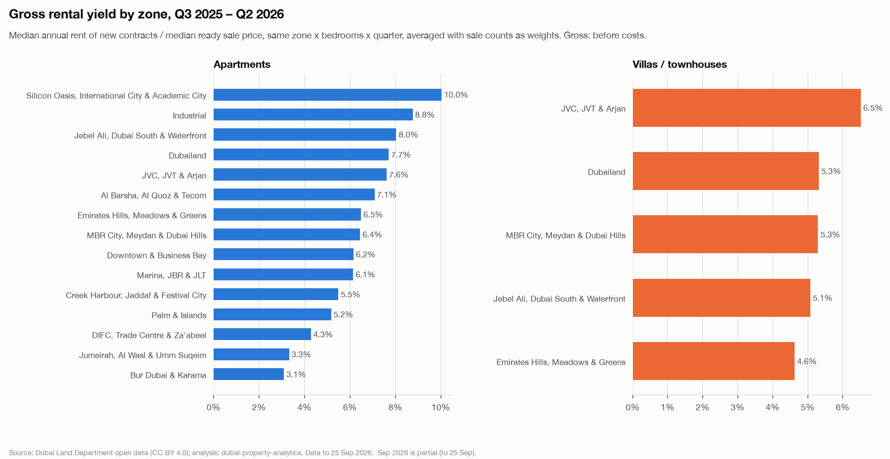
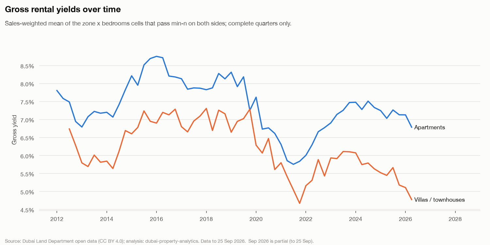
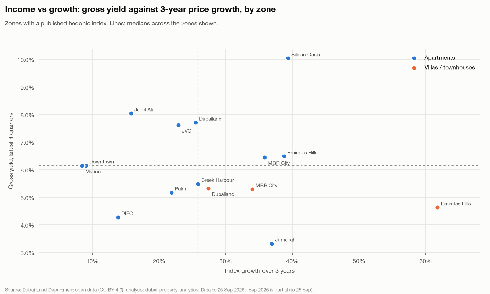

# Gross rental yields

Phase 4a (docs/05 §3). Gross yield = **median annual rent of new contracts ÷ median ready sale price**, for the same area (or zone) × property type × bedrooms × quarter.

- **Data:** to **25 Sep 2026**; Q3 2026 is partial and excluded from the 'latest' figures. Model `yield-gross-v1`.
- **Tables:** `ml.agg_yield_quarter` (published cells), `rpt.yield_quarter` (Power BI). Code: `src/dubai_property/models/yields.py`.

## Summary

1. **Apartments yield 7.1% gross** over Q3 2025 – Q2 2026 (sales-weighted across zone × bedroom cells), villas 5.2%. ([chart](figures/yields_by_zone.png))
2. **Yields over the cycle** (calendar years): apartments 8.5% in 2016 → 5.9% in 2021 → 7.2% in 2025; villas / townhouses 7.2% in 2016 → 5.3% in 2021 → 5.4% in 2025. Prices outran new rents into the 2021–22 surge; rents then caught up. ([chart](figures/yield_trend.png))
3. **Smaller apartments yield more:** studios 8.4% down to 5.4% for 4-beds; villas range 4.9%–8.0% (table below).
4. **Sanity:** 8 of 5,919 published cells fall outside 2–15% (flagged, kept; listed below).

## Method

- **Rent side:** `is_market_rent`: **new** Ejari contracts (renewals lag the market), **single-line contracts only** (rule C11 option 1: a multi-unit contract repeats its amount on every line, so a per-unit figure is an allocation, not a price), no C14 outliers, no virtual units or labour camps (C20), valid dates (C18). Rent = the contract's annual rent; bedrooms from the Ejari sub-type (C22).
- **Sale side:** `is_clean_market_sale` and **ready** (not off-plan). An off-plan price buys a unit that can't be let yet, often on a payment plan, so it isn't the price a landlord pays for today's rent. Price = AED per unit, so the villa plot vs built-up area question doesn't arise.
- **Cells:** quarter (rent: contract start; sale: registration date) × area × property type (apartment, villa / townhouse) × bedrooms. Medians with `percentile_cont` in Postgres; the 3.5M rent lines never leave the database.
- **Min-n:** ≥ 20 observations on **both** sides. Thin area cells **roll up to the zone**, where medians are recomputed from the rows (not averaged). Zone cells under min-n are not published. Sample sizes are on every row.
- **Aggregates in this report** (zone, Dubai, trend) are sales-weighted means of the published **zone** cells, so every rent is compared with a price of the same bedrooms and quarter. Cells **outside the 2–15% sanity band are left out** of every aggregate (they stay in the data, flagged; see the sanity check), so one implausible cell can't move a zone or the headline.

## Coverage

| Year | Area cells | Zone cells | Area cells only in zone rows |
| --- | ---: | ---: | ---: |
| 2010 | 6 | 6 | 1 |
| 2011 | 27 | 33 | 41 |
| 2012 | 82 | 76 | 125 |
| 2013 | 201 | 133 | 175 |
| 2014 | 193 | 124 | 196 |
| 2015 | 169 | 115 | 201 |
| 2016 | 146 | 117 | 273 |
| 2017 | 161 | 122 | 347 |
| 2018 | 129 | 106 | 328 |
| 2019 | 138 | 121 | 388 |
| 2020 | 148 | 117 | 409 |
| 2021 | 262 | 169 | 539 |
| 2022 | 334 | 215 | 783 |
| 2023 | 407 | 238 | 753 |
| 2024 | 447 | 245 | 796 |
| 2025 | 455 | 234 | 760 |
| 2026 | 291 | 152 | 499 |

Area-level cells need 20 ready sales of one bedroom count in one area in one quarter, which only the busiest areas reach; most of the picture is at zone level.

## Latest four quarters by zone (Q3 2025 – Q2 2026)

| Zone | Type | Gross yield | Sales | New contracts | Cells |
| --- | --- | ---: | ---: | ---: | ---: |
| Silicon Oasis, International City & Academic City | Apartments | 10.0% | 2,076 | 18,725 | 14 |
| Industrial | Apartments | 8.8% | 149 | 1,331 | 3 |
| Jebel Ali, Dubai South & Waterfront | Apartments | 8.0% | 2,893 | 14,542 | 16 |
| Dubailand | Apartments | 7.7% | 7,992 | 21,694 | 16 |
| JVC, JVT & Arjan | Apartments | 7.6% | 6,614 | 25,895 | 16 |
| Al Barsha, Al Quoz & Tecom | Apartments | 7.1% | 261 | 4,833 | 7 |
| Emirates Hills, Meadows & Greens | Apartments | 6.5% | 420 | 1,399 | 8 |
| MBR City, Meydan & Dubai Hills | Apartments | 6.4% | 3,179 | 12,039 | 16 |
| Downtown & Business Bay | Apartments | 6.2% | 4,065 | 14,943 | 17 |
| Marina, JBR & JLT | Apartments | 6.1% | 3,747 | 13,948 | 19 |
| Creek Harbour, Jaddaf & Festival City | Apartments | 5.5% | 1,847 | 7,125 | 15 |
| Palm & Islands | Apartments | 5.2% | 660 | 1,909 | 15 |
| DIFC, Trade Centre & Za'abeel | Apartments | 4.3% | 47 | 603 | 2 |
| Jumeirah, Al Wasl & Umm Suqeim | Apartments | 3.3% | 643 | 4,624 | 11 |
| Bur Dubai & Karama | Apartments | 3.1% | 97 | 4,185 | 4 |
| JVC, JVT & Arjan | Villas / townhouses | 6.5% | 115 | 319 | 4 |
| Dubailand | Villas / townhouses | 5.3% | 2,340 | 10,898 | 15 |
| MBR City, Meydan & Dubai Hills | Villas / townhouses | 5.3% | 99 | 760 | 4 |
| Jebel Ali, Dubai South & Waterfront | Villas / townhouses | 5.1% | 492 | 2,255 | 8 |
| Emirates Hills, Meadows & Greens | Villas / townhouses | 4.6% | 417 | 914 | 8 |

## Apartments vs villas, by bedrooms

| Type | Bedrooms | Gross yield | Median rent AED | Median price AED | Sales | New contracts |
| --- | --- | ---: | ---: | ---: | ---: | ---: |
| Apartments | Studio | 8.4% | 51,500 | 659,000 | 8,054 | 37,252 |
| Apartments | 1 | 7.2% | 80,000 | 1,400,000 | 15,015 | 66,954 |
| Apartments | 2 | 6.2% | 133,500 | 2,443,750 | 9,159 | 36,999 |
| Apartments | 3 | 5.6% | 210,000 | 3,750,000 | 2,342 | 6,362 |
| Apartments | 4 | 5.4% | 313,750 | 5,493,510 | 120 | 228 |
| Villas / townhouses | 1 | 8.0% | 70,000 | 970,000 | 131 | 317 |
| Villas / townhouses | 2 | 5.1% | 145,000 | 2,940,750 | 380 | 864 |
| Villas / townhouses | 3 | 4.9% | 152,285 | 3,040,000 | 1,749 | 8,704 |
| Villas / townhouses | 4 | 5.4% | 220,000 | 4,025,000 | 1,203 | 5,261 |

Median rent and price here are the medians of the cell medians, for orientation.

## Yield over time

| Year | Apartments | Villas / townhouses |
| --- | ---: | ---: |
| 2010 | 11.0% | – |
| 2011 | 7.3% | – |
| 2012 | 7.4% | 6.4% |
| 2013 | 7.1% | 5.8% |
| 2014 | 7.3% | 6.0% |
| 2015 | 8.3% | 6.9% |
| 2016 | 8.5% | 7.2% |
| 2017 | 7.9% | 6.9% |
| 2018 | 8.0% | 7.1% |
| 2019 | 7.9% | 7.0% |
| 2020 | 6.9% | 6.0% |
| 2021 | 5.9% | 5.3% |
| 2022 | 6.5% | 5.5% |
| 2023 | 7.2% | 6.0% |
| 2024 | 7.4% | 5.8% |
| 2025 | 7.2% | 5.4% |
| 2026* | 6.8% | 5.0% |

## Income vs growth

Zones with a published hedonic index: latest four-quarter gross yield against the index's change over the last 3 years. Top right = both income and growth.

| Zone | Type | 3-year growth | Gross yield |
| --- | --- | ---: | ---: |
| Silicon Oasis, International City & Academic City | Apartments | +39.3% | 10.0% |
| Jebel Ali, Dubai South & Waterfront | Apartments | +15.8% | 8.0% |
| Dubailand | Apartments | +25.5% | 7.7% |
| JVC, JVT & Arjan | Apartments | +22.9% | 7.6% |
| Emirates Hills, Meadows & Greens | Apartments | +38.7% | 6.5% |
| MBR City, Meydan & Dubai Hills | Apartments | +35.8% | 6.4% |
| Downtown & Business Bay | Apartments | +9.0% | 6.2% |
| Marina, JBR & JLT | Apartments | +8.4% | 6.1% |
| Creek Harbour, Jaddaf & Festival City | Apartments | +25.8% | 5.5% |
| Dubailand | Villas / townhouses | +27.4% | 5.3% |
| MBR City, Meydan & Dubai Hills | Villas / townhouses | +34.0% | 5.3% |
| Palm & Islands | Apartments | +21.8% | 5.2% |
| Emirates Hills, Meadows & Greens | Villas / townhouses | +61.8% | 4.6% |
| DIFC, Trade Centre & Za'abeel | Apartments | +13.8% | 4.3% |
| Jumeirah, Al Wasl & Umm Suqeim | Apartments | +36.9% | 3.3% |

## Sanity check: yields outside 2–15%

| Quarter | Level | Zone | Area key | Type | Bedrooms | Yield | Rent n | Sale n |
| --- | --- | --- | --- | --- | ---: | ---: | ---: | ---: |
| Q4 2025 | zone | Al Barsha, Al Quoz & Tecom | – | Apartments | 2 | 25.0% | 742 | 118 |
| Q2 2026 | area | Silicon Oasis, International City & Academic City | 483 | Apartments | 0 | 20.0% | 236 | 94 |
| Q4 2019 | zone | Al Barsha, Al Quoz & Tecom | – | Apartments | 0 | 15.8% | 296 | 70 |
| Q4 2025 | zone | Al Barsha, Al Quoz & Tecom | – | Apartments | 3 | 22.6% | 88 | 63 |
| Q2 2026 | area | Silicon Oasis, International City & Academic City | 483 | Apartments | 1 | 15.2% | 472 | 47 |
| Q1 2020 | zone | Al Barsha, Al Quoz & Tecom | – | Apartments | 0 | 15.3% | 277 | 29 |
| Q1 2019 | area | JVC, JVT & Arjan | 441 | Villas / townhouses | 4 | 17.3% | 47 | 21 |
| Q1 2019 | zone | JVC, JVT & Arjan | – | Villas / townhouses | 4 | 18.7% | 65 | 21 |

They are kept in the data (flagged `is_outside_sanity`) because each passes min-n, but **left out of every aggregate above** and of the Power BI yield measures. A high yield in a cell usually means its ready sales are a cheaper sub-market than its new lets (e.g. older buildings sold, newer ones let) rather than an error.

## Caveats

- **Gross, not net:** before service charges (often 1–2 points of yield on apartments), vacancy, maintenance, agency fees and DLD / Ejari costs.
- **Different units:** the rent and sale medians in a cell come from different units of the same type, bedrooms and area or zone, not the same flats.
- **New contracts** lead renewals; a yield on renewals would be lower in a rising rent market.
- **Nominal AED**; the latest quarter is partial and excluded from 'latest'.

Decisions: docs/05 §8.

*Source: Dubai Land Department open data (transactions and Ejari rent contracts), CC BY 4.0.*
